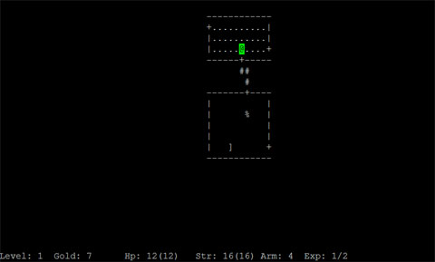

Back to: [West Karana](/posts/westkarana.md) > [2009](/posts/2009/westkarana.md) > [June](./westkarana.md)
# Shiren the Wanderer 3 coming next year for the Wii

*Posted by Tipa on 2009-06-09 19:12:26*

The thing about "rogue-likes" is, they aren't for everyone. Let's face it -- you will probably never, ever win a real rogue-like, no matter how long you play. The only question is, how far will you get before you die, lose everything, and have to start over from the very beginning? It's about the heroic struggle, not the happy ending. 

  
*This was once the most popular video game among all college campuses. Yes, really.*

Rogue-like games are (brief recap, here) games based on [the original Rogue](http://en.wikipedia.org/wiki/Rogue_(computer_game)), a game written in 1980 where you explore a dungeon that grows more treacherous faster than you get stronger. You can see where that leads. This article about [ROG-O-MATIC, one of the first ever "bot" programs](http://www.cs.princeton.edu/~appel/papers/rogomatic.html), explains Rogue (and its strategies), in better detail.

[Shiren the Wanderer](http://www.atlus.com/shiren/) is a Rogue-like in the grand tradition of Rogue-likes. You adventure. You get stronger. You learn about the world around you and how to live in peace and harmony with other creatures. And then you die.

[Out for the Nintendo DS currently](http://en.wikipedia.org/wiki/Shiren_the_Wanderer), the next version is coming out, [Amazon reminded me tonight](http://www.amazon.com/Shiren-Wanderer-Nintendo-Wii/dp/B002BVQNPW/), next Spring, which sets a date for the next time I will turn on the Wii ;)

[JC Fletcher at Joystiq writes about Shiren 3](http://nintendo.joystiq.com/2009/06/08/hands-on-shiren-the-wanderer-wii/):

> It's basically Shiren or any other roguelike, which means that it's a totally turn-based experience: monsters move or perform actions only as you do, attacking after you attack, and if you freeze, nothing will happen. Other signature elements are here:huge, multi-level dungeons, random item drops, items that require identification (which could reveal them as super-powerful or even cursed), near-total loss of progress upon death, and, uh, extraordinarily frequent death.

Okay, I'm sold :)

## Comments!

**[rob](http://www.lostaneighth.com)** writes: I am sold on the artwork alone! Looks very nice. I have the DS version of Shiren, but have not fired it up in a long time.

---

