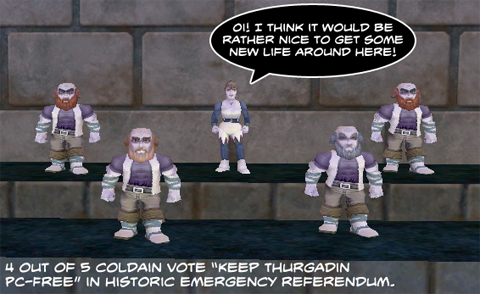

Back to: [West Karana](/posts/westkarana.md) > [2009](/posts/2009/westkarana.md) > [June](./westkarana.md)
# Nightly Blogroll 6/10 -- Icy Red edition

*Posted by Tipa on 2009-06-11 00:14:37*

Yeah, I know it's not a HUGE stretch to announce that Velious will be EverQuest II's next expansion when [pictures of dragon-turtles pulling ice barges are easy to find](http://mmoquests.com/2009/06/10/just-a-glimpse/), but yeah. Velious. 

Velious and Kunark are often grouped together, in the minds of old EverQuest players, as the "core" game, beyond which it got more achievement focused. The first thing you saw when you went to Velious, landing in Iceclad, was the black and spiky Tower of Frozen Shadow -- an absolutely wonderful dungeon, built so that each group could find their appropriate level, thick in lore and unique loot. The promise of that first dungeon was kept throughout the expansion -- even the raid zones (Sleeper's Tomb, Dragon Necropolis, Planes of Growth and Mischief, the Temple of Veeshan and the three faction cities, Icewell Keep, Kael and Skyshrine) had plenty of spots for single groups to play, and plenty of wide open spaces for kiting soloers.

Well, there'll be plenty of time to wonder about EQ2's new expansion once we find out more about it, but of course, I won't bother waiting until we know more to make wild guesses -- in another post.

On to the Blogroll!

If you don't really ever get tired of mysteries, or comedies, or SF books or fantasy or whatever, why do so many people get tired of WoW-like MMOs? Talyn at Pumping Irony has [had enough of the level grindy kind of game](http://pumpingirony.net/2009/06/10/done-with-diku/). But I wonder if that's really because most games these days assure you that things will become extra-special fun, once you grind out those 80 or 90 or 100 levels or whatever first. Personally, I feel that an hour spent grinding pointless achievements is one hour of my life I'll never get back, and this is why I am not playing LotRO. But that doesn't mean I'm off WoW-likes. I'm just off games that are not fun to play. Make me a fun WoW-like, and I'll be there.

Syp seems to agree; [he just published his latest "MMOmeter"](http://biobreak.wordpress.com/2009/06/10/mmometer-june-10th/), and most WoW-likes -- including WoW itself -- are pretty far down the list. Notable for NOT being kicked to the cold half of the crisper is LotRO, which is still delivering for him.

Hektor returns to MMOdus Operandi with [an article about a little known MMO](http://mmodusoperandi.blogspot.com/2009/06/and-service-resumeswith-wurm.html), [Wurm Online](http://www.wurmonline.com/). I confess I know little about this game; news of community-written MMOs like [Citadel of Sorcery](http://www.citadelofsorcery.com/) and [PlaneShift](http://www.planeshift.it/) comes and goes. Hektor, though, finds something original and almost primal in it, with mechanics that harken back to the days of early EverQuest and Ultima Online, except this game has a difference: everything you do affects the game world permanently. Overhunt an area, and there won't be any more animals there. Kill all the dragons, and all the dragons are dead and there are no more. And so on. You can make the world a barren wasteland or a verdant forest depending on the actions you take. That's pretty cool.

Dusty Monk of Of Course I'll Play It kinda figures that you can tell the moment a game starts to die by [the moment it stops adding new stuff for new players](http://ofcourseillplayit.com/?p=223). His reasoning -- only a portion of the players will see the hardest content, but EVERYONE sees the new stuff. As a person who plays a lot of MMOs as kind of an obsessive hobby, I gotta agree. Unless I really love your game, I never will see the high end stuff, and if you bore me to tears right at the beginning, well, why would I stay?

There's more, lot's more, but it's been a long night killing rats in deadspace and it's time for bed. See you tomorrow!

## Comments!

**[mbp](http://mindbendingpuzzles.blogspot.com)** writes: You are perhaps at the extreme end of "Serial MMO" playing TIPA but I wonder if the pattern of moving between MMO's is not more common than developers like to admit. I wonder if there is a market niche there to be exploited: "Our new mmo will give you three months of top quality entertainment before you finish the game and can move on to something else".

---

**[Tipa](https://chasingdings.com)** writes: I think those are called "single player RPGs" :)

---

**[openedge1](http://simple-n-complex.blogspot.com)** writes: *I think those are called “single player RPGs” :)*

That seems to be a narrow view Tipa. Especially from you.

Why cant an "MMO" give you 3 months of fun and a complete story, and then develop another chapter to be introduced to bring you back for another 3 months?

I think it would be progress, and would eliminate these blockbuster MMO attitudes of needing a budget of 25 million to offer 100,000 Kill 10 x and Fetch me quests to keep the player involved as they need the revenue. 

Guild Wars had content that could last a player 3-6 months alone...and then there is chapter 2 for purchase, etc...

6 Million copies sold can't be wrong.

---

