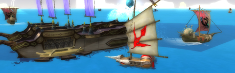

Back to: [West Karana](/posts/westkarana.md) > [2009](/posts/2009/westkarana.md) > [June](./westkarana.md)
# Nightly Blogroll 6/16 -- All Wet edition

*Posted by Tipa on 2009-06-16 00:55:15*

Yup, back in Florensia for a second try at it. Because, hey, be a pirate on the sea and an adventurer on the land, build your own ship, hire a (NPC) crew, two separate career paths, and it costs nuttin'. The cash shop only has some potions... I dunno how they make money in this game. The general chat is about what you'd expect, though.

Big news today was that ex-EverQuest and Vanguard helmer Brad McQuaid was ending his self-imposed exile of idyllic days spent racing cars and playing games to [jump back into the spotlight with his very own blog](http://www.bradmcquaid.com/Brad_McQuaid/Blog/Blog.html). Or did he? Genda believes [the whole thing is a hoax](http://www.thegrouchygamer.com/?p=185), someone (possibly drummer [Keith Sharward](http://www.myspace.com/sharward)) just having a bit of fun. The [actual Brad McQuaid](http://www.linkedin.com/pub/brad-mcquaid/11/a67/255) doesn't seem to have taken the steps of building up his LinkedIn profile in awhile, anyway.

And would he really have started off a blog by writing to all the folks who lost their jobs and perhaps careers that he'd been wiling away the past three years [living an idyllic life of leisure](http://www.bradmcquaid.com/Brad_McQuaid/Blog/Entries/2009/6/14_Where_the_heck_have_you_been.html)? I think not.

So use your own judgment, there. But I wouldn't go gushing to "Brad" about how much you liked/hated EverQuest/Vanguard *just* yet.

With EQ2's update 52 coming today and bringing loads and loads of goodies, and the recent absolutely cheap price Steam charged for the full game -- everything -- for $20, there's been lots of interest lately in EverQuest's sequel. 

Ogrebears is betting that Velious [will bring another ten levels with it](http://ogrebear.com/?p=1081), which would bring the total to 90 -- for a new record among the WoW-likes. He likes the idea, I don't, but I guess if you don't flush everyone's current gear and spells down the toilet every couple of years, what are people going to strive for? Me, I'm off that particular treadmill. I might level a char or two to 90, if that's what happens, but I'll be damned if I'm going to spend another hundred nights sitting in this chair doing the same damned thing over and over again just because some yokel in San Diego plinked a counter from 8 to 9. Life is too short.

Angry Raider [ignores the cries of the so-called hardcore](http://www.angryraider.com/archives/123) denouncing the dumbing down of EQ2 with the latest update. Spell ranks -- simplified. Research assistants who will get you the spells you need for nothing. And so on. Ogre and Angry have a point. If you're gonna toss 90 levels in the face of a new player, with the uncomfortable truth that they won't be seeing a group for the first fifty or sixty levels unless they brought it with them, you better make sure you coddle them until they get where the people are.

WoW learned that lesson.

I'm just being a contrarian here, I know, but I DON'T think pumping levels up all the time is the answer. That may make the grind-loving achievers happy, but it just turns me off. Someone commented today that the base stats for a raider in EQ these days is level 85 and about 3000 AAs. That's madness. That's actually making it impossible to start the game new. 

Somehow, WoW has managed to both keep pumping up the requirements and yet keep getting people. [Saylah writes about a cousin](http://notadiary.typepad.com/mysticworlds/2009/06/from-free-realms-to-world-of-warcraft-how-many-more.html) that wanted to try "Worldcraft" because (in unintended irony) she liked Free Realms and wanted to play something LIKE Free Realms, but more serious, like they talked about at work.

[The Evil Theurgist's Wizard 101 account was hacked recently](http://eviltheurgists.blogspot.com/2009/06/warning-hacker-on-account.html). I hope it's resolved quickly. He says hacked, but in almost every case I came across when I was an EverQuest guide, it turned out that the victim had given their account information to someone they trusted. Or they had shared it with their guild because everyone did. I don't know if this was the case with E.T., but just a word to the wise: your hacker is usually someone you know.

And we leave you now with Aggro Me's "[Teen Vogue Confidential: Your Most Embarrassing Gaming Moments](http://alwaysgoright.com/2009/06/gaming-meets-teen-vogue-meets-insanity/) (plus fifty rad fashion tips)".

Sleep well, or stay awake -- it's a free country -- but keep gaming!

## Comments!

**[Brian 'Psychochild' Green](http://www.psychochild.org/)** writes: *He says hacked, but in almost every case I came across when I was an EverQuest guide, it turned out that the victim had given their account information to someone they trusted. Or they had shared it with their guild because everyone did. I don’t know if this was the case with E.T., but just a word to the wise: your hacker is usually someone you know.*

Yeah, it's often someone you know, but [it can happen even to careful people](http://www.psychochild.org/?p=641).

---

**[Lars](http://mmomentofzen.blogspot.com/)** writes: Wow, even I have more friends on LinkedIn.

---

**Bhagpuss** writes: I'm really looking forward to another 10 levels in EQ2. I don't at all see it as a treadmill, because for me levels are the only "end game" content I have any interest in at all. I've never really enjoyed raiding and these days I rarely group beyond duoing with Mrs Bhagpuss, so most of the high end content in most of the games we play never even gets seen, let alone used.

Another 10 levels in EQ2, though, not only gives us (hopefully) ten levels of new content to play through, but will also allow us to go back and explore many places we've never seen (particularly looking forward to Mistmoore and Unrest) and to play through content that's currently beyond us (with luck, some of the easier Kunark dungeons should come into range). If it's anything like Kunark, the gear we get solo should enable us to handle older heroic content that's currently beyond us.

That said, there's nothing I ever like better in any MMO than new low-level content, so what I'm really hoping for is a new race and starting area. I found the Sarnaks and Timorous Deep very disappointing (I hate their hunched-over posture and I disliked the linear progression across the islands, and don't get me started on that hideous tangle they call a city...) so I am really keeping my fingers crossed for something a bit more open-plan and better-looking.

---

**[Why MMORPG&#8217;s Need Constant Progression | MMOFire](http://mmofire.com/?p=123)** writes: [...] has had enough of the “flush everyone’s current gear and spells down the toilet every couple of years” model of expansions, such as the widely presumed level cap increase in this year’s EQ2 [...]

---

**[Poll: Endgame Vs. Leveling Content | MMOFire](http://mmofire.com/?p=124)** writes: [...] again, perhaps you feel that it isn’t worth doing repeatable content grinds that will be reset in the next expansion. That’s why I’m curious to hear what all of you think. Happy [...]

---

