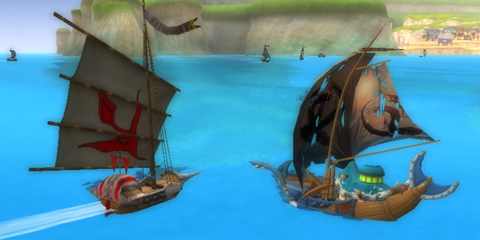

Back to: [West Karana](/posts/westkarana.md) > [2009](/posts/2009/westkarana.md) > [June](./westkarana.md)
# One if by land, two if by sea: a second look at Florensia

*Posted by Tipa on 2009-06-16 07:57:13*

I was a little surprised to see that my character from [Florensia's open beta last year](../../../index.php/2008/07/25/a-first-look-at-florensia/) was still around, though naturally I'd entirely forgotten how to play her. 

To get back up to speed, I put my Saint (healer) aside and started a new character, an Explorer (ranged dps specializing in guns). The very detailed tutorial took me through setting skills, inventory management, ship construction and combat, and I was just about to set out on my new life as an Explorer when I read in chat that people were desperate for Saints in their higher-level groups.

So I went back to Tipa and went my merry way... killing ten (strong dodos, weak fungi, wild boars, devil's scarecrows, etc). Now as back last year, I was struck by just how similar quests and combat were to Dream of Mirror Online. I finished up my quests in the area (leveling from 7 to 9) and headed back to town, because you can be an adventurer in ANY game. I wanted to be a pirate.

The port master of Roxbury took great pains to inform me that pirates aren't bad people -- in fact, most of them consider themselves "[gentleman pirates](http://math.boisestate.edu/gas/pirates/web_op/pirates27.html)" who would never harm an honest sailor.

Ah, but some have sailed into a more troubled sea -- and them -- THEM -- you must destroy.

Ten of this sort, a dozen of that, and collect banners from these and those if you could, please!

Ships -- which you build, crew and outfit, more or less like you do in Pirates of the Burning Sea -- come in several types which are roughly analogous to adventuring classes -- you have the tanks, the rammers (mine), the gunners (but no healers, unless I missed it). Sailing the seas is a matter of adjusting your sails and course for the best wind, tacking as necessary to ensure you have the upper hand when meeting the enemy. You want to be, as much as possible, out of their firing arc while they stay in yours.

As a land-based MMO, Florensia travels a well-trodden road. There's little there to set it apart from dozens of similar Asian imports. On the sea, though, is where Florensia shines. The sailing mini-game is fun and strategic, and as far as I have seen, doesn't require you to ever set foot on land. The game even goes so far as to put floating save points and merchants out in the open sea, and that would be my recommendation: Dabble in the land game, but head as soon as you can for the deep water. You'll find a sea game far more approachable than PotBS' slowness.

## Comments!

**[Beau Turkey](http://www.spouseaggro.com)** writes: Yeh, looks like there is a "maintenance ship" that repairs other ships, and a torpedo ship which I tried out. I like the game, and really like some of the graphics. I need to sail more, though..get better at that.

 Beau

---

