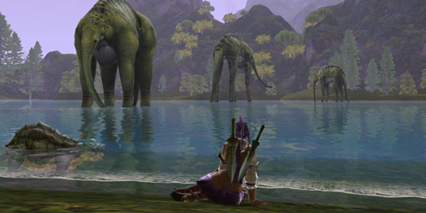
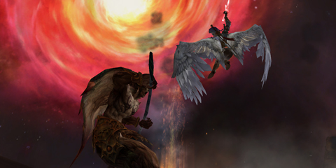

Back to: [West Karana](/posts/westkarana.md) > [2009](/posts/2009/westkarana.md) > [June](./westkarana.md)
# A first look at Aion: The Tower of Eternity

*Posted by Tipa on 2009-06-16 21:25:54*

Aion is not an innovative MMO. Anybody will tell you that.

You have your quest hubs with quest givers who task you with killing everything in the vicinity. Classes start off with four archetypes (scout, mage, priest, and warrior) and split at level 10 into eight subclasses (ranger, assassin, chanter[shaman], cleric, gladiator[berserker], templar[paladin], spiritmaster[mage pet class], and sorceror[wizard]).

And these work exactly as you might expect, in essence. Sure, there's a whole combo tree where you can buy and equip skills to make devastating combos, but since they kindly have made a one button combo system -- you hit the start combo ability, and then hit it again for the next ability in the combo, and so on -- you usually aren't pressing more than a couple of buttons. You never actually stop pressing buttons.

But I don't really want to get into the mechanics of the game. You can point to pretty much anything in Aion and say, I remember that from World of Warcraft, and this thing is just like it is from EverQuest II, and this feature is totally right out of Lord of the Rings Online.

That's the number one thing I have heard about Aion -- it's just like every other game, so why play?

Uncomfortable truth time, folks. Innovation does not do well in the marketplace. Blizzard proved with WoW that you can do without innovation if you give a polished experience and give people what they want.

Aion is so polished that it gleams. Every inch and corner of the place is filled with nice little touches -- like the pool in the corner of one of the starter regions (seamless world, of course) that has a dryad there who will leave you alone if you leave her alone. People were gathered at it, probably on some quest I hadn't gotten, but -- it was so immersive.

That picture up above -- those massive creatures? The first time I saw them, it was in the distance as I was testing out my wings for the first time. They were so far away, I wasn't sure if they were weird trees or rock formations or what they were. Somewhat later, a quest sent me to that area and there they were, immense, moving around slightly, they didn't care about anything but grazing at the river head.

This is the most immersive game since the original EverQuest. Not just because of the graphics -- though they are superb, just a little more ethereal than normal and far, far from the cartoony weirdness of WoW. Aion is immersive because every part fits together with every other part. The NPCs move around and inhabit their world, and this is a world worth inhabiting.

And yes, you get to fly.

Now and then you come to cut scenes -- for completing an important quest chain, Ascending to become a Daeva and earning your wings, or remembering how you came to be cast down from Heaven to live among mortals for a time -- and they are beautiful, and they make you want to level up and head back into the Abyss to bring the hurt to the creatures that cast you out.

That's the real meat of Aion. You start out on your own half of this shattered world -- the angelic Elyos on the bottom half, the demonic Asmodians on the upper -- and between them, at the core, is the Abyss. Ownership of the fortresses in the Abyss shifts according to the PvP battles, and those in control can levy taxes on the merchants in their realms. There is a third, NPC race, native to the Abyss, and they were the ones that shattered the world. I'm not sure if they take part in the faction control, but I wouldn't be surprised if they aided the weaker faction.

WoW took ideas from Ultima Online, EverQuest (mostly) and Dark Age of Camelot, and made them into a single game that was greater than them all. That's all Aion is doing here.

And hey, you get to fly. That's gotta be worth something.

## Comments!

**[Beau Turkey](http://www.spouseaggro.com)** writes: Hmm I didn;t get far enough into it to see anything. This weekend we will be playing some I hope. Great review..can;t wait to see some of what you have! 

 Beau Turkey

---

**[hudson](http://www.hudshideout.com)** writes: Color me unimpressed until I see the interface, chat window, responsiveness, quest types and other things. Any game can look good, but not all of them function well, just like LOTRO. 

Flying is a gimmick in my book.

---

**[Keen](http://www.keenandgraev.com)** writes: I agree with, well, everything. :) I'm glad you're enjoying Aion as much as I am.

As for the Balaur, the NPC faction, they do indeed siege your fortresses back from you and even help attackers at times. They have a mind of their own.

Hudson, flying is far from a gimmick. It's an integral part of the game and factors into the PvP more than you can really grasp.

---

**[James Taylor](http://iwinbutton.com)** writes: I had a semi-disappointed first glimpse at Aion, but half of that is because I was going in expecting something totally different than what it is. Aion is the epitome of a "WoW clone," and even though I despise that phrase and hate whiny teenagers who throw that around, but it's a sad truth. 

I went in expecting a next-generation Korean MMORPG experience. Something to tide me over until big Korean MMOs like Blade & Soul, TERA, or Lineage 3 inevitably hit. What I have seen so far is a full-blown cookie-cutter Americanized theme park MMORPG. It's got hella polish, this is true, but I feel like it has *no heart*.

And the fact that EVERYONE is basically the same race is pretty bleh. A change of skin tone doesn't cut it as a "different race" to me. But I digress, this is getting too long and I'm making it sound like I'm down on the game way more than I am. I still have my Collector's Edition pre-order and I can't wait for this weekend! Great write-up Tipa!

---

**[MmoQuests.com » Aion Beta Impressions](http://mmoquests.com/2009/06/17/aion-beta-impressions/)** writes: [...] for NA, I’m free to talk about my Aion beta impressions. Don’t forget to take a look at Tipa’s impressions too, they closely mirror my own. The game is not innovative, but that’s not what [...]

---

**[openedge1](http://simple-n-complex.blogspot.com/)** writes: So this could be like another EQ2 to me. I liked the game as there was a lot to do. It did not mean the content was "WOWSERS", but it kept me entertained for 8 months as combat was not too slow and the visuals were good.

Myself, the flying DOES mean something to me, as I really hated Perfect World as a game, but the flying was addictive.

And visually, Aion does look awesome, and I am a visual nut..

You sold me (even though we had that Twitter-Argument - Twitdebate - Tweetscussion...lol)

Cheers

---

**[Saylah](http://notadiary.typepad.com/mysticworlds)** writes: Looks beautiful that's for sure. I'll wait for launch and give it a try. I agree - innovation doesn't sell well in this market. The few players screaming/whining for it might consider that they are a minority. These folks are trying to publish games for the masses and for a return on their investment, safer, is a surer profit return.

---

**[Keen and Graev&#8217;s Gaming Blog &raquo; Blog Archive &raquo; More of Keen&#8217;s impressions from Aion&#8217;s first Beta weekend](http://www.keenandgraev.com/?p=2585)** writes: [...] only able to get up  to level 14, I saw and did a lot in these areas.  They are as immersive as Tipa mentions in her bloggings.  Although Tipa only mentions Polish from a look and feel perspective, I do want to include the [...]

---

**[Here are a few Aion impressions from others! &laquo; Aionic Thoughts](http://aionicthoughts.wordpress.com/2009/06/19/here-are-a-few-aion-impressions-from-others/)** writes: [...] very good read and you can find the whole thing here, with a nice write-up on the user interface [...]

---

**[Sundry Items &laquo; Ardwulf&#8217;s Lair](http://ardwulfslair.wordpress.com/2009/06/19/sundry-items/)** writes: [...] Incoming There are some blog posts talking about Aion HERE, HERE and HERE. As much as I would like to dismiss it with a wave of my lordly hand, it does look really good. I [...]

---

**[Caliga](http://www.mmogamers.freeblogit.com)** writes: I was excited about this game when I first learned about it over a year ago, but I lost interest over the months, and reading reviews from the Korean launch didn't help. But recent interest in the game from the blogosphere and your great write-up has me interested again. I'll definitely be trying this one.

Good work Tipa.

---

**[Dragonchasers &raquo; Blog Archive &raquo; First look at Aion: Better late than never edition](http://dragonchasers.com/2009/07/04/first-look-at-aion-better-late-than-never-edition/)** writes: [...] (for good or ill) on me. To lay the foundations of what Aion is, I’ll refer you to Tipa (A first look at Aion: The Tower of Eternity, Aion: The User Interface) & Stargrace (Aion Beta Impressions, Aion Beta Weekend – Round [...]

---

