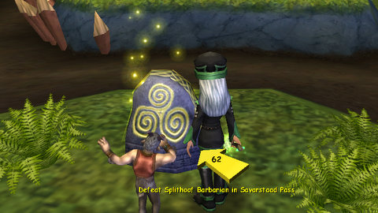
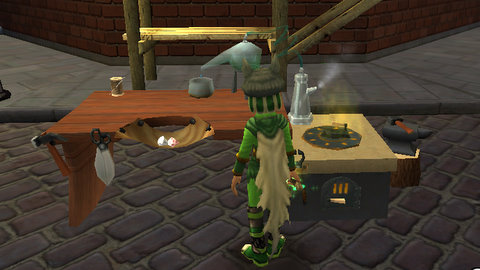
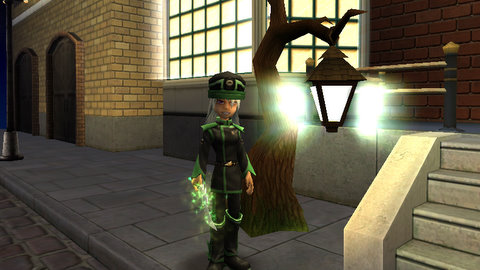

Back to: [West Karana](/posts/westkarana.md) > [2009](/posts/2009/westkarana.md) > [June](./westkarana.md)
# Wizard 101: Grizzleheim

*Posted by Tipa on 2009-06-22 08:23:25*

Though I was away this weekend, I still managed to squeeze some hours into Wizard 101's Test server to check out the latest changes. And there's a LOT of them. This next update does not just introduce the world of Grizzleheim into the game, but a whole laundry list of things players have been begging for (aside from appearance slots, which haven't made an, um, appearance).

**Grizzleheim opens, a new world of Viking Bears, Ravens and Wolves.** 

Ah yes, Grizzleheim. The whole new world that pretty much has nothing for max level characters. You can do the next Zeke collection quest, which continues its classic rock theme this time with The Yardbirds, rather huge, wooden birds that look suspiciously like Mr. Lincoln's less mobile cousins. But no new levels and gear that is no upgrade make this an excuse to haul out the lower level alts rather than to progress your main.

Grizzleheim works alongside your normal leveling path. The parts I saw were crowded with Rank 3-4 critters, which would place it next to Krokotopia in difficulty. And by the parts I saw, I mean with my level 30 Balance wizard, Allison Goldtalon, as I found certain quests were not offered to my level 50 Life wizard, Tara Mythcrafter. There were parts of Grizzleheim that only Allison could get to, though I could teleport Tara to her. This is the first time Wizard 101 has made content that can be out-leveled, and I have no idea why. Perhaps to give high level wizards a reason to befriend lower level wizards?

In the picture above, Tara stands before a Teleport Stone. You'll find these throughout Grizzleheim; once discovered, you can teleport instantly between the stone and the main teleport hub in your region. Very handy, and I hope to see this brought to the other worlds of the Spiral.

**We're introducing a Bazaar that lets players buy and sell items they've earned or found in the game.** 

Yes, you can finally sell stuff to other people through the Bazaar. You can find an outpost of the Bazaar in at least Wizard City (in Olde Town) and Krokotopia (on the mysterious fifth island, before this unused, and no, I don't know how to get to it, but it's on the map, and before you say anything, it's not the hourglass secret island).

The Bazaar is not an Auction House, like WoW, or a broker, like in EverQuest II. You don't get to choose a price for your item. To find a similar scheme, you have to go all the way back to the original EverQuest, where people would sell things to NPC merchants, which other players could then examine and buy from the merchant's inventory. You sell an item and get the cash, and your part in this is done. Your item appears immediately in the Bazaar and can be bought at that fixed price like anything else.

Can you buy something at an NPC store and then place it in the Bazaar? Sure, all but one of the pets for sale in the Bazaar when I looked could be bought in shops. Buyer beware.

Those hoping to avoid camping bosses for the best dropped gear will be disappointed -- the very best gear cannot be sold in the Bazaar, thanks to the new "No Auction" tag. However, the Bazaar is an excellent place for finding crafting reagents.

**Crafting lets players create their own equipment and Treasure Cards.** 

MMOs tend to go one of two ways when they add crafting. Either the crafted gear is superior to that found in boss drops, or it isn't. Wizard 101 has gone this second way.

Crafted items require recipes (bought from various vendors throughout the world, including in dungeons (there is a Myth robe pattern vendor in Krokosphinx' Hall of Champions, for instance)), reagents (some bought, most harvested in various places throughout the game), a crafting station and a crafting time slot.

Eudora Tangletree in Olde Town will have your very first crafting station for you once you bring her three Mistwoods, a fairly rare harvest. Find a place for the crafting station in your home, then return to Eudora for her very first crafting assignment: Five athames. This will require an astonishing amount of harvesting both the mist woods and cattails (found near water), and for all that work, the athames you make are nearly useless. In fact, as you look through her recipe book in despair, will it be worth the grind to become a master craftsman for *this*?

Well, hold on, Bucky. After you get your novice crafters badge (and here I was helped by a GM who was dumping crafting reagents on the Bazaar), you're sent to Krokotopia for whole new quest, where you make five really disappointing rings, which for some reason, take large quantities of parchment and stone blocks. Parchment seemed fairly common in the dungeons, but stone blocks -- seen only as a blue sparkle -- were somewhat more rare. Crafters had cleared out all the GM-given items from the Bazaar, and an hour or so doing quests in the Krokosphinx only yielded enough blocks to make two of the five rings.

Why level? Well, crafted items are made instantly -- click and done. To slow you down, your crafting station has a small number of "crafting time slots". Your first athame takes up a slot for an entire minute. You earn additional time slots as you finish each tier of crafting -- the Krokotopia ring takes up a slot for seven minutes. So mostly, while crafting, you'll be waiting for a time slot to open. You can see your time slots via a new tab in your character window.

Eventually, you'll be able to craft furniture and other house items, and I'm hoping that will make the grind worthwhile. I'm hoping, in fact, that top crafters will be able to make Grizzleheim homes, since Grizzleheim doesn't appear to have a builder turtle of its own.

**We've added Grouping that allows players to team up with friends.**

Grouping is pretty clever. You get a group-only chat channel and a group list, and that's handy stuff just by itself. But you also get a reserved spot in a dueling circle. You can make out a red sparkly person next to the wizard in the dueling ring above -- nobody but a group member can take that spot. If you have a group of four wizards and one of them starts an encounter, no wizard not in your group will be able to join.

This is a godsend for people with full friend lists -- people popping in all the time could ruin encounters. Now they can only take up spots on the duel circle that are left over after your group gets theirs.

**And last but not least the introduction of Chat Channels and Open Chat.**

Along with the group chat comes the dread General Chat ("All"), where wizards anywhere in the game can chat with each other. Since this chat channel follows the same rules as the existing Dictionary Chat, you can't be too explicit, and the chat was fairly helpful -- but we'll see how it is in the live game. There's a limit to how many people can be in a chat channel at the same time, and the chat system will start new general chat channels as needed.

I don't know if the chat channels are cross realms yet.

If you have a wizard leveling through the Spiral, you are going to want to be spending a lot of time in Grizzleheim. If you are a max level wizard, now's the time to start an alt -- the Bazaar makes alts easy to gear up, and Grizzleheim is full of things you've never seen before. Grouping is a huge win, and chat channels should build the elusive Wizard 101 community we've been wanting.

Crafting, as far as I have seen it, is somewhat of a disappointment. Huge costs in time and gold to make garbage items, and the Bazaar, which doesn't take scarcity into account when setting prices, won't let reagent prices rise to a level where they would be attractive for wizards to harvest for sale at premium rates to crafters. I have no idea at this time if crafting will ever be worth it, but I'll give it a shot when the game goes live.

## Comments!

**[Sierra StarSong](http://starsongky.livejournal.com)** writes: I've been toying with starting a Storm mage, looks like I should wait until after Griz goes live. Thanks!

---

**[Saylah](http://notadiary.typepad.com/mysticworlds)** writes: Whoa, they've added quite a bit of content that starts to round the game out into a more traditional MMORPG. Nice for them and their customers. I've found very few games launch with crafting that makes sense - itemization, cost vs. reward tend to be skewed. Some games fix it in short order while others never do and crafting sucks. Here's hoping KI will be more attentive and make continually changes to bring crafting in line. Seems like they're trying to widen the game play and add replay inducements, something I thought the game lacked, especially after you could reset your secondary class selection. I look forward to getting back to W101 in the early to late fall.

---

**[ryan icesword](http://westkaren)** writes: this look an awesome new world its totaly awesome detailed soon my b-day come up and i could get crowns and that awesome pet ''king tasha'' nice outfits cool places new stuff and new everything awesomeness

---

**Oran DuskHammer** writes: Hey Ryan, you can't actually buy the pet the girl has. It is only for Life Grandmasters

---

**Oran DuskHammer** writes: And btw, Don't get crowns get a subscription. I have had crowns and i have a subscription and i think the subscription is more worth it

---

**Tara Windwalker** writes: I thought I loved this game. But, if this is the way the game is going, I just can't do it. Crafting is not what I want, at all. Let some other game do crafting and harvesting. I can't believe after passing my 1 year anniversary of playing that I feel like quitting. I am amazed at how disappointed I feel while running around looking for items to harvest/craft. 

Wizard101 is beginning to remind me of how Club Penguin changed after Disney bought them. For almost 3 years that I played, it was a beautiful laid-back semi-innocent gaming world that turned into a ... well, for example, the promoted "original" and "rare" items were later just given away or for sale again. That just isn't fair to subscribers. The monthly subscription wasn't enough ... we were tantalized to buy more and more. 

I hope Wizard101 figures out other ways to make money without ruining the "original" and "rare" items and by making our gaming much more powerful by buying clothing and items. 

I really do love the game. It is beautiful and clever. I think while playing that we can feel the people behind the game really loving the game, too. There is a heart and soul in Wizard101 that is different than all the other games I have tried or played for awhile.

---

**Logan DeathThorn** writes: Not too excited about crafting but the group thing seems pretty cool. Finally I won't have to race some random guy for a spot in a duel lol,

---

**[Tipa](https://chasingdings.com)** writes: Grouping is definitely cool. I think we're going to find crafting has an important role to play, but I fear the managed economy will sabotage it by making it unrewarding.

---

**[Aaron Goldenflame](http://www.wizard101.com)** writes: if you need mist wood there is alot in well somwhere in Grizzleheim and when you find a chest or something just change realms and it will appear again not in the same spot but nearby the spot that you found it earlier. SEE YA IN THE GAME!!!

---

**icedblood13** writes: how do you get to the grizzleheim and do you have to pay to get there if you know these things you can request me on myspace at christian.gomez@ymail.com
please help

---

**Margaret** writes: Hi. I've always wanted to know how people hold athames. Do you need a special athame to hold? I would really like to know!

---

**Margaret** writes: Oh! And by the way my name in Wizard 101 is either Victoria Rubydreamer, lvl. 24(2 and a half bars away to lvl. 25) and Fiona Lifebringer, lvl.6, I had just made her yesterday. Fiona is a life wizard and her secondary choice was myth. Victoria is an ice wizard and her secondary choice was storm. I hope to catch one of you on Wizard 101! See you there!!!

---

**[Tipa](https://chasingdings.com)** writes: Actually, those aren't athames, they are a special kind of wand. You'll find them starting in Moo Shu, and sometimes holiday visitors will sell something special as well.

---

**Margaret** writes: Oh thank you very much! I hope I will find one soon!!

---

**nick** writes: were are the birds in bazaar?

---

**josh** writes: how do you get to krokitopia to get to that boss?

---

**dominic** writes: hey i dunno if your the same fiona but if yu are i'm blaze skullbringer if you are the same fiona its me reply me

---

