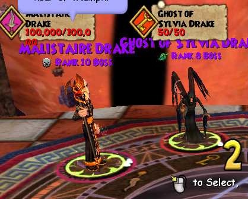
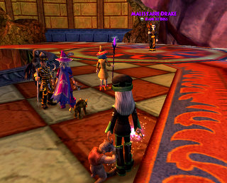

Back to: [West Karana](/posts/westkarana.md) > [2009](/posts/2009/westkarana.md) > [June](./westkarana.md)
# Wizard 101: The Ghost of Mrs. Malistaire

*Posted by Tipa on 2009-06-25 00:28:33*

Deciding to see if a treasure card like "Quench" could stop Malistaire from casting Meteor Storm all the time, Thomas the Friendly Necromancer and I took ourselves and our alts to the Great Spyre to see if we could figure out the puzzle of Wizard 101's ultimate encounter.

Aside from the forge outside the instance, we didn't find anything unusual. Inside were some harvests -- some ore and lava flowers -- and two of us received ectoplasm (a new crafting reagent) from the spirits that protected Malistaire -- but nothing suggested itself as a counter to Malistaire's spells. None of the treasure card recipes seemed to make anything that would reflect his spells back on him.

Thomas suggested getting our fire resists incredibly high. If we were able to get our resists above 100%, his meteor storm would do nothing to us -- but we would be so weakened without our gear that he could kill us in some other way. He has, after all, got 100,000 health. We have to be able to do 100,000 damage to him.

And though he no longer has his three spirit companions, he now summons his dead wife, Sylvia, to his side.

Malistaire cannot be stunned or interrupted, it seems.

The fight goes in cycles. Malistaire starts off by casting his meteor storm. Every time he casts it, it gets more damaging.

Then he seems to do a normal attack. The next round, he summons Sylvia. She spends a turn casting a minor buff on Malistaire, then a fire shell around the dueling circle, then a buff that gives every player maximum power pips, then she disappears while Malistaire erases the fire shell with a death shell, I believe. Malistaire casts his meteor storm again and it continues.

The key seems to be in the use of 'X' pip spells, that gain power with every pip spent. Four fire wizards casting Heckhound at the appropriate time with blades, fire shell, fire traps and feints up, should be able to kill Malistaire in about eight rounds.

While I think he can be killed in that way, a real solution wouldn't be so dependent on certain wizards casting certain spells. Especially since you likely still have to kill him at least a half dozen times for your robe -- if he is exceedingly hard to do, nobody will be willing to help.

We're getting closer now that we know more about the encounter, but there's something we're still missing.

## Comments!

**[Robert](http://worldofsolitaire.com)** writes: Hello

Thanks to your blog I've decided to give Wizard 101 another chance. I played it a long time ago, but I'm now giving it another go.

One question, you mentioned in this blog post that there was an idea to go max out on fire resist.
I'd imagine this would involve getting gear that gives bonuses to fire resist.

I'm assuming you don't already have a whole set of this gear and would need to go out and get some. Figure out which bosses drop it, go and farm those bosses until you both have a full set.

My question is where you would get this information?

In World of Warcraft you'd have thottbot or wowhead, item databases where you could search for gear that gives the most fire resist, it would tell you where it had a chance to come from and then you'd go and try and get it in game.

What would you use to find this information for Wizard 101?
Is there an item database somewhere?

---

**[Tipa](https://chasingdings.com)** writes: I don't think there is as much of a central place for Item DB information as there is for WoW or EQ2. That said, KI is always adding new things -- there's entirely new outfits for every school and level coming in Grizzleheim that boost both your primary and secondary schools, for instance.

Fire resistance may indeed be the key, but finding the gear will be an exercise in patience, I think. The new Bazaar should help. And if FR was big in the Malistaire fight, then I expect other bosses will require resist gear from other schools as well.

---

**AmberStargem** writes: Man I am SO glad Malistaire already dropped my robe! (which is stored in my bank for save keeping) I suggest that the almost grands who still have side quests (like me) go and get their best gear before they raise anything. (It also depends on how much time you still have left and how many side quests you have!) Hope this helps!

---

**BobH42** writes: Just wanted to mention that I've been invited to a focus group conference call for adult gamers that are playing Wizard 101 next Wednesday.

One of the main points I plan on bringing up is a request that they implement something similar to WoW's armory site, at the very least for the purposes of making the gear and card databases more transparent.

For me I think they've already addressed what I'd really like to see - more chat options for the 18+ crowd while still keeping the game enjoyable and safe for the younger crowd. Also make a lot of optional content for the 18+ crowd while keeping the core game playable for a kid. The new Grizzleheim (sp?) is an example of that general concept - parallel adventuring paths that are not required to enjoy the game but can be tuned differently since they're not part of the story-line progression.

Honestly I'm a really happy camper with what I've seen up through level 21 so far. The game's fairly easy but then again so's almost every MMORPG through level 21. That said I will admit to dying on a few occasions until I figured out that I could back out of a boss fight, reset my deck (to add in my prisms mainly), and then go back in.

So for me...my part in the conference call is going to consist of thanking them for a great game and at the same time asking for the same kind of open database availability that we get in WoW for the Wizard 101 community. Given those type of tools we could see much more development in secondary web sites with good theorycrafting and strategic discussions - all things that don't detract from the enjoyment of the younger players while enhancing the enjoyments of the math geek crowd that make up a fair portion of the adult gamer community. But I'm open to any other issues that adult gamers would like brought to the table if someone would like me to bring it up.

---

**[death](http://h)** writes: malistare is like raping use he has 100000 health

---

**ScottB4713** writes: BobH42, how did you get to be part of the focus group? I live in Dallas, and would also be interested in participating in one of these groups. I have been a very heavy player for the past 4 months or so, and have maxed out my Pyromancer at level 50, and have begun exploring Grizzleheim, but am not really sure where the developers are taking this world in the grand scheme of things.

---

**BobH42** writes: Honestly I don't know. I just happened to post on a message board (maybe the official one?) that I was an adult that played with my kids and their marketing department contacted me directly. They mentioned they don't have any future ones planned and that this was really something that they were trying out that they weren't sure how it would go.

If the conversation we had was any indication though this likely won't be the last one. I think they got a lot of quality feedback from everyone involved, some decent marketing ideas, and some good general ideas of where to go with the game to cater to the older set without losing the kids.

---

**[Tom](https://chasingdings.com/index.php/2009/06/25/wizard-101-the-ghost-of-mrs-malistaire/)** writes: I'm stuck on mooshu but i beat all of dragonspyre i just dont want to do all the fire minion deafeating missions alone because i'm fire (by the way is really stinks because i've got so many lv.50 and 45 stuff that i want to wear.
ps. I beat dragonspyre because i teleported to my lvv. 47 and 50 buds.

---

**[Tom](https://chasingdings.com/index.php/2009/06/25/wizard-101-the-ghost-of-mrs-malistaire/)** writes: A great way to get dozen of free stuff is to keep killing nightshade i'v got pets crown ,boots and a lot of gold and stuff to sell.

---

**[Tom](https://chasingdings.com/index.php/2009/06/25/wizard-101-the-ghost-of-mrs-malistaire/)** writes: I think the 2nd toughest boss is valdimere darkflame or somthing like that anyway he is in the laybyrinth and has 8,000 health

---

