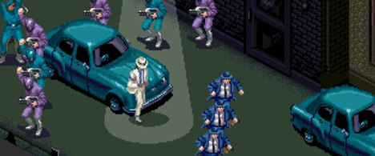

Back to: [West Karana](/posts/westkarana.md) > [2009](/posts/2009/westkarana.md) > [June](./westkarana.md)
# Daily Blogroll 6/26 -- Space Michael edition

*Posted by Tipa on 2009-06-26 07:59:43*

I'm not gonna say anything snarky about Michael Jackson. When he died yesterday, millions of people all over the world played his music loud and sang along; people gathered to remember him. When you and I die, how many people will even remember we lived? Nobody will remember us for how many max level characters we had or how many nights we spent raiding. We'll only be remembered by and because of the people whose hearts we touched. Beau Turkey finds the most memorable moments in MMOs are not the levels ground out, but [the coming together of friends to work on something as a team](http://epicdolls.com/beauturkey/?p=1685).

Space Michael, btw, was the name of Jackson's character in the Dreamcast game, "[Space Channel 5](http://en.wikipedia.org/wiki/Space_Channel_5)". I played that game so many times I could finish the entire thing in less than an hour. About 3/4 of the way through, you'd have the chance to save Space Michael by doing some of his signature moves. After, [he'd join your crew](http://www.youtube.com/watch?v=po18qslOrj0) and dance with you through the rest of the game.

In a weird bit of irony, [Roy Greenhilt FINALLY returns to the land of the living](http://www.giantitp.com/comics/oots0665.html) in Order of the Stick. Roy, we MISSED YOU. Think you waited too long for a rez? Roy waited SIX MONTHS. [And we waited two years](http://www.giantitp.com/comics/oots0443.html) (and 222 strips).

There's actually one place in the world -- and just one, really -- where people care how many max level characters you have, and that place is a gaming convention. [SOE's Fan Faire](http://events.station.sony.com/fanfaire/) starts today and we expect to hear more about the upcoming expansions for EQ and EQ2, the "go live" date for EQ's new Mayong 51/50 server, and other fun stuff. Expect a lot of attention paid to Free Realms. Lazaretto is in Las Vegas with [a live report from the pre-show](http://www.completeheal.com/?p=1177) -- we'll be watching his blog for more information all day.

I like how, in the SOE Fan Fair page, they list Vanguard after the canceled "Matrix Online" and "Trading Card Games".

Growing up in the US, I didn't know all that much about Australia. Our family was friends with an Australian family, but aside from the accent, they were just like anyone else, no difference. Australians were seen in US movies and TV as a rough and tumble people ready for a good laugh or a good fight, full of the enjoyment of life. That image has been shattered recently by Australia's decent into the abyss of "why won't anyone think of the children?" where games not suitable for children between the ages of 15 and 18 [cannot be imported or played over the Internet](http://arstechnica.com/tech-policy/news/2009/06/australian-net-filter-to-block-video-games-too.ars). Oz gamer Stropp [doesn't want to live in a "Nanny State"](http://stroppsworld.com/2009/06/26/slouching-towards-the-nanny-state/) where the government imposes complete censorship in the guise of "protecting the children", any wants to spread the word -- this is how freedoms get taken away.

Copra [takes a look at the current state of World of Warcraft](http://bullcopra.blogspot.com/2009/06/learning-to-play.html) and for the life of him, can't figure out how a new player could ever even think about joining WoW's end game. Isn't that the reason, though, that they do a complete gear reset every expansion? So everyone starts out at the same place every two years. New players only have to wait a couple of years for the next expansion and they'll be fine.

Software developers have to constantly deal with the dreaded "check list" -- if your program doesn't have all the features every other program of that sort has, you fail and that's all there is to it. MMOs aren't immune to this. Myrix asks MMO devs to [throw the check list away and just make a fun GAME](http://www.thewanderingrogue.com/2009/06/putting-the-game-before-the-mmo/). Don't need crafting? Don't add it just because WoW has it!

Gordon of We Fly Spitfires points to a really cool and non-condescending [documentary about virtual worlds](http://blog.weflyspitfires.com/2009/06/25/another-perfect-world-watch-it-here/), watching it now.... Oh, hai, [Raph Koster](http://www.raphkoster.com/)!

Lastly, Keen [takes a look at Warhammer's new "Land of the Dead"](http://www.keenandgraev.com/?p=2636) and finds in it the same sort of realm give-and-take he liked so much in Dark Age of Camelot's "Darkness Falls" realm war dungeon.

Traveling again this weekend, so I'll be back Monday. Keep gaming!

## Comments!

**[openedge1](http://simple-n-complex.blogspot.com)** writes: *I like how, in the SOE Fan Fair page, they list Vanguard after the canceled “Matrix Online” and “Trading Card Games”.*

Yea...hehe...kinda like that ya know?

---

**[Hudson](http://hudshideout.com/blog)** writes: Poor Vanguard, always the red headed step child

---

**[Werit](http://werit.blogspot.com)** writes: Don't forget about Moonwalker for the Genesis.

I've always wanted to try Vanguard.

---

**[Tesh](http://tishtoshtesh.wordpress.com/)** writes: Moonwalker was such an awesome arcade game. *hat tip with glove*

---

**[The Friendly Necromancer](http://thefriendlynecromancer.blogspot.com)** writes: I played space channel 5 to the ground as well. haha! You never cease to surprise me, Tipa. :-)

---

