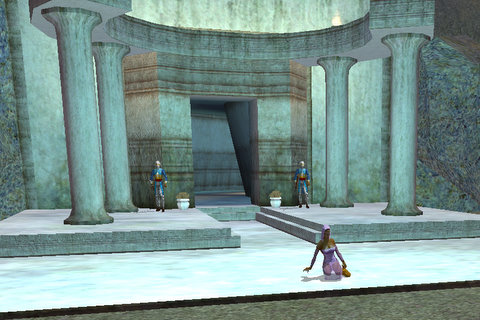

Back to: [West Karana](/posts/westkarana.md) > [2009](/posts/2009/westkarana.md) > [June](./westkarana.md)
# SOE Fan Faire news -- some shocking surprises!

*Posted by Tipa on 2009-06-26 22:15:58*

EverQuest II's next expansion is not Velious, as widely assumed based on the (now known to be) red herrings seen in Kunark. EQ2's next expansion, Sentinel's Fate, will bring the island of Odus back to Norrath.

At the same time (but not as part of the expansion), good races will be able to start in the frozen city of Halas, a move widely expected as it brings the number of good/evil starting cities to three each -- Freeport, Neriak and Gorowyn vs Qeynos, Kelethin and now Halas.

Sentinel's Fate also carries with it ten new levels -- raising the bar for endgame activities to level 90.

There was no word on new AAs, but there will be WoW-style achievements, so now you, too, can experience having your tank strip down naked for that "Tanking Venril Naked" achievement.

Yay.

My take: if people want to play WoW, well, look, right over there, OMG IT'S WOW! Go play it.

Did ya like skipping through Fallen Gate without a care in the world because it was grey to you? Auto mentoring is coming -- your level will be adjusted so that even low level zones are a challenge (and give xp and AA, of course). However, the loot still won't be useful.

The next game update introduces the Shard of Love -- Erollisi Marr's plane! This was never seen in the original EQ, so this will be an entirely new experience. I'm guessing there won't be pointless slaughter on this plane -- or I hope not.

Legends of Norrath will be introducing some cool loot cards. One's a dragon illusion -- you float along above the ground. Another, a cloak that repairs all your gear, once per day. That'll save plat for raiders.

Back in old EverQuest, their sixteenth expansion will be Underfoot, as in the Plane of, and Brell makes an appearance. Looks great for such an old game.

51/50 server announced -- progression server close second, talk to them in a couple of months. Special rewards for killing Naggy and Vox server first.

When is the new server, Mayong, going live? It's live NOW -- but only if you're in the Fan Faire. Which means -- those elusive server firsts? Going down tonight in Las Vegas. Sorry, second-come-latelies.

---

Other random notes:

FR will have new stuff for racers, including garages to build and tune your own carts.

Free Realms 4 million registered accounts by early next week #ff09 getting close

station cash for character xfer for station cash -- $25.00 in two weeks #ff09

can have an art book of everyone in your guild. #ff09 middle of july

teaming up with HP to offer high quality art prints of YOUR CHARACTER for station cash.

i thought he looked sick.

Brad Wilcox, head of customer service group. GM boss. They got rid of the Indian customer service. #ff09

Plat sellers in EQ/EQ2 -- Norrathian Underground Gnome Investigation Team -- NUGIT

270,000 plat sellers banned #ff09

---

iTunes has the Dares "It's Your World" song.

Free Realms soccer by Big Bang Entertainment. Release the summer, full quest line, player uniforms will match with guilds.

New area Home to the Dwarves. Dwarves live in desert. Druid job. Levels past 20. FR characters have FF tee shirts.

You can have trading cards of YOUR character -- you get 10 physical can redeem them for digital ones.

Purchased Octopod company. Pox Nora. 

Smed implies games will be coming out on PC and Mac, starting with Pox Nora.

DC Universe Online. PC & PS3. New trailer. No release date announced.

The Agency. Matt Wilson. 

SW:G. Six years old today. Star Wars Chronicles, player generated content system. New death troopers.

EQ. ten years old, opened march 16 1999. 10 year art book. 

EQ2. three month update cycle. 

## Comments!

**[Hudson](http://hudshideout.com/blog)** writes: I couldn't be less excited about an EQ2 expansion if I tried. Odus was like the Detroit of Norrath, no one wanted to go there.

Also, I don't understand auto mentoring. You mean if you zone into something it reduces your level OR it simply saves you the effort of right clicking and then mentoring someone in your group? So what they are saying is you cannot go back to old dungeons and take a look around with no fear of death?

Hey, I will ask all the dumb questions don't worry :)

---

**[Loredena](http://gnomedepot.net)** writes: Auto mentoring does not mean that you cease to grey out zones, with your level changing as you zone! It just means that if you know you want to go clear out every quest in TS, you can first hail someone in your city and say 'make me 25 again!' instead of having to find someone to mentor. Really, you're self mentoring -- but if while in TS you find a real level 25 to group with, you can switch to mentoring them. I wrote this up at http://gnomedepot.net

also, they did not compare their achievement system to WoWs -- it was based on XBox Live actually (and ironically). They talked about slayer, healer, crafter, explorer, and questor type achievements. by making it account based instead of character based they can have it include class specific achievements. As a rule, unlike WoW, there are not a lot of rewards to these, just bragging rights -- you get a guild announcement, maybe a title on occasion. That's it. It is simply a way to track for yourself what you have done. Most will be visible, but some won't.

---

**[Hudson](http://hudshideout.com/blog)** writes: AH found it :)

"Solo Mentoring (You won’t have to mentor anyone you can just level your level to what ever level you want)."

---

**[Loredena](http://gnomedepot.net)** writes: Solo Mentoring is setup in 5 level increments. You'll hail someone in your city (possible guild amenity as well) and specify which x0 or x5 level you want to be. So for instance if you wish to go clear out old quests in TS, you could ask to be set to 25. You will not level while in this mode (you gain exp and AA exp as normal, but if your 'real' level goes up you still stay 25 till you dementor). You also don't get the increased AA exp you do from leveling a real player, and, should you find a real player you wish to mentor instead, you can switch to doing so.

There will be missions starting at 80 that will send you out to do old content, at the appropriate level, thus using this mechanic. It seemed aimed in part at getting more activity in older zones, and in part in satisfying those people who want to experience revamped zones without either having to run it grey or find someone to mentor, yet don't want to roll up yet another alt (or any for those strange people who don't play alts ;)

---

**[Fan Faire 2009 – The Recaps &laquo;](http://stationbrenlo.wordpress.com/2009/07/17/fan-faire-2009-%e2%80%93-the-recaps/)** writes: [...] West Karana [...]

---

