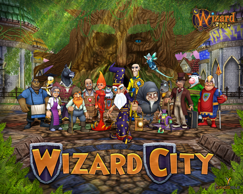

Back to: [West Karana](/posts/westkarana.md) > [2009](/posts/2009/westkarana.md) > [June](./westkarana.md)
# *EXCLUSIVE* Wizard 101 wallpaper!

*Posted by Tipa on 2009-06-30 17:56:54*

***
**EDIT**: I apologize -- the service I used to host the wallpaper instead shrunk it. I have replaced that link with a link to the full sized, 1280x1024 version.***

I got a shocking letter from Fernando Blanco of KingsIsle today. As a thank you gift for all the Wizard 101 players who read my blog, the artists have drawn up a "cast list" of all the faculty and staff at the Ravenwood School for the Magical Arts... look closely, because if I'm guessing right, Wizard 101 Director J. Todd Coleman himself (or someone who looks a lot like him) sneaked in while they were gathering for the photograph (see if you can pick him out)!

Click on the smaller picture above to view or download it at its full 1280x1024 size.

And yes, this is my desktop wallpaper now :)

Enjoy!

## Comments!

**[Stargrace](http://www.mmoquests.com)** writes: wow awesome!

---

**[Krystalle](http://www.krystallevoecks.com)** writes: That is awesome! Congrats on the exclusive goodies, Tipa!

---

**[Isaiah Spelldust](http://www.defendersofthespiral.blogspot.com)** writes: Where is J. Todd Coleman? I cant see him.

---

**[Isaiah Spelldust](http://www.defendersofthespiral.blogspot.com)** writes: Wait, do you mean the Bazaar?

---

**Tara Windwalker** writes: So clever and beautifully done. I'm happy for you. 

You deserve it. You have helped Kingsisle promote the Wizard101 game .... and, you have consistently given us wise gaming advice/tips.

I think that is Todd standing between Prospector Zeke and Dalia Falmea (fire school).

---

**[Ravious](http://killtenrats.com)** writes: Wow that is awesome!

---

**[Tipa](https://chasingdings.com)** writes: Yeah the Bazaar guy (just noticed he was). He looks JUST like J Todd.

---

**[Wizard101 poster/background and Grizzleheim &laquo; Exploring War Like Worlds.](http://exploringwar.wordpress.com/2009/07/01/wizard101-posterbackground-and-grizzleheim/)** writes: [...] Comment! Check out the free Wizard101 background on west Karana. [...]

---

**[MmoQuests.com » Random Game News](http://mmoquests.com/2009/07/01/random-game-news/)** writes: [...] and the new 18+ chat system, and a few other goodies. Speaking of goodies, be sure to check out Tipa’s site for some wallpaper goodies! I love how fast things come out of test for [...]

---

**[Robert](http://worldofsolitaire.com)** writes: Any chance of getting this wallpaper in 1920x1200 ?

---

**[Tipa](https://chasingdings.com)** writes: 1280x1024 is how it was sent to me. I can expand it in Photoshop if you like, but there won't be more detail.

---

**[Robert](http://worldofsolitaire.com)** writes: @Tipa
Aww. I was hoping the original was larger.
Enlarging it in Photoshop will just produce a blurry enlarged version.

Thanks anyways though :)

---

**Deja** writes: Hmm, your link isn't a 1280x1024 image ... its smaller than that. :(

---

**Deja** writes: Oh, awesome image, btw!!!!

---

**[Tipa](https://chasingdings.com)** writes: Hmmm you're right. Last time I host a picture at Photobucket. I'll fix it when I get home. Good catch - thanks'

---

**[Tesh](http://tishtoshtesh.wordpress.com/)** writes: Sweet. Now I want to pick W101 up again. It's one game that I'll likely never uninstall, and will likely always hold up as a good example, but there's just so much to do...

---

**[/AFK &#8211; July 5 &laquo; Bio Break](http://biobreak.wordpress.com/2009/07/05/afk-july-5/)** writes: [...] is offering up a spiffy — and exclusive — Wizard 101 poster.  Only the first thousand blog viewers can see it, [...]

---

**[J Todd Coleman](http://www.wizard101.com)** writes: Ha, nope, that it isn't me.... in actuality, it doesn't look anything like me. Guess again!

Todd

---

**joel** writes: Thx for the notice

---

