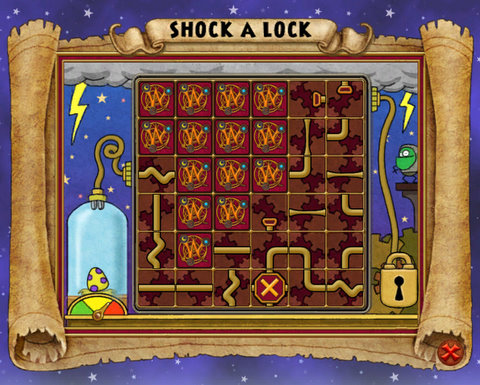

Back to: [West Karana](/posts/westkarana.md) > [2009](/posts/2009/westkarana.md) > [March](./westkarana.md)
# Wizard 101: Opening Silver Chests

*Posted by Tipa on 2009-03-05 06:46:30*

Has it ever happened to you? You're skipping merrily along some barren Dragonspyre (or Marleybone) street, and you see a sparkling silver chest sitting there in the road or behind a tower. You open it and are transported to a new mini-game that is over before you've figured out what to do?

What the heck do you do with them?

In many ways, this puzzle is like the train mini-game that everyone knows and loves as the easiest way to refill potion bottles, except here, instead of just rotating the tiles, you are sliding them around.

After a few seconds pause, the spark will come from the plug on the left and slowly travel among the connections until it reaches a dead end, or the plug on the upper right, which will shock open the box.

You make connections by clicking on one tile, and then click on any other flipped tile to swap them..

If you need more time, try to make a loop for the spark to stay in while you make the rest of the connections. If you can do this, you can take all the time you need to solve the puzzle and open the chest.

What's inside? Find a silver chest, practice your shocking skills and find out!

I have finally managed to kill enough spiders to have the crystal for my dragonrider staff forged, and I fashioned the staff itself at the forge in the Fire school in Dragonspyre Academy. After a perilous and solo climb through a tower to obtain the Last Dragon Egg, I am now off to find a crystal hammer with which to tap the egg just lightly enough so that my baby drake can claw its way out.

I imagine I will be sent to fight through various towers many more times to get some knickknack or other for my drake before I am allowed to ride it to meet Malistaire. But the end is in sight!

## Comments!

**[Malfi](http://mattexl.blogspot.com)** writes: I'm looking forward to playing with these! Sounds like a game I used to play that was sludge coming through sewer pipes and you had to control their direction without doubling back or anything. Tons of hours spent on that. But a question, how do I open OBSIDIAN chests? I see them all over the place, but they don't let me do anything to them. Do I need something special?

---

**[Tipa](https://chasingdings.com)** writes: The game you're talking about is "Pipeworks", I think, there's a version at [Pipe Works](http://digitalpostma.com/pipes/). It's what the "Choo Choo Zoo" mini game is based on. And yeah, this is pretty similar.

The Obsidian chests are part of the Dragonrider Staff quest -- you have to grab a piece of the staff from each chest, and they will only open if you are on the quest. I just finished that quest :)

---

**[Robert](http://worldofsolitaire.com)** writes: Hello

I enjoy reading your blog :)
I tried out Wizard 101 but found that the card variety between different schools was not enough and the card battles took a lot of time to play so I decided to stop playing. But I did like the nice graphics and the atmosphere of the game.

I would like to know what is in the silver chest :)
But I don't play anymore. Could you maybe tell us what you found in them for those of us that read your blog but don't play?

---

**[Tipa](https://chasingdings.com)** writes: Well, I have to agree with you about the length of card battles. I had to do a solo tower in the Drake Hatchery last night and that was eight levels of (solo) pain. I couldn't bring in my alt balance wizard to join me, either.

Actually, it seems like win or lose, you get the same reward -- gold and perhaps a rare treasure card. What I haven't noticed is if potion bottles get refilled; I'll have to check next time.

---

**[Malfi](http://mattexl.blogspot.com)** writes: Yeah! Pipe Dream is what I used to play. That hooked me BAD for a while. I probably have the old discs laying around somewhere.

That explains the Obsidian Chests. I'll just have to wait until I'm ready for that quest. Working through Krokotopia right now, but I'll probably be out of game for a as I pack and prep for moving (again).

---

**[Tipa](https://chasingdings.com)** writes: Note about silver chests: I just won the silver chest minigame, but it didn't refill any of my empty potion bottles! Oh well, would have been nice if it had. The reward was 70 gold, about average for a wooden chest in the area.

---

**[Caldabuse (Neiebuse)](http://www.twitter.com/cambrian_man)** writes: Hey, it's Malfi! I'm actually working on Kroktopia as well (finishing up Palace of Fire) so if you ever need help, let me know. I'm Devin SilverSpear in W101, so if you see me around, add me.

You know, as much as I'm enjoying Wizard 101, I have to say, the friend system can be a bit of a struggle. It would be nice to be able to have an account setting that just gave me a permanent friend code or something.

---

**Nestor D** writes: nice cool thanks for the info i well use your advise in the future.

---

**anyone** writes: can some one tel me how to get out the tower? plz

---

**daniel** writes: can some one tell me how to get out plz?

i bagged out you

---

**daniel** writes: my bad i mean beg of you

---

**[Tipa](https://chasingdings.com)** writes: Which tower?

---

**Lance** writes: I am doing the obsidian chest quest and cant get into the building in ancient burial grounds, wha tdo I do?

---

