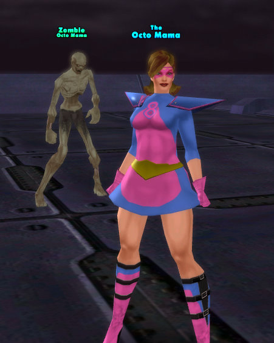

Back to: [West Karana](/posts/westkarana.md) > [2009](/posts/2009/westkarana.md) > [March](./westkarana.md)
# The League of Cruelty Presents: Octomom

*Posted by Tipa on 2009-03-07 15:19:05*

Name: Octomom

Power: Octomom has the mutant ability to raise an army of small children with which to wreak her will on a celebrity-starved society.

Weaknesses: No known source of income

Supergroup affiliation: Morning Talk Circus

Okay, I apologize in advance to the real 'Octomom', but ... how could I resist? I have to point out that on my CoH server, Freedom, "Octomom" and "Octo Mom" were both already taken, hence "Octo Mama". So, my bad taste is, at least, shared by two others :/

## Comments!

**[The Friendly Necromancer](http://thefriendlynecromancer.blogspot.com)** writes: hilarious!

---

**[Syp](http://biobreak.wordpress.com)** writes: Er... I grouped with an "Octomom" a few weeks ago... weird!

---

**[mjB](http://fargoneworld.blogspot.com)** writes: the good news is Victor Munoz is likely to profit more off of this fiasco than Nadya Suleman, as his lawyers are going to shred through that confidentiality agreement tomorrow and then we will get ALL THE DIRT! Yay!

http://www.associatedcontent.com/article/1544901/nadya\_suleman\_octomom\_empire\_crumbling.html?singlepage=true&cat=25

mB

---

