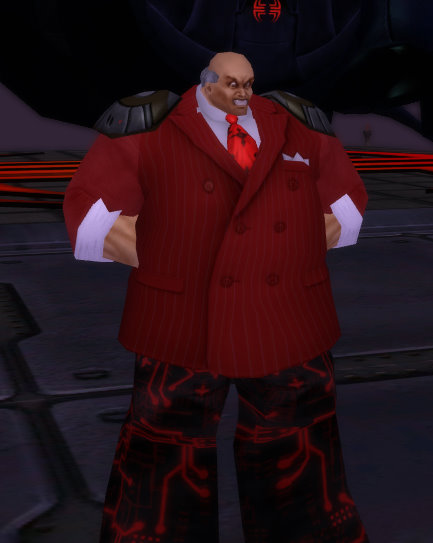

Back to: [West Karana](/posts/westkarana.md) > [2009](/posts/2009/westkarana.md) > [March](./westkarana.md)
# The League of Cruelty presents: Rush O Mon

*Posted by Tipa on 2009-03-08 11:45:51*

Name: Rush O Mon

Power: Rush O Mon uses the power of his voice, transmitted and amplified by the twin stereo transmitters on his shoulders, to attack and defeat his many opponents.

Weaknesses: Various addictions, powerful ego.

Supergroup affiliation: Leader and prophet of the Dittoheads. He has also taken shadow control of the minority governing party.

Gotta love character creators.

## Comments!

**[Sente](http://adingworld.wordpress.com)** writes: Are we seeing a bit of warming up for Issue 14?

I love that it is possible to save and load customes nowadays, so it is possible to start to work on mission design before Issue 14 releases. At least start creating some new villains, villain groups and contacts. And to save some old costumes for existing characters also.

---

