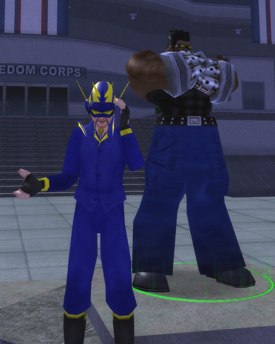

Back to: [West Karana](/posts/westkarana.md) > [2009](/posts/2009/westkarana.md) > [March](./westkarana.md)
# The League of Cruelty presents: The Teleprompter

*Posted by Tipa on 2009-03-09 22:09:49*

Name: The Teleprompter

Power: Never far from the halls of power, the Teleprompter makes sure his master stays ON message and doesn't say anything he isn't SUPPOSED to say.

Weaknesses: He has a position paper on the subject which he will distribute to you in triplicate. Stay on message. Emphasize the words correctly. Stay calm.

Supergroup affiliation: Longtime member of the Transition Team.

Still trying to figure out what kind of missions I'm going to write for the Architect. I was thinking, maybe you could free and then join a dance crew. Or something.

