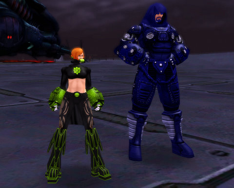

Back to: [West Karana](/posts/westkarana.md) > [2009](/posts/2009/westkarana.md) > [March](./westkarana.md)
# City of Heroes: Adversarious and Radium Red

*Posted by Tipa on 2009-03-11 07:07:43*

There's maybe two MMOs that I have played where the newbie grounds are always full of people. One is World of Warcraft -- when I played, there were always people around the newbie grounds. The other is City of Heroes.

It's going to be getting a lot busier, what with Issue 14 bringing along the Architect system, where people can make their own adversaries and mission arcs and then publish them for everyone to play. The spotlight of buzz will once again focus on this always innovative game.

Last night, after our TOTALLY SUCCESSFUL raids of Shard of Hate and Tomb of the Mad Crusader in EQ2 with the Ascarey raid group, Kasul and I headed into City of Villains for a little fun. Kasul has never played before, so instead of being awesome with my mid-level mastermind, I started over as well with Radium Red, a Tech Dark/Rad Corruptor, a build I'd never played before. Kasul rolled up Adversarious, a Brute. We made a leveling pact and headed into battle to deliver the Rogue Isles from the hands of the Snakes and the Infected into, well, OUR hands.

How many years since City of Heroes launched? And STILL, no game has matched the complexity of their character creator. Chronicles of Spellborn comes closest, of the games I've played, but even that game has only a fraction of the possibilities. Before you even get to work on your costume, you've already had to choose your origin, primary and secondary power sets -- choices which can never be changed and affect everything you do forever.

Kasul realized that he would probably end up rerolling as he learned his way around. Everyone does. CoH is NOT an easy game to pick up.

I spent some time browsing the CoH forums for information on Corrupter builds, which seemed to have two major themes. The first -- if you do things right, you will never get hit. And the second -- only babies need healing. If you play right, nobody on your team will need your healing powers.

With such awesome advice, I picked some long range dark blasts and spent the night picking off mobs from extreme range. After Adversarious died, I started tossing the occasional heal because we are apparently Insufficiently Awesome, which would be a great supergroup name.

There's a lot to like in City of Heroes, but I didn't mention to Kasul last night that the missions we did were -- well, pretty much what you do. The enemies get tougher and you get better powers, and there are the mayhem missions (which are a lot of fun), the mission arcs, strike teams/task forces, but, just as everything you do in Wizard 101 centers around playing a card game, everything you do in CoH centers around jumping into an instance and killing everything you find.

This is precisely why I've never been able to get out of my 20s in CoH. And why I'll be checking out Champions Online in June -- the promise of getting out of the warehouse is just too tempting.

But between now and then, there's Paragon City and the Rogue Isles to explore, and missions to architect, and time to enjoy all the many things that CoH just does *right*.

## Comments!

**[chadmango](http://chadmango.blogspot.com/)** writes: The endless 'door' missions is what seems to prevent me from playing CoH for long spells. I love the game, but my highest toon is only lvl21, and I've been playing on and off for a couple of years... I do however have a bucket load of alts lol.

Looking over your screenies I feel an urge to go create myself some new characters, see if we can't up the design stakes a little ;)

---

**[Green Armadillo](http://playervsdeveloper.blogspot.com)** writes: Yeah, I think you pretty much summed up my experience with COH. Best character generator in the business, but it's a problem when you enter your third mission and it looks just like the last two. For that matter, the first time I wandered down the street and stopped a bunch of petty crimes, I thought it was pretty cool. Then I walked down a different street and found yet more petty crime. It seemed against the superheroic nature NOT to stop criminals, but it quickly became a waste of time to actually stop and fight every trivial low level thug. I'd hate to speculate on the state of the economy in Paragon city if people still think breaking into storage units worth the risk despite all the masked crime-fighters on the streets.

---

**[Tipa](https://chasingdings.com)** writes: Or for that matter, how in City of VILLAINS, mostly you do exactly what you do in City of Heroes -- beat up bad guys. What you'd REALLY like to do is start a gang of your own with a thousand cookie-cutter minions, rent your own warehouse, and start beating up on the heroes who come to take you down. Having the CoV gameplay be essentially identical to CoH is just weird.

My highest character is 23, that's about as far as I can get, even though when a good team working together is kinda fun, and the costumes are usually pretty inventive.

---

**[Sente](http://adingworld.wordpress.com)** writes: Playing in teams often and have a regular group of friends to play with do a lot to reduce the issue with the similar missions. 

The game does a lot of things right and the often fast-paced hight-intensive team play even in shorter sessions works out rather well. But same as you I am really looking forward to see what Cryptic may be doing through Champions Online. 

For me the dominator archetype has also been a significant part of the attraction with City of Villains. It is a great archetype and the dominate skill design is brilliant I think.

---

**Graktar** writes: I've played City of Heroes on and off since it was released (well, since 2nd wave of beta actually) and only just hit level 50 on my first character last month, due to the reasons mentioned above. I found that once you get to level 35 you start getting more interesting missions, storylines, and enemies to fight, and there are a few mission arcs that are really really well done and make for some great MMORPG gaming moments. However, level 20-34 can be really drab (thankfully Croatoa is an interesting change of pace at the end of that bracket) and hard to get through. Once you get to 35ish though, you have the ultimate power from your primary set and the slots to make it useful, fresher more interesting missions and zones, and the leveling doesn't really slow down that much. It only took me a couple of weeks (at most) to go from 43 (where I last quit) to 50, playing casually. 

Full groups are where CoH really shines, as the gameplay gets much more hectic and the xp flies by. I'm really looking forward to the Mission Architect to try and recreate some of the adventures from my Heroes Unlimited campaigns back in the day, but wonder how it will work with groups and difficulty settings. Will it scale my end boss to a lt. properly for a solo player on heroic difficulty, or will it not scale at all, making the mission too hard for some, and too easy for everyone else?

---

**[almagill](http://travelswithatrollslayer.wordpress.com)** writes: I resub to CoH every once in a while, pay for a month, enjoy it for a day or two then drop the account. Again. But I know I'll be back someday for another run around with my uber level 20ish toon.

Or at least I DI Dknow I'd be back to fight aother day till I managed to seriously cark up my account details and couldn't resub last time. CS were as helpful as they could be (uh, if you can confirm the CC details from when you first registered... I can't remember a PASSWORD and you think I'm organised enough to have CC details from what, five? seven years go? How long HAS CoH been out?)

Still...

... I guess I could start a totally fresh account and start all over. It's not as though the higher levels are that different from the lowbie stuff after all ;) See! There's an advantage to that side of it... (if you scrunch your eyes up and try really ahrd to make it look like one)

---

**[Tipa](https://chasingdings.com)** writes: Heh well, no telling how long my stint will last. I've been subscribed since last summer but barely played. At the moment, just having fun with friends until Architect rolls around, but I have no illusions I'll be in CoH when Champions flies in.

People tell me the game opens up at higher levels, but my two highest level characters are level 21, and it's basically turtles all the way down.

---

**[Happy Brewday! &laquo; Shattered](http://shatteredblog.wordpress.com/2009/03/12/happy-brewday/)** writes: [...] of EQ2 I’ve been spending some time in City of Heroes with Tipa. I’ve been playing a Brute, which is the tank archetype and really enjoying it. My Brute is a [...]

---

