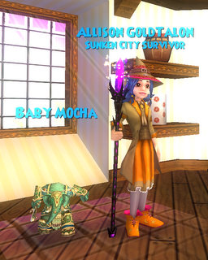

Back to: [West Karana](/posts/westkarana.md) > [2009](/posts/2009/westkarana.md) > [March](./westkarana.md)
# Wizard 101: St. Patty's day -- and new Crowns items!

*Posted by Tipa on 2009-03-13 07:22:39*

A funny little man dressed in green dragged me to my computer. "Log in! To Wizard 101!" he insisted. And when I started to do just that, he slapped my hands rudely from the keyboard. "No! Log in to the TEST SERVER! There all the new St. Patty's Day things you will see!"

"Gee," I said. "Thanks, Yoda."

I did find the new St. Patty's Day stuff. But I also stopped in on my friend Zeke the Prospector and found that he now carried new items for the discriminating shopper.

First, St. Patty's new wands. That's right, no new clothes from him, and the St. Valentine's Day gal hadn't brought any either. This is a GOOD THING, since until we have appearance slots to show a different outfit than the one that gives us stats, buying an outfit with no stats is not wise.

The wands cast Life magic, and as is usual now, come in different powers for different levels, so you can always find a wand that's good for your level. Wand? Heck, you can get an IRISH HARP!

|  |  |  |
| --- | --- | --- |
|
 wizardgraphicalclient-2009-03-13-07-34-54-60 |

 wizardgraphicalclient-2009-03-13-07-35-36-95 |

 wizardgraphicalclient-2009-03-13-07-35-25-49 |

|
 wizardgraphicalclient-2009-03-13-07-35-20-53 |

 wizardgraphicalclient-2009-03-13-07-35-14-93 |

 wizardgraphicalclient-2009-03-13-07-35-08-65 |

|

 wizardgraphicalclient-2009-03-13-07-35-04-72 |

 wizardgraphicalclient-2009-03-13-07-34-58-82 |

 wizardgraphicalclient-2009-03-13-07-34-54-60 |

The Prospector Zeke in Dragonspyre now sells level 45+ Crowns clothes, athames and rings. These are unusual in that they are not specifically an UPGRADE from the level 35+ items sold in Moo Shu, and they are certainly well below the level of many ordinary drops in Dragonspyre itself. Is this an effort to make the Crowns items less of a "must buy" for each new world? It's likely -- but it's weird that they aren't a real upgrade from the Moo Shu stuff.

I've bought the Moo Shu crown clothes, so here's a comparison between the stuff from Moo Shu and the corresponding Dragonspyre stuff. Click on the images to see them full-size.

|  |  |
| --- | --- |
|
 [wizardgraphicalclient-2009-03-13-07-39-19-14](../../../uploads/2009/03/wizardgraphicalclient-2009-03-13-07-39-19-14.jpg) |

 [wizardgraphicalclient-2009-03-13-07-39-45-61](../../../uploads/2009/03/wizardgraphicalclient-2009-03-13-07-39-45-61.jpg) |

|
 [wizardgraphicalclient-2009-03-13-07-40-17-29](../../../uploads/2009/03/wizardgraphicalclient-2009-03-13-07-40-17-29.jpg) |
 [wizardgraphicalclient-2009-03-13-07-40-32-41](../../../uploads/2009/03/wizardgraphicalclient-2009-03-13-07-40-32-41.jpg) |

|
 [wizardgraphicalclient-2009-03-13-07-40-44-35](../../../uploads/2009/03/wizardgraphicalclient-2009-03-13-07-40-44-35.jpg) |

 [wizardgraphicalclient-2009-03-13-07-40-58-50](../../../uploads/2009/03/wizardgraphicalclient-2009-03-13-07-40-58-50.jpg) |

.... and lastly, thanks to Kasul and Beckett's MMO Magazine, a glowy staff :)

## Comments!

**[Tesh](http://tishtoshtesh.wordpress.com/)** writes: Are those really negatives on gear? Interesting.

---

**[Tipa](https://chasingdings.com)** writes: Yeah, I wouldn't wear any of those new clothes over Moo Shu clothes. I'm not really sure where KI is going with them, unless they choose to lower the stats on all the previous Crown clothes to match, which would be an option I could understand. The previous tiers are overpowered. I only have one upgrade to Moo Shu crowns gear so far, and that's the Jade Oni tunic -- from Moo Shu. I haven't upgraded any visible slot with Dragonspyre gear yet, and I'm almost done with the expansion. And no upgrades to hat, robe or boots have yet dropped.

Dragonspyre has been, on the balance, a disappointment. The difficulty is extreme, but the rewards are few.

---

**[Ethic](http://www.killtenrats.com)** writes: I got the staff from Beckett as well. Looks cool and my balance wizard needed some 0p attacks anyway. Lots of players stop to look at it. Nice article by the way!

---

**[The Friendly Necromancer](http://thefriendlynecromancer.blogspot.com)** writes: I knew you'd put that staff on Allison! ;-)

did you try out the shared bank feature while you were there?

---

**[Tipa](https://chasingdings.com)** writes: No, I didn't. Was running late, trying to get article finished before work! I'm sure it works...

---

