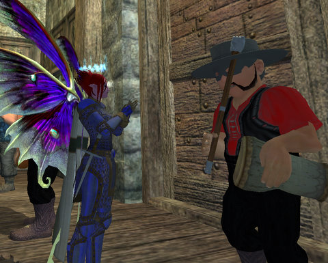

Back to: [West Karana](/posts/westkarana.md) > [2009](/posts/2009/westkarana.md) > [March](./westkarana.md)
# EQ2: Brewday, or: How did I end up HERE?

*Posted by Tipa on 2009-03-14 07:40:04*

...

No, please, just give me a second ... I remember it, at least I think I do ... Dammit, someone turn out the lights. Oh, that's the sun? Then could someone PLEASE TURN OFF THE SUN?

Gah. My head ... Oh, you want to know what I did on Brewday?

Damned if I know. The last thing I remember was getting together with the drummer from the band after a few of their songs and ...

Would you STOP MOVING SO FAST? I have enough trouble focusing ... well, just sit still or something.

Anyway, so I wake up back in the Guild Hall with a few kegs, a mostly-empty stone stein, a cabbage with eyes and an evil grin that calls me "Mommy", and a tattoo on my rear that says "Brell Was Here". I wouldn't even have noticed if it didn't hurt so damn much.

Anyway. I'm just gonna go back to bed for a week and then see a sage about getting that damn tattoo removed.

And if the sage so much as snickers, he's dead. DEAD.

## Comments!

**[Stargrace](http://www.mmoquests.com)** writes: Bwahahaha! 
Love it!

---

**[Green Armadillo](http://playervsdeveloper.blogspot.com)** writes: Good times. It's a clever holiday, I just wish it didn't involve zoning quite so much. I think I spent more time last night staring at loading screens than collecting items/getting drunk/etc.

---

**[Green Armadillo](http://playervsdeveloper.blogspot.com)** writes: P.S. Forgot to mention, I like the outfit on the Fae. It's always fun when you get to coordinate with your wing colors - I was thrilled to find a questline in Zek that coughed up an entire set of green healing leather for my dirge, cause suddenly she's got an all-green outfit in her appearance slots. :)

---

**[Tipa](https://chasingdings.com)** writes: Um... oops... I have an admission to make...

I changed her wing colors to match her outfit :(

---

**Milia** writes: You missed the best screen shot of them all. The troll chick in Gorowan. I'm going to be scarred for life by that one.

---

**[Tipa](https://chasingdings.com)** writes: I probably have it :) I take dozens of screenshots for every one I post here. But yeah --- brrrrrr.

---

