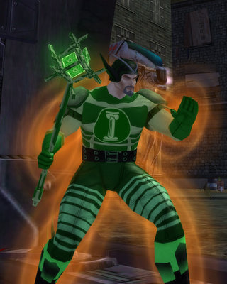

Back to: [West Karana](/posts/westkarana.md) > [2009](/posts/2009/westkarana.md) > [March](./westkarana.md)
# The League of Cruelty presents: Mad Money and leveling pacts

*Posted by Tipa on 2009-03-15 10:39:17*

Name: Mad Money

Power: Mad Money uses his infamy and notoriety to manipulate the financial markets of the Rogue Isles. Once a lowly hedge fund manager, the Complicit Netherworld Broadcasting Corporation recruited him and now use his powers for their own nefarious ends.

Weaknesses: He wilts in the face of laughter.

Supergroup affiliation: Minion and sometimes spokesman for the Complicit Netherworld Broadcasting Corporation.

---

Kasul and I finished up our missions in Mercy Island last night and headed in to Port Oakes. Port Oakes is where the game world expands -- you get the newspaper missions, the mayhem missions, teams are easily available at a wide range of levels. Leveling to eight wasn't too hard. I'd had a date with Thomas, the Friendly Necromancer to do the second half of the assault on Malistaire's Lair in Wizard 101, so i ducked out for a few minutes to save Dragonspyre, again, from the reawakened Dragon Titan. Kasul had to work today, so he decided to head to bed.

Heck, I wasn't sleepy :) After Malistaire refused, again, to give me his robe, I returned to CoV and joined a team and leveled us both, via the leveling pact, to level 10. This morning, I joined another team and reached 12... that will be enough. Well within sight of level 14 and our travel powers. I urged Kasul to go for flight because flying is so cool, but I ALWAYS choose flight, so I'm going with teleportation instead. Turns out that I got a temporary flight power by finishing a mayhem mission, so -- I can fly, AND soon be able to teleport!

## Comments!

**[Sente](http://adingworld.wordpress.com)** writes: First mayhem gives the raptor pack and the second a jump pack. Plus you can get additional flight packs from missions in Cap au Diable (Marshal Brass) and Sharkhead Isle (Lt. Chalmers). I usually do not have to pick a travel power until mid-20s at the earliest on villain side, even without picking up all those temp powers.

---

**[Tipa](https://chasingdings.com)** writes: I can see that you wouldn't have to, but I wanted to try out teleportation so much that I went and bought the power at 14, even though I had both the flight pack AND the jump pack. Teleport didn't disappoint. It's like flight on steroids. Thousands of feet above the city. chain-teleporting through the sky, and if you stop before you reach the end, you'll begin to fall and finally die.

I'm like a junkie, now -- I need more RANGE!

I paired porting up with the flight pack until I got confident enough that I wouldn't kill myself in those two seconds before choosing my next destination and porting out.

I like how 'porting removes momentum.

---

**Graktar** writes: Well, I was going to warn you away from Teleportation, but I'm glad I'm too late since it sounds like you like it. Teleportation is arguably the fastest and most powerful travel power, but it's also the hardest to use. I think my reaction time is just too slow these days, or maybe I'm lazy -- I like my travel powers to make life easier, not harder! Zooming out as far as you can makes a huge difference for teleport though. Since you can teleport anywhere within range you can put your mouse, the more of the area you can see the better teleport works. Teleporting straight through skyscrapers is pretty fun.

I tend to pick flight for ranged characters, and superjump for melee characters. Superjump is probably the best overall travel power due to being faster than flight but easier to use than teleport, and more versatile than super speed. Flight is by far the easiest to use, but sure is slow. Superspeed is a lot of fun, but the lack of vertical movement kills it for me in a game as 3 dimensional as CoH.

---

**[Tipa](https://chasingdings.com)** writes: Nah, teleport is an adrenaline rush. I love it. I keep getting myself into trouble with it on missions, though. Why the hell would I want to WALK to that group of Longbows when I can just PORT there!?

I never tried the superjump power from the mayhem missions before; since I always bought flight, I never really cared about the other travel powers, but now that I've tried jump out, I do like it.

I always guessed super speed would be fun until I came to a wall, so never tried it.

I want to commute to work by teleportation, 100 yards at a time. 112 yards with range enhancement.

---

**[Sente](http://adingworld.wordpress.com)** writes: Teleport is quite nice and is the travel power I have choosen from my brute, tanker and the highest controller. As you say, nothing like just appearing in a group of enemies when you are a big bad smash-stuff kind of type :)

Super Jump is the one I have used in most cases though and the travel power I have used on all my dominators - partially also to pick up combat jumping and acrobatics. In very three-dimensional areas like Grandville I find teleport easier than super jump though. But both are quite fun ;)

Super speed is quite fun also, as long as the areas are flat and the roads fairly straight. Works better in Paragon City than Rogue Isles.

An interesting effect will occur if you trigger a teleport just as someone does a Recall Friend on you. You will be transported to the friend's location and then immediately teleported to the destination location of your teleport. Have happened to me a few times and has caused some wtf:s from team members using recall ;)

---

