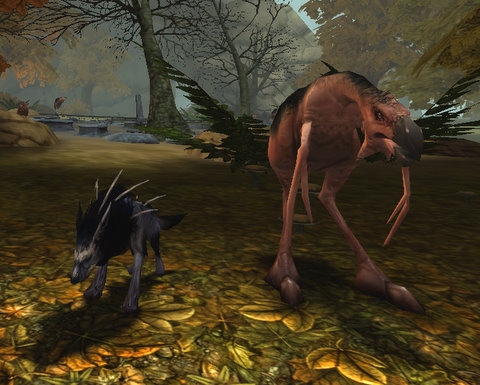
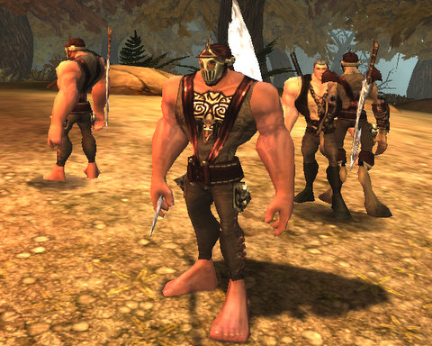

Back to: [West Karana](/posts/westkarana.md) > [2009](/posts/2009/westkarana.md) > [March](./westkarana.md)
# Chronicles of Spellborn -- the Skinshifter

*Posted by Tipa on 2009-03-16 07:35:02*

This isn't going to be a new player's preview to the Chronicles of Spellborn -- you can find links to that sort of information after this post that point to my experiences playing on the EU servers prior to the Acclaim closed beta, or take a look at Dragonchasers' excellent [initial impressions](http://dragonchasers.com/2009/03/15/the-chronicles-of-spellborn-initial-impressions/).

On the EU servers, I played a Rune Mage. My special power: Special tattoos that could be triggered to cause explosions. Rune mages are the EQ2 warlocks (or WoW frost mages) of Spellborn, and since many of my damage spells also triggered instant heals or heals over time, I felt very comfortable mostly tanking things, moving only to get out of enemy AOEs, but mostly just building and executing combos through the skill deck.

I got lambasted in a comment on Youtube when I posted a movie of my mage just kinda standing around, tanking while casting spells (which worked FINE for me). They said I should move around more (but why!?) When the Acclaim beta came around, I decided I'd try a melee class that moved around more, so I could experience that kind of play.

I decided to try the Skinshifter, one of the rogue disciplines.

While I was creating the character, I figured I might as well be really daring, and try out one of the non-human Daevi. They play identically to humans but are somewhat taller, and they have hooves. I expected most people to be playing humans, but I did see a fair number of other Daevi about.

One of the issues with Spellborn is that you really can't approach the game cold. From the very first time you level, you're asked to divide skill points between "Mind", "Body", and "Focus", without any clear indicator of which is best. The discipline you pick at level five will draw power from one of these, but if you have not looked ahead and already chosen a discipline, you might have points spent without much benefit to you in the long run.

This is the largest issue I had with both the Rune Mage and the Skinshifter -- I had to make decisions pretty much from the start on how I would play each class. I knew I would want to AE tank on my Rune Mage, so I had to invest in the kinds of spells that also healed, and the kind of spells that would trigger those heals, and AEs. I could have brought the mage in a totally different direction, but I figured out soon enough what I wanted.

For the Skinshifter, I wanted a character that could pull from extreme range and have the monster hurting before it came close enough to hurt back. Then have some debuffs and finally a nice selection of fast and positional attacks all on one ring of the skill deck, because I knew I'd be moving around a lot more with the rogue.

Here's a video of my char fighting a bear and moving around some. I was able to figure out later how to keep multiple mobs in each other's way so I would take even less damage, which is kind of neat. I mapped movement left and right on the skill deck to the mouse wheel, so I wouldn't have to take my hand off the movement keys to select a column. I pull on the right column, drop to the middle column for my two Distract debuffs, and then spend the rest of the fight on the left column. On longer fights, I move back occasionally to the middle column, but one of my Distracts roots me for a second, so that skill is going to be replaced.

By the end of the day, I was able to go four or five fights without resting, which is better than my mage was able to do. Some of the players in the beta claimed they never took damage. Well, I'm just not quite that good.

At level 5, I was invited to visit the academy in Hawksmouth City and choose a Discipline. I'd known from the start that this character would be a Skinshifter -- someone who could go where nobody else could go, someone who just has to see what's over that next hill, or in that Ousted tent. They change form to move around freely.

My first two Crystal Mazes -- the mystic devices which shift your skin -- were for a Wolf and one of the enemy Ousted.

As a wolf, no animal bothers me. I can dance with the wolves, doze with the dodos, hang with the hogs, whatever -- none of them mind having me around in the least. Run right through the forests instead of sticking to the roads? You bet!

The Hawksmouth City guards don't like wolves that much, it turns out. Not too much. Luckily, after they hit me once, I automatically shifted back to my Daevi form, and they were okay with that. That didn't work so well when I stumbled upon a group of Ousted. They don't like wolves AND they don't like normal Hawksmouth citizens much, either. That particular misstep was my only death of morning, and dropped my PEP from 2 to 1 :(

If I'd remembered to hit the Ousted crystal maze instead of trying to run, I'd have been fine. I may not look too pleasant as an Ousted, but I can walk right into the center of any Ousted camp, give the secret sign and just be one of the guys.

I can't attack them, though. You can't attack things or use any ability (can't even learn a new skill!) while shifted.

The Skinshifter wasn't quite what I expected. I was very much looking forward to appearing to be someone's friend, then stabbing them in the back while people looked on, wondering why their friend was going berserk. As it is now, I can walk into an Ousted camp, but if I want to attack them, I have to go hide somewhere, shift back to normal form, and attack like any other class.

That said, I might still take another look at the class in the live game. But for now, I'm going to move on to my next selection: The Void Seer. As close as the game gets to a pure healer.

## Comments!

**[Pete S](http://dragonchasers.com)** writes: If a picture is worth 1000 words, a You Tube video is worth 3/4s of a blog post! I should have just linked to that video instead of describing the circling combat (though your circling is a lot more controlled than mine).

Looking forward to hearing about the Void Seer!

---

**[Saylah](http://notadiary.typepad.com/mysticworlds)** writes: Screw comments on YouTube the defining criteria for correctness is did you survive? Yes, then you're style is you're own. While i don't doubt that strafing around helps some people are really good at that myself among them. I did just fin in AOC as a Bear Shaman moving a little here-n-there but mostly standing toe-2-toe and duking it out.

The game looks nice. Still not sure I'll give it a whirl. I'm sick of Acclaim like of I'm sick of mark jacobs.

---

**[Saylah](http://notadiary.typepad.com/mysticworlds)** writes: I meant "are NOT" good at strafing.

---

**[Chronicles of Spellborn: The Void Seer | West Karana](https://chasingdings.com/index.php/2009/03/19/chronicles-of-spellborn-the-void-seer/)** writes: [...] I posted about the Skinshifter, which included a video where my character circle strafed a lot to avoid a mob’s special [...]

---

