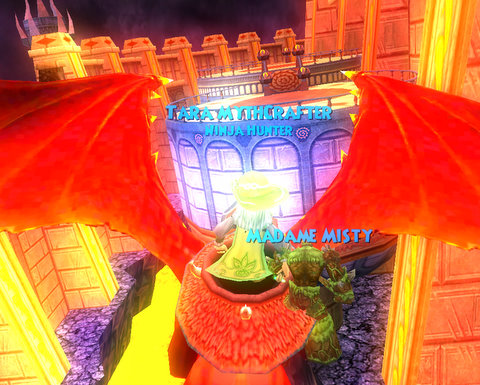

Back to: [West Karana](/posts/westkarana.md) > [2009](/posts/2009/westkarana.md) > [March](./westkarana.md)
# Wizard 101: Father Drake's Tower

*Posted by Tipa on 2009-03-18 07:44:32*

Malistaire has gotten a really bad rep. Sure, he destroyed parts of Wizard City, stole the Krokonomicon from Krokotopia, plotted with Marleybone's nefarious Dr. Katzenstein, nearly killed the Moo Shu Emperor, and teamed up with the Dragon Titan whose army destroyed Dragonspyre, but really. Can you blame him?

Think of what Wizard City was like, pre-Death professor going berserk.

"Oh, hello, new students. Here's your wand. There are no monsters wandering the streets of Wizard City, so go about your business. Don't worry about Professor Malistaire, he may seem gruff, but he likes puppies and loves his wife. If he should happen to go insane, I'm sure your experience never casting the one spell you have will be adequate to stop him."

Now, post-Malistaire-berserkination, Ravenwood no longer turns out weak wizards who aren't quite sure which end of the wand is the holding end and which is the DON'T TOUCH THIS end. It's turning out WARRIOR WIZARDS. WARZARDS. WIZZIORS. Stone cold killers who think nothing of eliminating hundreds and hundreds of enemies.

"Oh, hi, random wizard from the past. Yes, I am sure you were a great wizard in your day. Yes, I would love to have heard more of your story but it seems my balance blade, life blade, life trap and a BIG HELPING OF CENTAUR BUTT has rudely interrupted you."

Anyway.

Stone cold killer wizard I may be, but Dragonspyre fights are so long and so tedious. When I found out the very last tower, Father Drake's, was one I could not bring my alt, Allison, along on, I took a break. I came back a couple of days later with potion bottles full and my short deck trimmed, primed and ready, and took it on.

It wasn't actually that bad, and my trip up the tower really impressed Father Drake, who was more than happy to give me all the scales I could ever need with which to forge my drake's armor.

Oh yes, I do have a drake now!

I found its egg. I warmed and hatched it. I learned how to care for it. I spent days attending to every one of its needs. I read everything I could find on the subject of drakes. I forged armor taken in bits from hordes of insanely powerful creatures. I pledged my life to it, and it to me.

ME+DRAKE, 2GTHR 4EVR

And what can we two soulmates do together?

Well, he'll fly me to the Dragonspyre Academy Headmaster's Tower, ie, Malistaire's Lair.

And... well, that's about it.

It says it cannot leave Dragonspyre, and I can accept that. But why can't it help me fight while I am IN Dragonspyre? We're best pals, right?

*Like the wizard holds on to her wand,
Like Kraysys keeps hiding my hat,
Like me singing this song,
You'll never recover from that,

Let the others fight and fuss,
Cuz you and me, Drake, we've got us.......

Me, and my hatchling
(We're closer than Marleybone mobs)
(We're closer than shimmering blobs)
Strolling Triton Avenue
Wherever you find it, you'll find me if you look
Hidden behind some wizardly book
Me, and my hatchling
(We're closer than a duel when you're out of cards)
(We're closer than any two other wizards)
Not a soul can bust this team in two
We're stuck together like glue...*

Anyway. I'm not old enough for that song. My mom liked Frank Sinatra, okay? So SUE ME.

Anyway. Huge drake pet would be a total win. Or a card or something. But he just brings me on a one way trip to Malistaire.

Thomas and I killed Mali times #4 and #5 for me. Still no robe, but I did finally get my school ring from the Helephant that had it. Allison got the life blade, and we still haven't seen the life robe drop for anyone yet. I hope the good Thomas and his crew will be up for attempts #6 and #7 on Malistaire's life soon -- and this time, I have the quest to take him down!

Thomas [reported on an interesting trip](http://thefriendlynecromancer.blogspot.com/2009/03/quinn-hexthief-rocks-austin-texas-in.html) someone else had taken to the KingsIsle headquarters where, among other fascinating bits of news, they hinted at an upcoming feature for Wizard 101 that is their own take on a feature seen in other genre games.

They didn't say what it was... but I bet it is the Wizard Islands we've heard so much about. An island for just ourselves! A home away from home! Where we can let all our pets roam free! Now wouldn't THAT be nice?

Looking forward to it almost as much as I am looking forward to the St. Patty's Day stuff, not currently live in W101 as of this morning, the day after St. Patrick's Day :P

See you around Ravenwood!

## Comments!

**[The Friendly Necromancer](http://thefriendlynecromancer.blogspot.com)** writes: count me in 6 and 7!

---

**Nestor D** writes: nice it would be awsome if that dragon pet would fly you everywhere you want and be awsome if you flew to the commons at wizard city and everybody is like wow look that girl just came from a here from a flying dragon.

---

**[Tipa](https://chasingdings.com)** writes: I totally agree :)

---

**[shanejr1](http://wizard101)** writes: wow i did not see that befor couse im new to wizard 101

---

**elijah** writes: damn i am just level 10

---

**robert darkflame** writes: wow now i really wanna go there
if you are on Christmas can you help me with some quest there on the helephant realm from the portal

---

**lilli** writes: i need to get on level 10 really badly inset of buying cronws!!!!!!!!!!!

---

