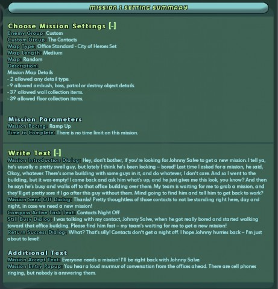
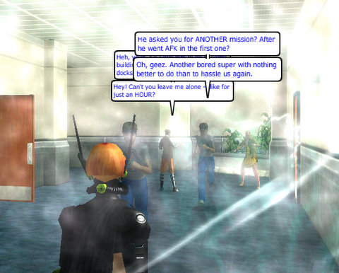
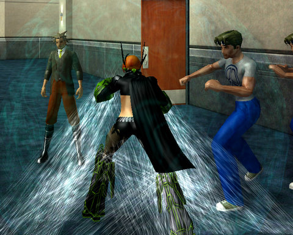

Back to: [West Karana](/posts/westkarana.md) > [2009](/posts/2009/westkarana.md) > [March](./westkarana.md)
# City of Heroes Architect system: Don't you know that you're my hero?

*Posted by Tipa on 2009-03-19 07:45:35*

It's the wave of the future. No, it's not the wave of the future. Handing the level making tools to the players is the wave of the past, and it's made game after game stick around for years past the "sell by" date. Half Life, Warcraft III, Unreal 2... It doesn't take a genius to see that tapping the boundless enthusiasm and creativity of your players can be a *good thing*.

There's no good reason this hasn't become a larger part of MMO gaming. City of Heroes has always been an innovator in the MMO world, so it's really no surprise that they were the first to make a really bold move into player-created content with the Architect system that comes with Issue 14, and in open beta now.

After a lengthy patch and a long wait for the servers to slow down enough to squeeze in, I ran to the Architect offices, found a spare console, and started to create. I got the Thrill Seeker badge just for showing up, and time toward the Architect day job by logging out in the Architect offices.

The concept behind Architect is that you are making a holodeck mission for the enjoyment of you and your friends. This is a holodeck mission with player damage turned ON, but the rewards can only be spent on items the Architect corporation sells. The rewards might be virtual, but the experience is real, and ... it's okay to have a little fun with it.

I called my mission, "Contacts Night Off". What if all the mission contacts who seem to have no lives aside from standing around, waiting for a hero or villain to call them about a mission, just decided to go home? And sleep? Or just not get hassled by mission-seeking players?

  
*Click to see this at full size*

Any new story arc starts with a contact. But -- they've all gone home! Enter Sammy Super. Sammy's got a team waiting for him to grab a mission and get the heck back before they get bored and kick him out of the team. All he wants is a mission -- but his contact, Johnny Salve, just walked off and isn't answering his cell phone! He can't go after him because he's in a super team and they'd be pretty pissed if he went off and did a solo mission without them -- but maybe you could get Johnny and tell him to get back to work?

Sammy Super is impatient and whiny, but you've noticed that all YOUR contacts have gone missing as well. It's in your own best interests to track them down. So you accept, and head out -- or in this case, head into the light.

  
*Click to see this at full size*

The process is fairly painless; you can quickly make a mission simply by choosing goals, enemy groups (and you can pick from any enemy group on both the hero and villain sides), any special NPCs, special mission objectives -- if you ever encountered something in a mission, it's available to you here.

I made a custom enemy group called The Contacts, with various levels of NPCs dressed in contact-y clothing. The kind of NPCs you might take a long look at and wonder what sort of mission they would give. Minions, Lieutenants, Bosses... and beyond that, several ranks of more difficult enemies. And of course, for the end of the mission, the rogue contact, Johnny Salve.

The bare bones of a mission created, I set it to test mode and entered the mission I just made.

Sammy Super stood before me, complaining about the rudeness of contacts these days.

Ah, Sammy Super. Could anyone be as generic as you?

I battled through hordes of contacts who just wanted to be left alone and it turns out all those people weren't quite as defenseless as they'd have us believe. They put up a heck of a fight, but in the end, I defeated them all, and finally came across Johnny Salve, chatting it up with other lazy contacts.

The jig's up, Johnny. You're coming with me.

Final verdict? Too soon to say. It is extremely easy to write a mission, but you can't color outside the lines. My first idea -- go backstage at a concert, gathering backup dancers for a huge dance off -- was impossible. You can only do what missions do, and while you can choose from every single animation in the game, you can't really get people to follow you and then do a dance routine.

But if you want to make your own enemy groups, your own supervillains to fight, your own story -- heck, if you just want to make a mission populated with you and your alts that recreate some of your most famous fights, you can do that. Want to make a mission with just straight up action and constant fighting? You can do that. Want to make a murder mystery? Mmm... I think you could do that.

It won't be long before all the really good MMOs come with these sorts of tools, but for now, you have to come to City of Heroes to get a glimpse of the future.

Big win.

## Comments!

**[Jason](http://www.channelmassive.com)** writes: Nice information Tipa.

City of Heroes design lends itself well for player created content, but I'm not sure how you would implement it in some of the other existing MMO's out there. Guess that's why I don't get paid to make games. :)

Jason (resident drunken idiot of Channel Massive who likes to sign his comments because it makes them 10x more valid)

---

**[Hudson](http://hudshideout.com/blog)** writes: Very cool. I have not had time to check it out in beta, I did get my controller to level 10 last night via a nice sewers run and some Kings Row team ups. I think I will wait for the general release as I am still making alts to find that one character that clicks with me.

---

**[almagill](http://travelswithatrollslayer.wordpress.com)** writes: Looks interesting Tipa, though I might leave it till it goes Live rather than burn out my whole ONE idea too soon.

How does the scenario editor compare to the one in Saga of Ryzom (if you tried that?)?

---

**[Kasul](http://shatteredblog.wordpress.com)** writes: As long as you can script in ambushes and design your own enemies that's a great step forward. Really looking forward to trying it out! :)

---

**[Tipa](https://chasingdings.com)** writes: I've not tried the one in Ryzom. The only level creator I have used prior to this is Neverwinter Nights 2 -- and this is TONS easier, though without, of course, the level of customization. The Architect system makes CoX missions, and there's limits what you can do. Though, by stringing together mission objectives and story arcs, I think you could end up with something pretty new. The more exposure you have to the more complex CoX missions, like the Task Forces, the more aware you'll be of what can be done with the tool.

@Hudson -- I'm years into CoX and have never gotten a character above 21 precisely because I never found a character that does everything right for me, though my mastermind comes closest.

@Jason -- well, most MMOs are more complex than CoX, which is built around these sorts of missions. But I'm sure there are WoW players who could take some boring dungeon like, say, Wailing Caves in the Barrens (or Wailing Caverns, don't remember which it is called), and fill it with their own plot, NPCs, objectives and loot. It could be done.

@Kasul -- yup, it has ambushes and a bunch of other triggered events. One thing I didn't check is if you could do Mayhem-type missions. I think the possibility for writing stories with this system -- writing COMICS -- is going to be pretty cool.

-- Tipa (who refuses to sign comments because her name is in big blue letters above the comment:) )

---

**[Pete S](http://dragonchasers.com)** writes: Thanks for the write-up! I've been thinking of following the herd into CoX for a re-visit. I always enjoy the 'come back for a weekend free' periods, but never quite enough to throw down $$ for a month. This might be the thing that gets me over that hump.

So how are missions distributed? It sounds like the files are local, not on the server, so do you have to download a friend' mission from outside the game or something?

---

**[Tipa](https://chasingdings.com)** writes: Files are local during your own development, then are sent to NCsoft when you publish it.

The Architect stuff is why I have stayed subscribed to CoX for so long. I've always wondered if I could do a level designer's job -- something I have always wanted to do. Now's my chance to find out.

---

**[City of Zeroes (and Ones) &laquo; Bio Break](http://biobreak.wordpress.com/2009/03/19/city-of-zeroes-and-ones/)** writes: [...] 19, 2009 by Syp Tipa over at West Karana took the new City of Heroes Architect system out for a spin (it’s in open beta now) and found it both easy and a tad restrictive.  But I agree with her [...]

---

**[Tipa](https://chasingdings.com)** writes: Notes to self: Story #2 -- Sammy Super's team got tired of waiting, and went into a mission without him, and got into trouble. Sammy Super can't bear to face their scorn, so he wants the player to go free them. Story #3 you saved Sammy Super's team, but they were so mad that they kicked him off the team until he can prove his abilities by singlehandedly defeating a boss. Because this whole thing is YOUR fault, he insists you help him.

---

**[Sente](http://adingworld.wordpress.com)** writes: The CoX missions are formulatic and there is indeed limits in what you can do. But that is also what makes it easy to use.

I played around a little bit with the Ryzom Ring editor when it was initially released. It provided more flexibility in scripting what you could do, what the environment would look like and the behaviours of the critters involved. But with that freedom also came complexity.

Mission Architect does allow to create something playable in a short time. It may not be the greatest content ever created, but people can easily get the satisfaction of actually have created *something*. They still have enough features in there that it does not have to be too simplistic.

---

**Graktar** writes: Has anyone done a little tutorial write up of how to actually use the thing? I'm interested in playing with this, but simply don't have time to learn how to use it through trial and error (even if it's fairly easy). Case in point, when I tried to check it out last night I was about 5 minutes into it before being interrupted by collicky baby. Sigh.

---

**[Tipa](https://chasingdings.com)** writes: It's really easy, just filling out forms and clearing the errors, but I haven't seen a specific tutorial yet. The NPCs in the area will tell you enough to get you going.

---

