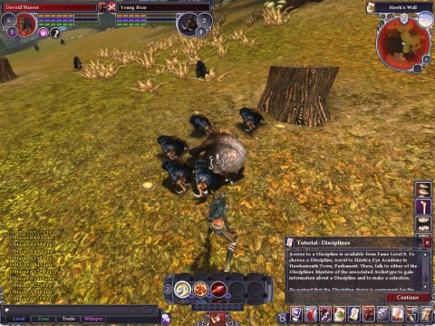
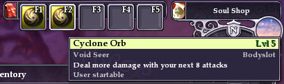
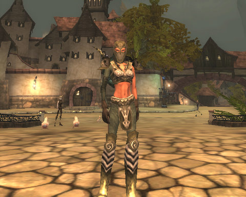

Back to: [West Karana](/posts/westkarana.md) > [2009](/posts/2009/westkarana.md) > [March](./westkarana.md)
# Chronicles of Spellborn: The Void Seer

*Posted by Tipa on 2009-03-19 23:40:57*

The second round of closed beta has begun, all the old characters were wiped away (well, at least mine were), so I started up a new mage and brought her through level 5 so that she could become a Void Seer.

Void Seers were, I thought, going to be pretty close to a basic healer. This isn't the case -- not at level 5, anyway. The only heals she has are the heals all mages get (and every class gets some kind of heal, even if it's self only). Mage heals are curses placed on a monster, and when that monster gets hit with melee, ranged, or magic (depending on the curse), the group gets healed. To heal in Spellborn, you don't spam the "more healing" button. You attack more.

After I [posted about the Skinshifter](../../../index.php/2009/03/16/chronicles-of-spellborn-the-skinshifter/), which included a video where my character circle strafed a lot to avoid a mob's special attacks while positioning myself to deliver powerful flanking and rear attacks, a lot of people decided that Chronicles of Spellborn required too many twitch skills to play.

That's going to be true -- if you play a rogue. Warriors and spellcasters play different ways.

Mages, in particular, only need to move to avoid AEs and lingering damage attacks, like poison. No matter what your class is, if you see a monster pausing to use a special attack, you're going to want to step to the side or something.

Nonetheless, I went into the game tonight to show just how little you really need to move, as a mage. Here's my level 3 mage taking on a level 4 boar -- and ending the fight with nearly full health. Watch.

I was killing for a quest in the boar fields behind the lumber yard -- and this is not a good place to fight. Adds everywhere. Stuff just kept adding to this one fight. By the end of it, I'd killed five boars and one bear -- and ended the fight at full health. I did move around a little to keep everything in front of me and bunched together for my AEs, but nothing really twitchy. Click on the picture for the full, unaltered, screen shot.

So those people who insist the only way to play is to move about madly? They're scaring you. You DO have to move out of the way of special attacks, especially out of the newbie fields when monsters begin to use all the special abilities YOU have. But you don't have to always be moving; just generally be aware of what the mobs are doing and don't let them get behind you, and you'll be fine. Moving all the time is going to interfere with your ability to build and manage your combos, and combos are key to survival, so ask yourself -- how much are you really getting from running around?

Anyway. The Void Seer.

Every discipline gets special "body slot" abilities -- the class-defining abilities. For the Rune Mage, these are special glowing tattoos that can be pulled from your skin and tossed on the ground. For the Ancestral Mage, these are your pets. For the Void Seer, these are special attacks.

The Rune Mage is the AE mage. The Ancestral Mage is the pet mage. The Void Seer is the DPS mage (as near as I can tell). I haven't particularly seen anything at level 5 which suggests they are the best healers, but from what I understand, mages in general have decent heals, so while some later abilities may give them a healing edge, you'll be able to make do with another sort of mage in your group -- plus, the warrior classes have various ways to help keep their groups alive.

The first bodyslot ability Void Seers get is Cyclone. This makes their next eight melee attacks strike with far more force. Combine that with the ability that heals the group whenever you hit the cursed mob, and you can see why Void Seers won't be stepping out of the melee to heal from afar. They are going to be right in it.

I bought two of them so I'd always have one ready. My only objection with Cyclone is that stuff dies too fast to get decent healing from killing it. That will change, I know.

Having played Skinshifter, Rune Mage and Void Seer thus far, I'm still no closer to deciding what class I'll play when TCoS goes live. I kind of want to go back to the Rune Mage, because I've figured out how to build my skill deck now, and think I'll do a lot better now. But I want to try out a warrior class, and I think I would like to see what the Ancestral Mage brings.

Warrior next, though. For one, I'd like to see if they have to strafe to live, or if, like the mages, they have enough built-in healing to take a beating and survive to give better than they got.

