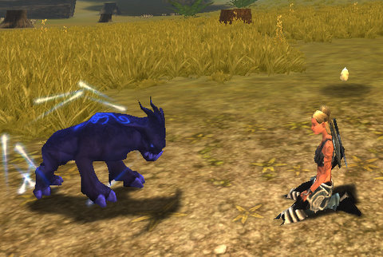

Back to: [West Karana](/posts/westkarana.md) > [2009](/posts/2009/westkarana.md) > [March](./westkarana.md)
# Chronicles of Spellborn: Adventures in Newbieville

*Posted by Tipa on 2009-03-21 07:52:18*

One of the really great things about the open beta is that it is the FIRST time, my time on the EU servers included, where there were enough people running around that it felt like an MMO.

You could go from Hawksmouth City to the docks without happening upon even one Young Bear last night, I kid you not. I'm surprised there were any older bears, seeing as how we completely slaughtered the next generation.

I logged on to Spellborn to find the Void Seer I'd made the night before was gone, so with no older characters to hold me back, I made three new ones: a rogue, a warrior, and a mage.

|  |  |  |
| --- | --- | --- |
|
 sb_client-2009-03-20-21-17-27-04Dina, the Rogue |

 sb_client-2009-03-20-21-17-31-39Nashuya, the Warrior |

 sb_client-2009-03-20-21-17-37-62Tipa, the Mage |

... just to reserve the names. I started off with Tipa, intending to make her into a Rune Mage by and by.

Because the trash mobs were so camped, it took a little longer to reach level 5, where I could choose my discipline. But I didn't get around to heading back into Hawksmouth City until I was well into level 6. Running takes so much time, it's better to complete all the quests in an area before you take long trips.

When I finally made it to the Spellcaster Academy, I was chatting with the Rune Mage instructor and realized that I'd *done* Rune Mage. Sure, only to level 13, but it was *terra cognita* just the same. And I'd just made a Void Seer the night before.

I stood in front of the Ancestral Mage teacher for awhile, then, reluctantly, agreed to follow his path. Now I'll never be lonely. I make my OWN friends!

The client crashed, so I called it a night.

This morning, I headed back in, hoping to finish the Hawksmouth quests so I could move to Aldenvault, where the real fun starts. Well, Quarterstone is where the really real fun starts, I guess.

Anyway. I finished up a couple of quests. People in zone chat were talking about one of the named mobs in the newbie fields, a level 10 boar named Old Winifred, a mean old bird. I knew just where she was, and I was soon grouped with another mage and we were on the hunt.

I was being followed, however, by someone who knew I knew where the boar was... and he tagged it just as my group was about to engage. We killed it, he got the credit somehow.

He did this a couple of times before wandering off. Then we found someone else had her (respawned) on the road. He was level 8, but the battle was not going well for him. Old Winifred saw us, then, and remembering the pain we caused her in her past lives, charged straight at us. Not really wanting to kill her again for someone else's benefit, we ran off, circled back, and now the warrior wanted to group up for the kill.

Great idea! We grouped up and soon had her dead, and the quest completed. Headed back to the city for the turn in, I dinged 7 and was a good way into it. I guess those wanted posted quests are pretty lucrative. We headed out for more named mobs, but after being ambushed by a crowd of higher level Ousted, things went south -- and then my client crashed again.

Those crashes are annoying, but since I have other things to do today, it was just as well.

## Comments!

**Tierrunner** writes: The level 8 pet is super neat...doesn't attack but it's doesn OTHER things! Muha...Muha......Muhahahahahahahahaha!

---

**Tierrunner** writes: ACK I meant lvl 10!

---

**[Green Armadillo](http://playervsdeveloper.blogspot.com)** writes: I take it the bears are actually beatable these days? I was in the closed beta at some point, and the bears were, for whatever reason, insanely powerful compared to players or mobs. It was amusing and/or unfortunate, depending on whether or not you needed to kill them. :)

---

**Tierrunner** writes: Nah this is the same thing as the US closed beta. The bears are the same, and they must be crushed!

---

**[Tipa](https://chasingdings.com)** writes: It's the wolves I hate.

Either you have healing or you avoid the damage; one thing you cannot do in Spellborn is stand toe-to-toe with something. EVEN in groups, as we found today with Old Winifred and that other guy we attempted.

---

**Drew** writes: The named mobs provide absolutely insane amounts of fame upon turning them in. Getting 18k fame for being lucky enough to join a group that invited me as I ran by compared to my other quests in the second zone giving me between 250 to 2k fame....I am beginning to wonder if it is plausible to simply form a big group and level just off named mobs and wanted posters. :/

Things are fairly empty once you're out of the first zone. Only grouped up that once since leaving and there is almost no chatter to speak of. Go out even further to the pvp enabled zones and it is virtually empty.

And for all the complaints about spawn rates...I'm personally thinking they are too fast as every single death I've had is due to whacky mob respawns (ie: killing a group with a sliver of health left to have them all instantly respawn on top of me 1 second later). Classic "Woooohoooo-FUCK" moments. :) 

Still, having fun. Just wish people would give Acclaim money and get past level 7.9 already so I didn't feel like I was back playing on the European servers. :p

---

**[Saylah](http://notadiary.typepad.com/mysticworlds)** writes: @Tier - Just from reading Tipa's post I think there's a lot to consider before deciding to pay money. The combat system is new, for me Acclaim is new - I haven't played any of their MMOs and I think people are realizing finally, that the 2 week shine of new can be deceiving. They're also cognizant that the new player experience is way more polished that what comes after. Both of these points should have always been obvious but I think we've had a few games come out that have drawn these matters in stark relief in player's brains, if they feel among the "burned"

If people feel like me, it's going to take feeling VERY sure that I'm going to want to play for a few months at least before committing any money on a subscription. That or the initial experience has to be so amazing and unique that it grabs you instantly. Of recent note, only Wizard101 struck that chord for me and even then I waited until I had to pay to access the next zone before committing myself to a subscription.

---

