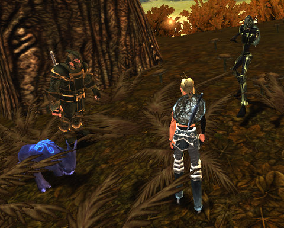

Back to: [West Karana](/posts/westkarana.md) > [2009](/posts/2009/westkarana.md) > [March](./westkarana.md)
# Chronicles of Spellborn: Grouped!

*Posted by Tipa on 2009-03-24 07:59:49*

The Chronicles of Spellborn is a game you can solo, start to end, never having to group. But while it's possible, it's not a really good idea. Some things you can only do in groups -- like the Wanted posters. Those give quests to kill a named mob and give a HUGE amount of experience when you kill them. But if you go it alone at the level you get the quest, you won't last long.

Now that both of us are back from our vacations, Kanad and I joined up last night to bring more terror to the boars and bears of Hawksmouth. He's playing a warrior, me a mage -- when Jalent logged on with his rogue, it miraculously became the perfectly balanced group.

We slaughtered lots of wildlife, Kanad leveled and picked up his Discipline, I finished up some quest lines in the area. When Jalent suggested leaving the overcamped newbie fields to head to the 'next up' zone of Aldenvault, it seemed a good chance to see something relatively new.

Several crashes later, Kanad went to bed and we picked up another mage, name of Demetrius (or something like that). We were just minding our own business, saving a local farmer from [raptor attack](http://www.xkcd.com/135/), when this tiny, tiny hyena started attacking us. He was level 20, but we weren't going to give up.

Even if we were attacked by a dozen raptors during the course of the fight.

Even if we stumbled into an Ousted camp.

I don't know how long the fight lasted. Ten minutes? Easily. Fifteen? Perhaps! For three level 8s to take down a level 20 took a lot of teamwork, a lot of trading off aggro, a lot of close calls.

We finally brought him down. And then we went to the little hamlet in the center of the zone and GOT THE QUEST TO KILL IT. Which, naturally, meant we wouldn't see him the rest of the night.

We tried for another wanted poster. The target was a level 15 crime boss in the middle of a PvP-enabled area. Being only level 8, we were safe from gankage (I think), but a lot of the people hanging around deliberately tried to get in between us and the waves of Ousted.

I closed the night fairly close to level 9. I'll probably head back to Hawksmouth and finish up there before I level.

Fighting all those Ousted left me with LOTS of crafting components; I made a new dagger, new pants and a new tunic and have recipes for several more items. This morning I went to the dye shop and changed my colors to look more like my pet, though they don't have that kind of deep blue. Well, purple is close enough. I guess.

## Comments!

**[Beau](http://www.spouseaggro.com)** writes: Grouping in Spellborn is a blast, too. Very fast, actiony. I love soloing and solo through most games, occasionally picking up a group now and then. With Spellborn, though, I try to jump into one whenever I can. It not only goes faster but I think it lets the combat really shine.
 Also, you get to see more cool effects! :)

 Beau

---

**[Tipa](https://chasingdings.com)** writes: It's just insane how much stuff to keep track of. Trying to keep circling the mobs to keep them bunched and avoid AEs, backing up to try and lose aggro to let healing trigger, but also trying to keep combos going... very hectic. It was great when we had the warrior-rogue-mage combo; in Aldenvault, we were rogue-mage-mage, and really missed the warrior (though we did okay without one).

Time to start thinking about the High Houses.

---

**[Pete S](http://dragonchasers.com)** writes: Where/when do you learn about crafting?

I started a mage in the OB but only got him to 4 or so. I'm kinda cooling my heels until the new subscription plan rolls out. And/or my tax refund arrives. :)

---

**[Tipa](https://chasingdings.com)** writes: Crafting isn't part of the tutorial. I learned about it on the EU TCoS forums, before they were IP blocked for Americans. You get "broken" items from killing humanoid mobs, then you take them to a smith, who will turn them into a recipe. When you gather the things on the recipe (rare drops from mobs), you return them to the blacksmith, hand him the recipe, and he makes your item from it.

The Ousted camp in Hawksmouth is a great place for both recipes and the components to make items.

---

**[Sente](http://adingworld.wordpress.com)** writes: So you took out Tiny Tyke? Congratulations!
He can be a real menace, always popping up at the wrong moment ;)

Grouping in Spellborn is great, which is why it also has been a bit annoying that there were so few people around on the Euro servers.

---

