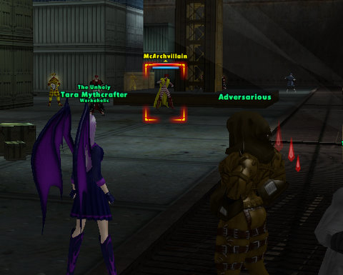

Back to: [West Karana](/posts/westkarana.md) > [2009](/posts/2009/westkarana.md) > [March](./westkarana.md)
# City of Heroes Architect: Killer Klowns

*Posted by Tipa on 2009-03-25 07:23:34*

Last night was one of those kinds of nights where you're trying to pass a kidney stone, drinking gallons and gallons of water, and you know, it would be a really nice time to KILL. SOMETHING.

Trying some of those City of Heroes Architect player-created mission arcs on the test server sounded just about right, so Kasul and I headed there to see what trouble we could cause.

My level 21 ninja/ice mastermind had finally been copied, so we weren't going to have to do missions at level 1. Kanad made a new character, and I chose him as my lackey so we could both take somewhat higher level missions.

The first one, where we have to disrupt some dangerous archaeology, was filled with closely-packed groups of extremely dangerous mobs, and was just one death after another. After half a dozen wipes, we decided to abandon that one.

Kanad chose a kinder, gentler mission full of clowns. Everyone likes clowns, right? Especially clowns that represent fast food restaurants, and whose minions are named after food. Flame broiled, frosty, etc.

That was a lot of fun :) Still, the enemies in player missions seem quite a bit more dangerous than the normal mission, with a far wider variety of powers, even in the lower level runs.

We made a fair amount of xp and infamy, some invention stuff, and architect tickets we could turn in for more architect mission creation stuff, as well as enhancements and other stuff.

(Kanad has done a [much better writeup](http://shatteredblog.wordpress.com/2009/03/24/architecture/) of this over at his blog!)

## Comments!

**[Kasul](http://shatteredblog.wordpress.com)** writes: I made a trip to the Arbiter before I quit last night, and I'd made three levels (to level 5!) Quite nice experience at my level. The scaled infamy wasn't anything to get excited about though.

---

**Graktar** writes: So I finally got to tinker with this a bit over the weekend. It is far less deep than I'd hoped, but at least it's easy to crank out stuff and making custom mobs is fun . . . ish. Is there any way to pick individual powers rather than just powersets that the game then picks powers from? For instance, I wanted one of my custom villain groups minions to use pulse rifles, but the only way to get that is with the mastermind/robotics powerset, which results in them summoning pets and isn't what I want.

Tipa, you mentioned that the first mission you tried had lots of mobs packed in very tightly. I didn't see any settings in the mission generator for mob density, except for the final boss of a mission. The mob density in my missions has been very light, is there a way to increase it, or was it just some weird result of the two of you going in?

The mobs in player missions definitely have the capacity to be very hard. I got quite the shock when a level 39 version of my tanker main was unable to beat the final boss of my first mission. The boss hit really hard while taking virtually no damage in return, and what damage he did take healed up fairly quickly. Bosses with defense sets are nasty.

---

**[Sente](http://adingworld.wordpress.com)** writes: Graktar, using "staggered" option for mob distribution seems to generate areas with higher mob density in some places. You can also add patrols to fill out the spaces and set their difficulty to hard. I had a quite small map with a relatively large number of patrols in one mission I played around with - it was pretty much impossible to fight just one group at a time.

While it is not possible to select individual powers to use, you can customize the weapons used for those powersets that use weapons. You could probably try to pick assault rifle as powerset for you pulse rifle minions, but you might need to unlock some additional weapon packs to get an suitable pulse rifle.

There ar plenty of packs with additional weapons, maps, customes, enemy groups, heroes/villains to unlock - chat with the ticket vendor. It will only list those packs that you have enough tickets to obtain. They seem to start from around 25 tickets for the cheapest ones.

Custom enemy group mobs can be made quite nasty. Set them at extreme difficulty and some evil combinations of powersets and people will have a challenge with mob levels that in the regular game are quite easy. I think that it is great that this option exist, but it also requires some wise mission design to use so that people can still enjoy the content.

---

**Graktar** writes: Ah, it's probably the patrols, I forgot about those. I think I also have the pacing set to 'flat'. I'll try 'staggered'.

I've been playing for a fairly long time and have a lot of costume options unlocked. My poor custom minions are indeed using the assault rifle set, but there's no way to make them shoot energy blasts so they're still not pulse rifles. Sigh.

I think being able to make the missions hard is good. After all, if it's not working out for you you can just exit and do something else. Still, there's little so frustrating as mobs you just can't beat. I remember a regular mission I did at level 49 with my tanker. I ended up completing it through the contact because it was chock full of Carnival of Shadows bosses that drained endurance to heal themselves. I'd knock them down to 50% with no trouble, and then they'd start endurance tapping me and healing up. A few blasts of that and my end would run out, my shields would drop, and they'd hold me. They'd then chain tap back to full health while slowly killing my constantly held tanker. I had to burn half a tray of inspirations, die, and then use rise of the phoenix just to win. It would have been ok if there was just one of these bosses in the mission, but there were at least half a dozen. I gave up :p

Can you unlock additional powers for your custom enemies using tickets? I've been surprised that a lot of the npc 'staples', such as pistols, baseball bats, and leadership powers don't seem to be available.

---

**[Sente](http://adingworld.wordpress.com)** writes: I have not seen any new powers being unlocked; pistols and baseball bats I have only seen as emotes (which I have used).

Another option for the pulse rifle enemies would perhaps build a custom group out of all the quantum/void minions and Lts that there are. All warshades/peacebringers will hate your missions then though...

---

