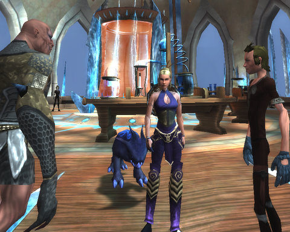

Back to: [West Karana](/posts/westkarana.md) > [2009](/posts/2009/westkarana.md) > [March](./westkarana.md)
# Shiny new hat & adventures in Aldenvault

*Posted by Tipa on 2009-03-26 07:40:35*

|  |  |
| --- | --- |
| 
everquest2-2009-03-25-21-39-46-26
 | 
eqgame-2009-03-26-08-12-24-54
 |

It was a sad day when the trolls discovered lawyers. I suppose that living in Freeport, they were bound to stumble upon some, sooner or later. The Dark Brotherhood, after all, is largely comprised of lawyers. 

I guess I really should have expected that letter from the Big Bend Basher's League threatening a lawsuit I wouldn't soon forget (or survive) if I didn't start featuring more trolls and ogres in my model shots. The vellum was made from stretched and scraped gnome skin, so I knew they were serious. I knew that gnome skin. That burn, that scar -- that was Tsuki, last week's fashion model.

So, going forward, our models here at West Karana will all be fine, upstanding members of the Big Bend Basher's League. Today's supermodel is Lublimii, a bootmaker who works in Neriak's marketplace. She's showing off the Legionnaire's [Shiny Hat](http://www.fireflywiki.org/Firefly/SerenityPilot).

One thing you have to say for today's trolls. They are a HUGE sight less ugly than the ones five hundred years back.

Kasul, Jalent and I traipsed around a little in Spellborn last night. Kasul and I started off with a long, long, LONG fight through some tunnels below Aldenvault to kill two named raptors and the trainer wot domesticated them. Lots of fun, and gee, it would have been wonderful to have taken a screen shot! It was kind of intense, though. The quick respawn rate meant we were fighting continuously without a lot of time to just step back and have a look around.

I dinged nine somewhere in there and started on the quest to see which High House I would join. Jalent chose House Shroud, so I probably will, too, just to make things easier with the House-specific quest lines and PvP. This IS a PvP server, and I expect things to become quite a bit less friendly pretty soon. 

There's already lots of people just taking a few swings as they run by -- though they could be trying to kill my pet. One guy spent a good half minute trying to kill it, while Kasul and I looked bemusedly on.

Halfway through nine, at ten I get a NEW pet, a healing pet. Kasul dinged 7 and is catching up really fast.

Tonight is probably going to be either Lord of the Rings Online or Wizard 101. Two games that need some love.

