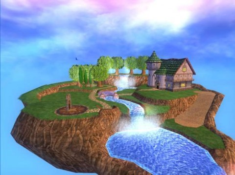

Back to: [West Karana](/posts/westkarana.md) > [2009](/posts/2009/westkarana.md) > [March](./westkarana.md)
# Wizard 101 unveils player housing!

*Posted by Tipa on 2009-03-26 07:54:53*

Hinted at by [Quinn Hexthief](http://thefriendlynecromancer.blogspot.com/2009/03/quinn-hexthief-rocks-austin-texas-in.html) a couple weeks back, KingsIsle has finally [introduced their player housing](http://mmohub.org/news/GDC%202009:%20First%20Look%20at%20%27Wizard101%27s%27%20Player%20Housing/85/). And it looks FANTASTIC!

I can't WAIT to start building a wizard tower of my own! It will have seven -- no, TEN -- floors, and anybody who wants to visit me will have to battle two to four monsters at once, and they will ALL BE YOUR SCHOOL OF MAGIC! Bwahahaha!

(Thanks to [gamemom](http://twitter.com/gamemom) for the heads up!)

## Comments!

**[Ysharros](http://stylishcorpse.wordpress.com)** writes: /jawdrop. GAH! I deleted W101 just yesterday to squeeze a few megs of space out of my ever-fuller HD (it's old, only 100Gb of storage. I remember when that seemed impossible to fill up...).

That is pretty spanking news, thanks for passing it on.

---

**[mbp](http://mindbendingpuzzles.blogspot.com)** writes: I was sure W101 would be a flop because it didn't seem to know what its target audience was and yet the game seems to be going from strength to strength. I guess I still don't know if its a kids game or an adults game but as long as its pulling in the numbers who cares. That flying island look so cool by the way. I want one.

---

**[Tipa](https://chasingdings.com)** writes: W101's target audience is a new one for MMOs -- family gaming. Like the good family films -- Pixar ones, for instance -- they work on enough levels so that both adults and children can be challenged and have fun and play together.

That's actually incredibly groundbreaking, and the success of W101 and likely, FR (WE HOPE!) is due to World of Warcraft blazing the trail. WoW has plenty of content for stats-obsessed number crunchers, but can also be played enjoyably by people who just like collecting fluff pets or mounts or chatting in Ironforge or goofing off in WSG. WoW opened the door a crack. W101 and its ilk are busting it wide open.

---

**[Wizard 101 Player Housing &laquo; Tish Tosh Tesh](http://tishtoshtesh.wordpress.com/2009/03/26/wizard-101-player-housing/)** writes: [...] March 26, 2009 by Tesh Thanks to Tipa for noticing this and posting about it: [...]

---

**[Rohan](http://blessingofkings.blogspot.com)** writes: *I was sure W101 would be a flop because it didn’t seem to know what its target audience was and yet the game seems to be going from strength to strength.*

Make a good, *polished* game, and people will play it. If only more game companies believed in this.

---

**[Tipa](https://chasingdings.com)** writes: I hope I can hover over other people's flying islands ... and drop stuff on them.

Just saying.

---

**Mallika** writes: Damn, that looks awesome!

---

**Nestor D** writes: wow this looks great i can't wait to have my own home in wizard 101 i herd they selling a house per every world from the friendly necromancer if it is true i get a house in mooshu or wizard city those are my places to go in this game.

---

**[Thallian](http://thallians.blogspot.com/)** writes: I enjoyed wizard 1010 but never really got into it. This looks neat! Thanks for sharing it Tipa :)

---

**[moomoo](http://wizard101)** writes: WHERE DO I GO TO GET TO THAT HOUSE!?

---

**[Tipa](https://chasingdings.com)** writes: We'll find out as soon as they open up the houses on Test. I have money saved up and everything. I just hope they take gold and not crowns, though.

---

**[Gemini191](http://Wizard101.com)** writes: This looks like an extrodinary event. I can not wait for the new Wizard 101 houses to come. It seems like the small Wizard 101 has become more popular than it has before. Keep up the good work, Wizard 101!

---

**[Tipa](https://chasingdings.com)** writes: The newbie grounds are still consistently busy, even seven months after launch. And the higher level areas are finding more people as well. They have opened up a ton of servers, too!

---

**Scarlet Dusk** writes: im fairly new at Wizard101, but love it already. (definition: 2 weeks new) it would be totally awsome if they did do houses, even though it would take me centuries to save up enough money. my parents keep yelling at me for being on so much so maybe it will only take years! ;D

you're right though about the servers Tipa, this is the only game i have ever been on (online) that is so popular that i can get on whenever i want, and on the same server to!

---

**kevon** writes: wizad 101 has to have mounts

---

**kevon** writes: plase have mounts

---

**kevon** writes: 3 mounts tiger boar and horse

---

**kevon** writes: those three mounts

---

**kevon** writes: the mounts level for players level 10 to 50

---

**kevon** writes: oh crap

---

**kevon** writes: 10 to 50

---

