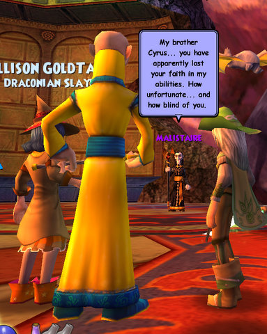
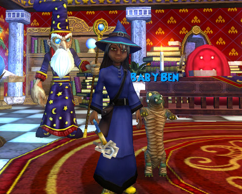

Back to: [West Karana](/posts/westkarana.md) > [2009](/posts/2009/westkarana.md) > [March](./westkarana.md)
# Wizard 101: So, Malistaire. We meet again.

*Posted by Tipa on 2009-03-28 21:19:16*

I don't want to talk about Kraysys.

But... five times! Five times I killed him last night. Add that to the dozen times or so I've killed him before, all but one of those times specifically to try for a chance at my Life school hat. No luck.

My alt on the other account, Allison, won it once, not that it does her any good. We can share stuff between characters on one account, why not between all the accounts on the family plan?

Anyway. I was getting a little bummed from farming him -- it seems that's all I ever do when I play Wizard 101 these days -- when Thomas, the Friendly Necromancer, told me he was taking a break from the Wizard 101 Central scavenger hunt, and perhaps we could take down the certain ex-head of the Ravenwood Death school?

Um, yeah :) I've defeated Malistaire before, but always with Thomas' drake ticket. Now it was time to fly my own battle drake to the final confrontation...

... after we killed several encounters along the way. The Gurtok in charge of handing out athames handed me one for my Life school as he slammed heavily to the platform, for which I thanked him. So that's my ring and athame I had from the place. Would Malistaire have my robe?

Thomas got his robe the very first time we fought Malistaire, and we wondered if I would get mine when I had the quest to do so.

Nope. Another time. This was my sixth fight against Malistaire, but this is the one that got me the Drake Rider title :)

I had some fun trying out the shared bank. I had to make a character on that account to try it out because, why have an alt? The game is precisely the same the second time through as it was the first. One of Wizard 101's few failings is its linearity (and I bet that they're working on solving that very problem).

I had some odds and ends in the bank I could share with a new character, some basic robes, some wands that dropped while I was farming Lord Nightshade until I found he no longer dropped the Celestial Robes, a pet I no longer use...

I played her a little -- she's a Myth wizard -- because I'd never seen the new tutorial. And that tutorial is fantastic, right from the start you face off against Malistaire and his demonic minions.

The voice overs, were done really well, no complaints about them. I read a lot faster than they can speak, though, so I was usually well down the road while the NPCs were just warming up.

It does add to the flavor of the game.

I am SO SO SO excited about player housing! I usually drop 20-30,000 gold dying my gear all sorts of new colors when I get close to the 99,999 gold limit, but I'm not doing that now. If houses can be bought with gold, then I'll want to have my choice.

I'm thinking Marleybone.

Hopefully with a blimp taxi!

## Comments!

**[The Friendly Necromancer](http://thefriendlynecromancer.blogspot.com)** writes: HAHA! A blimp taxi. nice. And your own personal "Mr. Personality" driving you there. I may have to join you in aquiring a Marleybone estate if that's the case, Tipa.

---

**[Casadia12](http://gem65.wordpress.com/)** writes: Hey.Do you know how you got the quest for Mooshu?

---

**[Tipa](https://chasingdings.com)** writes: You get the quest from Headmaster Ambrose after you kill Meowiarty in Big Ben in Marleybone.

---

**[Tesh](http://tishtoshtesh.wordpress.com/)** writes: My home will be in Marleybone, too.

...I'm hoping housing will be the gold sink they desperately need to really make a blind currency exchange work. :)

---

**[Casadia12](http://gem65.wordpress.com/)** writes: Cool. Thanks.

---

**wizard101fan** writes: Sorry MB houses dont have blimp taxis and they are bought in gold

---

