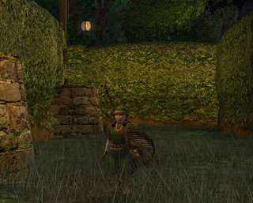

Back to: [West Karana](/posts/westkarana.md) > [2009](/posts/2009/westkarana.md) > [March](./westkarana.md)
# Lord of the Rings: Lore and History of the Hedge-Maze

*Posted by Tipa on 2009-03-30 07:58:02*

In the times of war and strife, still there must be hope. Spring brings with it new life, and the Free Peoples of Bree have chosen for a time to put aside their worries and cares and take joy in the seasons turn from the cold fastness of winter's reign to spring's joyous green awakening.

Mayor Graeme Tenderlarch has caused to be built, with the lore of the elves, the good cheer of the Halflings, which some call Hobbits, the craftsmanship and drink of the Dwarves, and the industry of Man, a Hedge Maze in the festival portion of the Horsefields above Bree.

In these dark times, it is rare that the Fair Folk come willingly or for long into the lands of Men, but the Hedge Maze, called in the Sindarin tongue "salchram", holds a special place in their history of the Third Age.

Long ago, in a time forgotten by Men but not by the immortal Elves, lived in Lórinand (now called Lothlórien) an Elvish lady named Nimrodel, whose tragic death as she journeyed to Edhellond to sail into the West would later inspire the name of the river that flows through the golden forest. 

Her mate and lover was the Elf-lord Amroth, son of Amdir, the last Sindarin Lord of Lórinand. In the days when the great stone doors of Moria were never shut and the eternal light of the Silmarils still could be seen glittering deep within every Elvish eye, Nimrodel caused to be constructed on the shores of the river which would later bear her name, a hedge maze of unsurpassed brilliance and cunning. In its twists and turns she hid gifts of Elvish workmanship such as had rarely been seen in that time, and never now. She bade Amroth to depart within and to bring her back the greatest treasure of all held in the maze, and that treasure would be his to keep.

Amroth entered the maze and was within it for a day and a night and part of the second day. When he emerged, he knelt before the throne of his Lady, empty-handed.

"You have seen my maze?" asked Nimrodel.

"I have seen it, my Lady. I have negotiated every turn, examined every leaf, and rejoiced in every detail. I have seen such delights as would astonish even Feanor, were he to behold them."

"And yet, you have left the salchram empty handed. Was there nothing you found that you found worthy of the great Lord Amroth?"

"My Lady, my Queen," said Amroth. "Nothing I found in the maze could compare to what I see outside of it, when I look into your eyes. For I have the most precious treasure already, and beside it, all others pale."

Such was the love of Amroth and Nimrodel that in times of special joy or for the amusement of Elvish youth, the Sindarin would cause a hedge maze to be constructed in the memory of their love, but never again would the false turns hold treasures, as the true treasures are those of the heart, and are never lost.

---

So, am I serious about LotRO now? :)

## Comments!

**[openedge1](http://simple-n-complex.blogspot.com)** writes: That was "seriously" serious!

I am still seriously debating never playing this game. Seriously.

---

**[Tipa](https://chasingdings.com)** writes: You can't be serious.

---

**[Almagill](http://travelswithatrollslayer.wordpress.com)** writes: Seriously!

---

**[mbp](http://mindbendingpuzzles.blogspot.com)** writes: Seriously brilliant Tipa. Seriously.

---

**Egat** writes: Serious talaga! I still have my lifetime subscription but I never get to hang out with Ysall.

---

**[Tipa](https://chasingdings.com)** writes: @Egat that's sad. I wonder how she is doing? She bears up so well under so many challenges. Oh, in late reply to your email from a couple weeks back, when I play, I play on Najena, but I have more or less left EQ2 for reasons best left to another post (though not from drama or anything to do with other people, I must hasten to add), so I'm not on a lot. But the Great Gaming Wheel keeps turning, and I'm sure I'll be back before too long.

---

**Egat** writes: Oh! I went my own way, ended up on Mistmoore with the Vivix Protectorate crew. I was shocked when I set foot into the guild hall and met all the guards named (and dressed) after old EQ1 friends: Knobb, Kalrie, Myzzen, Brecht, Hakken, Aeonn, Sasfai, Frekkels, Giah, etc. Put a tear in me eye, it did.

---

**[Tipa](https://chasingdings.com)** writes: Kalrie! I thought she went to WoW with those that went to WoW. I didn't know any CE went to EQ2 instead :)

---

**Egat** writes: Oops, it's not the real Kalrie, just a guild hall NPC named and dressed like Kalrie.

---

**[Tipa](https://chasingdings.com)** writes: Remember when Kalrie used to keep the Erollisi Marr rotation list? And the uproar when Crying for Resurrection Cries of Insurrection announced they were breaking the rotation? And then how it turned out nobody cared anyway?

Still... for the year or two of that list... I thought it was a great idea. Your guild was a REAL guild when you had a spot on the list -- and you were an UBER guild when you no longer needed Trak or VS!

---

**[Saylah](http://notadiary.typepad.com/mysticworlds)** writes: That was awesome. There was a time when I was so in love with Lord of the Rings - books not the games, that I wrote poetry and translated it into High Elvish. Whoa, I had way too much time on my hands in those days. :-)

Not playing EQ2 for a while? That's a story I want to read about. I keep thinking about popping into W101 and moving forward but then I think about what i'm missing in ROM. I suppose that's a good thing that I'm still having that much fun. I'm not good at playing multiple games I like. I feel like I'm cheating on one with the other.

---

**[Anjin](http://bulletpointsblog.blogspot.com)** writes: As opposed to Saylah, I never got into Tolkien beyond the Peter Jackson movies. (I'm not a heretic! Keep those torches back!) This was serious cool, though.

---

**[Lost in the Maze &laquo; All Geek to Me](http://allgeektome.wordpress.com/2009/04/01/lost-in-the-maze/)** writes: [...] is an excellent post giving some plausible lore behind the creation of the maze at the West Karana [...]

---

