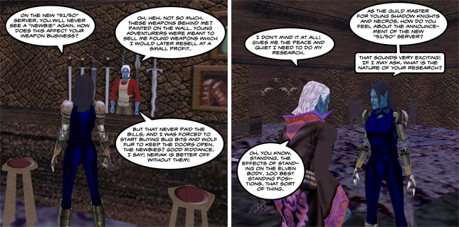

Back to: [West Karana](/posts/westkarana.md) > [2009](/posts/2009/westkarana.md) > [May](./westkarana.md)
# It's official, the new EverQuest server is chosen, plus EQ3 rumors?

*Posted by Tipa on 2009-05-02 10:05:08*

  
*WK's own Neriak correspondent, Nashuya N'Hamsha, interviews local residents about the new 51/50 server.*

EverQuest dev (and write for the EQ Dev Blog) Clint Worely announced yesterday that all the votes were in -- [the new EverQuest server type has been chosen](http://eqdev.wordpress.com/2009/05/01/what-a-wild-ride/).

[The original poll had several suggestions](../../../index.php/2009/03/14/everquests-new-server-what-are-the-choices/), including a new regular server, a PvP server, a special rules server and even another progression server similar to but improved over the previous progression servers, The Sleeper and The Combine. The most unexpected option was one for a new "51/50" server, where all new characters would start off at level 51 with 50 AA and presumably some decent starting gear, probably the common Defiant armor that has been dropping since last summer's "Living Legacy" event.

While the support on the forums and other discussion places seemed to favor a new progression server, the devs have been hinting at for quite awhile what they confirmed last week, that the in-game polls had been trending strongly toward the 51/50 server.

Forum participants questioned the wisdom of just asking current players their feelings, as they felt lapsed players would return for a progression server, but they could not offer their views unless they resubscribed.

Clint Worely also announced that he was leaving EverQuest, but wouldn't be going far, "as the world of Norrath has plenty of adventuring left in it for generations to come, so I hope to see all of you in game again in the future!". It's almost certain he is talking about another title in the EverQuest franchise, but whether this means a port of EQ or EQ2 to a different platform or a potential EQ3 is anyone's guess. I choose to believe EQ3, but the hints so far haven't attached a "3" to the "EQ" yet. It is only clear that a new product in the EverQuest lineup is being developed.

## Comments!

**Emmwynn** writes: The logic behind this is baffling. Most, if not all, existing players have many characters already above level 50. So what exactly will this kind of server add to their experience? A quick alt server? I've looked at the EQ forums recently and the two most requested server types, namely a time-locked progression server and a classic server, weren't even offered as options. It's EQ's 10th birthday isn't it? Wouldn't this have been an idea time to celebrate the early years with a server that offered players the chance to experience it once again.

The point about only asking existing players is a good one. It sounds like SOE have given up EQ as this could have been an excellent chance to get old players back in the fold. I would have returned for a classic or timelocked server but not for a 50/51 server that jumps all the stuff I loved about EQ (Blackburrow, Crushbones, Unrest, the Orc Highway, getting killed by Cazil the Sand Giant and so on). This game doesn't have to die. On the back of World of Warcraft it could even grow but they've chosen not to. The game will die because SOE aren't giving it a chance to thrive.

---

**John D.** writes: I've been looking at giving EQ another solid shot for quite some time, and initially planned to make that attempt when this new server opened. I was hoping for a FV/Progression server to do that, but, alas. Out of curiosity, how difficult do you think it would be for a new-ish EQ player to hop back in at level 50? I'm something of a seasoned MMO fellow, which might help, I suppose. I was thinking about either a Cleric or a Zerk, to pick opposite ends of the spectrum.

It is truly a shame that this poll wasn't opened up to a population beyond the existing subscribers. While I can understand that they may want the opinion of people who are already giving them money, and there's no guarantee that voters would eventually subscribe, this could have been a great "Come back to your roots" campaign for the current generation of MMOers to try a classic.

On another note, if they do indeed produce an EQ3 some time before the sun expires, I will hop on that like a tick on a dog.

---

**[Tipa](https://chasingdings.com)** writes: If you start a character on the new server when it opens, there will undoubtedly be thousands of people at the exact same level forming groups and moving through content, so it should be pretty easy no matter what your class. If you plan to move into raiding, then a cleric would be an excellent choice, since mercenary clerics cannot be used in raids. Otherwise you'll find that most groups will have NPC clerics or tanks available, and you might want to be more a utility or dps class. A berzerker wouldn't be a horrible choice, but I don't know how classes on the new server will trend. Expect a lot of soloer classes, like necromancers, beastlords and druids. I've always loved rogues, personally :) Bards, too! A good bard is valued in any setting.

---

**John D** writes: Thank you very much for the advice! To be honest, I had completely forgotten about bards, coming from a variety of games filled with the musically-challenged. Time to head back to those EQ Wikis. Cheers!

---

**[Keeplaying Through &laquo; Tish Tosh Tesh](http://tishtoshtesh.wordpress.com/2009/05/04/keeplaying-through/)** writes: [...] up the alt’s journey even more.  SOE might be catching on with their new EQ2 51/50 server, brought to my attention by Tipa.)  That decision point, where the player realizes that he/she has to play through dozens of hours [...]

---

**Dude** writes: Emmwynn way to be hater. Dont come back simple as that. We (speaking on all Players) wont miss u. One Love!

---

**Emmwynn** writes: Dude,

I'm no EQ hater. Played the game consistantly for 6 years from 2000-2006, hardly the behaviour of a game hater. Some of the best gaming experiences I've ever had were in EQ. It makes me sad to see the game in decline when it should be thriving thanks to Warcraft bringing in a lot more MMO players than there's ever been before. This kind of server is not the way to grow the game, it's a way to keep a small percentage of the current playerbase happy.

I somehow doubt you speak for all EQ players but you need to get realistic. If the game doesn't start bringing in more players then you won't have a game to play at all. The 10th anniversary could.. could have been a starting point for this. There's more ex-EQ players than current EQ players, by a huge margin, and the trick is to get those ex-players interested again. 50/51 is not going to do that in my opinion.

---

**Drakul** writes: I'm an ex-player and I'm coming back for 51/50. I was in Norrathh on opening day. I've played up to 65 on numerous characters. I want to see the new zones. Starting at 51 facilitates that for me. Most people counter that with, "you can get to 51 in a couple of days." So why would I want to waste a weekend leveling? I don't need to see the old zones. I don't want to see the old zone. I spent 18 hour sessions in most of them (as my rl went by the wayside). 

All that matters to me is that everyone starts at the same level and no one is at such a equipment/AA advantage that I feel I'll never catch up. If those two things are satisfied, then I don't really care if it's progression or 51/50, although skipping the zones I still have memorized after all these years is icing on the cake.

---

**Aonis** writes: Yea I couldn't agree more this decision was extremely stupid.
And just at the time I was feeling hideously unsatisfied with my various attempts at liking World of Warcraft, I start trolling old eq boards to see if there's any chance of a new progression server only to run into another ridiculously un-thought out marketing move by SoE.

When will you realize that lvls 1-50 were the meat of the game, it's WHY naggy and phinny raids were so fun. Because you were raiding 'em with your long-time guildies.
HOW many people are gonna be running through the fear portal dragging out your 42 corpses until you figure out which one has your equip. on it on this server?

Frankly I was hoping to see the FV RP rules server win. I think it would be really cool to have to learn other languages **plus no farming**. Most people didn't spend too much time on languages in the game so it would bring something new along with the nostalgia as well as illuminate the minor intricacies of the game we all used to love.
I bet you wish you had FV rules on the Combine server. Lets see how fast it takes Ebonlore to rush through the game when they can't even organize a raid. HAH!

Point is: SoE you have failed to meet the attention and needs of the retired EQ community, many of which find WoW and games like it grossly unsatisfying after the comraderie we had in EQ. Will said it, your poll is a complete scam.
The only people that are playing EQ now are super-high enders who are able to keep up with each other. You think these people (which are the vast majority of your poll voters) are going to vote Combine or FV rules?
Wake up, it's not about you projecting a profiting image to us like oh la dee da we dont need you to resubscribe we haven't noticed any red flags on our balance sheets due to WoW.
It's about getting us back on our accounts. All you guys at SoE have ever done is pump out more expansions to try to make a buck because recurring monthly subscriptions weren't enough for you. Well this is a pretty large untapped profit and idk what kind of monkeys in suits you have working over there.
GIVE US A REASON TO COME BACK. pz.

---

**Frank** writes: Sony jumped the shark (again) on this one.

---

**[wimp](http://tranquilityatguildpotal)** writes: Well for all of u making those new toons there will be a guild starting on mayong by the name of tranquility. the plans are a lil scetchy but we r looking at becoming a raid guild that raids 3 to 4 times a week so if u have any intrest please go to guildportal .com and search for tranquility. as of right now it says combine server so check it out and leave some responses. ty

---

**[Tipa](https://chasingdings.com)** writes: Oh hey, I hadn't seen that they had named the server. Thanks for the scoop!

---

**Sarejen** writes: Personally I never even thought about a classic server till I read your post Emmw. I do play the game right now but I am not totally satisfied because for 1 trying to group really does suck, and as you said we skipped some of the best zones, Crushbone is my favorite zone but I have not went there at any time because the tutorial skips that, and of course the gear there is horrible compared to crescent reach or something. I was seriously hoping they would revamp Crushbone for the higher levels players but alas that didn't happen. If they could upgrade the gear in zones like Crushbone or even downgrade a server to make it not all super powered gear that would be way more interesting.

---

**[Tipa](https://chasingdings.com)** writes: It used to be the standard guild joke that, when we formed up for Veeshan's Peak raids in Greater Fay, and low level players wondered why a raiding guild was in GFay, we'd say we were going to raid Crushbone.

What we were really there to do was to die so we could have a corpse outside of VP. At that time, once you were in VP, you couldn't leave until you died or walked through the portal in Phara'Dar's lair to the Plane of Sky. Couldn't gate, one-way entrance (which was guarded by hostile wandering mobs). So to leave VP without clearing it. you'd have to have someone rez your corpse outside.

Weird. You hardly ever see dungeons that have a chance to kill you and everyone around you right when you zone in, but EQ had bunches -- VP, Planes of Fear and Hate, and of course, Karnor's Castle.

---

**[Zac](http://www.sosm.com)** writes: Does no one realize that a classic server would never be able to make it. How long until you run out of content and there is no fun left in the game. Hitting the roof on character progression would be very unsatisfying. It would basically be a RPG that serveral people play. There's only so much that can be done. I don't know about you, but at the time who really enjoyed being wiped trying to break fear for the 5th time in a week. Or fighting over dragon spawns for epics. Your setting yourselves up for failure. Any who, don't knock SOE for doing this, its their choice, and we all know that a progression server would fail, and eventually be merged just like the last too. It has no long term profitability which is what SOE is looking for. So to conclude, if you don't like EQ as it is, then don't play.

---

**Jasmyne** writes: I've been playing a couple weeks on Al Kabor. That is the Mac only server and it is pretty much Classic EQ., at least it is EQ up to PoP. I was so tickled tonight to actually get an SBS in Crushbone! (Shiny Brass Shield for those who weren't around then!) Players are EXTREMELY nice and willing to answer questions and buff and even lowbies can get buffed with KEI (how long since THAT happened!). It is just a really nice fall back for those of us who miss the old EQ days and have gotten Macs too.

---

