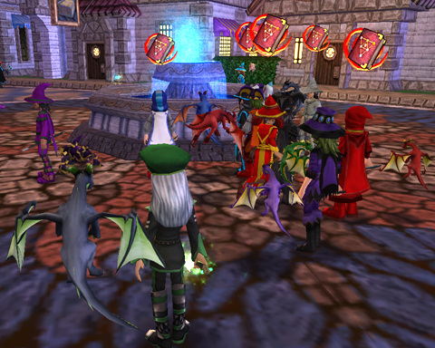

Back to: [West Karana](/posts/westkarana.md) > [2009](/posts/2009/westkarana.md) > [May](./westkarana.md)
# Wizard 101: Scandal strikes Wizard City

*Posted by Tipa on 2009-05-04 14:00:31*

  
*Agent Provocateur Eggbert defies Wizard City planners by giving out free Summer Dragons*

WIZARD CITY, Shopping District -- Holidays come and go in Wizard City, and the merchants who come with them tend to do what they're told. In a shocking move last Thursday, Easter merchant Eggbert chose to not go quietly back into the Spiral. Authorities were called to investigate reports that Eggbert was giving Summer Dragons out to any who asked for free. Wizards everywhere flocked to the shopping district. Many made alts just to receive the free flying flapping friends, which were available in every conceivable color for the price of a stroll through the Commons.

Professor Greyrose, head of the Ravenwood Ice School, had this to say about the misbehaving merchant: 

> Eggbert has left the Spiral until next year. As a goodbye gesture, he was giving away Summer Dragons, but has since run out. 

Thanks to everyone who enjoyed the holiday wands he sold, and there are still a few holiday items left on the creatures of the spiral if you didn't get a chance to buy one. 

More on this story as it develops.

