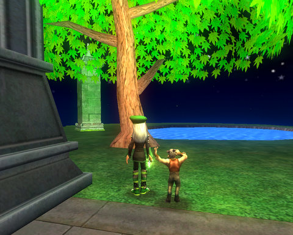
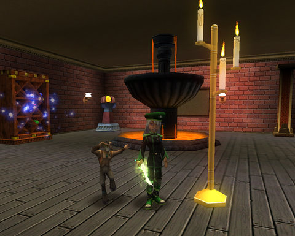

Back to: [West Karana](/posts/westkarana.md) > [2009](/posts/2009/westkarana.md) > [May](./westkarana.md)
# Wizard 101: Housing slump? What housing slump?

*Posted by Tipa on 2009-05-07 00:46:34*

I scurried my way to visit a housing turtle as soon as I finished patching Wizard 101. I wanted to get started decorating my house as soon as I could, but which?

I'd been thinking about buying one of the Wizard City castles, but when I tried to decorate it one last time on the Test server, I found the outside difficult to work with. I talked it over with Kasul, and he convinced me to go with a Marleybone home.

He was right, of course. After all, the builder turtle for Marleybone was named by the people who read this blog! The very least I could do was give him my business!

Thomas came by to offer some decorating tips, and some friends of his popped in, and one of them had this fantastic idea to go do some 4v4 dueling. Off we went, and we were soon matched up against four identical wizards in Krokotopia garb. But though they were lower level, they were professional duelers and more than held their own in the battle, especially once Thomas' friends took off leaving us, a Death and a Life wizard, hardly powerhouse damage casters by any means, holding the bag.

The other team had more than enough Rebirth treasure cards to slow the fight down, and of course I could match them Rebirth for Rebirth, so the fight couldn't end until all of them ran out of mana eventually. After about half an hour of a pointless fight we never asked for, we excused ourselves and took off. Dueling? Nah, not any more. Rebirth has made 4v4 duels last forever.

There ARE some unique housing items available for duelists... so maybe someday.

I traveled the worlds of the Spiral looking for found or bought items. This is only the bare beginnings, I have a lot more stuff to find, but -- here is my parlor. There's a settee under the bay window that you can't see, two overstuffed chairs in front of a roaring, candlelit fire, a piano and bench with the Life symbol above, and a bed upstairs.

This is my park. A maple tree dreams over a still pool, and a found jade column sits decoratively in the back.

My sorcery room. If I ever get the urge to return to Dragonspyre, I can sit and wait here until the feeling passes. I didn't even know I HAD this little underground room until I found it, entirely by accident, while exploring. It's my favorite room so far :)

Next time, I'll be going from boss to boss seeing if they have anything for me, and I'll probably bring Allison to double my chances.

I hope Kraysys drops something nice....

## Comments!

**[stargrace](http://mmoquests.com)** writes: Looking absolutely amazing! 
I'm so glad the housing is in now, eager to get myself situated! I need a lot more money before I can buy a proper home, but I'm looking forward to collecting items and decorating my dorm.

---

**[Tipa](https://chasingdings.com)** writes: The new dorm rooms are quite a lot larger than the old ones, so all the better for decorating :) The small Wizard City island isn't that expensive, though -- you might be able to afford it!

---

**Stingite** writes: A few runs with star through malistaire would give her plenty of cash.

---

**Julie** writes: I had to upgrade my pc due to virus and have been trying to down load wizard's but i keep getting a blank web site. Should i leve a message at the Kingsly Ent. web page?

---

**[Tipa](https://chasingdings.com)** writes: you could, but it sounds like the problem is at your end to me. Their web site looks fine to me.

---

