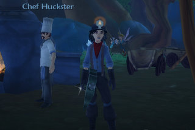

Back to: [West Karana](/posts/westkarana.md) > [2009](/posts/2009/westkarana.md) > [May](./westkarana.md)
# A word to bloggers about reviewing MMOs I play.

*Posted by Tipa on 2009-05-07 07:36:30*

In the aftermath of the scandal surrounding Darkfall and its 2/10 Eurogamer review, I just have a couple of things to say.

You Darkfall players and those bloggers up in arms because they didn't play it sufficiently enough to get a good picture of the game? Listen up.

Are you the ones who write about EverQuest II that the starting areas are drab and some screenshot you saw a few years ago wasn't bright enough for you? Weren't able to figure out the skills or heroic opportunities and pronounced it broken? Wondered why I stuck with the game even though it clearly wasn't as good as WoW?

YOU FAIL. I don't go into WoW, play the first 20 levels and then pass judgment on the entire game. Don't come into EQ2 and futz around in the starting area and say the game is a massive pile of excrement. You CAN say the game doesn't appeal to you on your first impression, but that's ALL you can say.

By the way, I played WoW to 60 pre-BC, raided Molten Core, Onyxia, that instance in STV and a bunch of world bosses, and I don't have a thing to say about anything POST-BC because I never played it.

And those people who looked at Wizard 101 and maybe played around awhile in Wizard City and then wrote that you just seemed to play the same card again and again and the fights were too simple and you didn't like the open group scheme? Guess what?

Wizard City is a giant TUTORIAL. It's SUPPOSED to be easy. You don't start hitting the real meat of the game until Colossus Blvd because this is a game meant to be easy enough for kids to play. By the time you finish Marleybone, you'll have an idea of how complex and deep the game REALLY is. Don't think your experiences in the first ten levels qualify you to give a score to W101.

Last year, I challenged bloggers to pick a game and stick with it an entire year, because I felt at the time that that's how long it took to really appreciate all the complexity of an MMO. I chose Wizard 101 as my 'year' game. No matter how frustrated I got with the game, I stood by it and stuck with it. Clearly it didn't take a year to see and do everything, so maybe next time I take my own challenge, six months will be enough.

Wizard 101 may not be your kind of game, and that's totally legit. Nobody is going to stand around saying you have to like it. But until you've spent a hundred hours going through at least the first three worlds -- because Marleybone is a gem that should not be missed -- you don't know enough about the game to review it.

See, when you're a player, playing for fun, if a game isn't fun for you, you should find a game that IS. But when you're blogging about a game you haven't played much, all you can say is, "my own initial impressions based on the starting zone was...". If you insist that you are writing a REVIEW, then I better read how you liked the END GAME, because if you haven't even had as much experience with the game as the players who will read your article, where's your credibility?

I have not read even ONE true review of Wizard 101. It went into beta in July and live September and I have seen a lot of articles with "review" in the title, but none of the reviewers had ever leveled a character through Marleybone at the time of the article.

I have not written a Wizard 101 review, and I won't, because my review is in the articles I've written about leveling through the game.

Free Realms has been live for a week, and I've seen a bunch of reviews for the game that seem to be based mainly on the tutorial and playing a few minigames. Where are the articles about taking a balanced group into a three-pip dungeon? Where are the articles telling me the relative worth of the wizard or the archer for ranged dps? Is it better to start with a brawler or a ninja? How are the cash shop items? Which pet dog sniffs out the rare collections best? That's not part of your review?

Then HOW can you call it a review? You haven't even played the game yet?

So, people up in arms because of a perfunctory Darkfall review, remember this next time you see a review for a game where the reviewer clearly saw only a fraction of the content and an even smaller bit of the game play: They don't know what they're talking about. They are all lying when they call their article a "review" instead of a "first impressions". I expect the replacement Eurogamer "review" includes building a city and defending it from attackers, some sea battles would be good to cover, and what their death/kill ratio was in PvP. How can I expect any less from someone who is claiming to review Darkfall?

And here's a coda: MMOs aren't something you can ever write about without putting yourself in the article, because MMOs are as much about the community as the game itself, and if you aren't part of the community, then you aren't playing the full game. At least Eurogamer's reviewer admitted he hated Darkfall from the start. It would have been much worse if he had claimed to be neutral, but then let his hate for the very thought of the game seep into every word without admitting his bias.

## Comments!

**eddster2** writes: Tipa,

Just to say, I am an EQ player who played EQ1 extensively, tried EQ2 when it came out, gave up on it, came back June last year and Loved It and realised what i'd been missing.

Could you write a "review" about EQ2 (obviously based on Your experiences as you've said thats all a review can be)?

I love reading your blog and think if more of the bloggers who are passionate about EQ2 could only write some more up-to-date reviews, maybe even get them published on the bigger sites, then maybe more people would give it a try instead of writing it off based on reviews that came out on the incomplete game.

---

**[Tateru Nino](http://dwellonit.blogspot.com/)** writes: Aren't all game reviews ultimately impressions-pieces? Someone writes up their subjective impressions, and we read the ones from writers whom we have learned have similar tastes, likes and dislikes to ourselves.

Actually, I often find myself reading reviews by writers whom I know have very different tastes to mine. If those particular people hate something, I know that there's a good chance that I'll probably enjoy it a lot. We write about what we like, and about what we don't like - and why - and let the reader pass judgement based on both what we say and on what they know about us and our preferences. Isn't that the way it works? Or am I being too idealistic?

---

**[Scopique](http://www.cedarstreet.net)** writes: MMO "reviews" are inherently flawed because the game that you play one day is not the same game you play the next, due to patches and changes and the activities of the player. 

I like that you divided it into "impressions" -- which to me is something personal, like an opinion -- and "reviews". Unfortunately, fanboys and haters never take time to make grayscale distinctions like that.

---

**[Tipa](https://chasingdings.com)** writes: @eddster2 -- I couldn't write a review of EQ2 as it currently stands because I am not part of an active guild, and like EQ before it, EQ2 can't really be enjoyed or seen without an active guild to do things with. I dislike soloing and so don't really play the game as it's meant to be played any more. But beyond that, I don't think you can really review an MMO. A good MMO reaches you on a personal level, and that's going to be different for every person. You can list features and report bugs, but you can't really write a review.

@Tateru -- If someone is reviewing a game they finished, they can call it a review. It's like book reviewing -- the reviewer can say they hated the book so much that they couldn't get past the first chapter, but that's not really a review, it's a first impression. If someone is claiming to review a game, they should have played through all of it at least once. For a true MMO review, I'd hope for at least that. If MMO reviewers honestly titled their articles "My first impressions of the starting area", I'd accept that. They are being honest.

Massively always labels its first impressions posts "first impressions" and doesn't try to assign a score. That's honest and that's how it should be for ALL these sites, not just Massively.

---

**[Kendricke](http://www.clockworkgamer.com)** writes: Getting angry with critics isn't exactly a new or novel idea, Tipa. Critics have been taking it on the chin for thousands of years. Within the gaming industry, reviewers aren't exactly going to be the sudden shining exception to that rule. 

I don't expect that a reviewer spend a year with a game before reviewing it. How could that possibly be seen as a reasonable expectation? Should I wait till November to review Warhammer Online? To decide whether or not it's worthy playing? Should I only now start writing up my Age of Conan review since it released at this time last year? 

On the one hand, we hold developers to a standard that they should release polished content, but on the other hand I see demands such as this that reviewers hold off for a full year before actually reviewing a game. Would it help if the reviews were referred to as "hands on" articles or as "previews"? Personally, I'm just looking for reviews which include some hands on action, some descriptions of major systems and functionality, and a general outline of the reviewers opinions on the subject. If a scoring system is used, I want to know what the scores generally mean.

In the case of Eurogamer, I got everything I typically want from a review. The reviewer wasn't just rehashing press releases or parroting back information that was heard on a press tour. No, the reviewer spent time in-game (2 hours, 3 hours, or 9 hours depending on who you listen to). Regardless of whether or not the reviewer spent a week or a month or a year in the game, time was spent actually playing. For an initial review, that's good enough for me. The review didn't talk about end game content or how much acreage the game shipped with. However, it did talk about basic AI, inventory control, control sets, graphics, animations, general gameplay, combat mechanics - major systems and functionality. 

Not every review will be in-depth (though I thought this one was better than most) and not every reviewer is going to be impartial and fair toward every title played. I expect that. Generally though, if there's a particular issue someone has with an aspect of a review, they should be able to call that out. Simply saying "that review sucks" is at least as bad as a review which only states "this game sucks". If a Darkfall player feels the combat is innovative, responsive, and intuitive, then they should point that out. If a Darkfall player feels the inventory system is user-friendly, quick, and well-organized, then they should point that out. Refute the points and not the one making them, lest ye set the same trap you claim was set for you.

Game reviews aren't going to be all-encompassing. Neither are movie reviews, car reviews, book reviews, or any other form of criticism. Of course, as we all know, most people tend to ignore the critics (right or wrong), otherwise Wolverine would never have made $30 million on its first night.

---

**[Van Hemlock](http:blogs.chimpswithkeyboards.comvanhemlock)** writes: I'm not sure that having to see it *all* ought to necessarily be a qualification to have a valid set of opinions and observations about an MMO. Would that not make the arrived at opinion a bit academic? Even if you spend an entire year playing an MMO you don't like, just to be sure of giving it a fair appraisal, to make sure you actually don't like it for the right reasons, you've still paid a year's sub and been counted as a player for that year in the stats. 

Got to draw the line somewhere, and is it unreasonable to expect to be enjoying even a thing as complex and deep as an MMO within a few hours of starting? And indeed, letting other people know about those hours?

Also, pragamtically, I can't see any website or magazine paying for one person to spend an year playing a single MMO, just to turn out two or three pages of (albiet *really* informed) observations to show for twelve months work.

The alternatives are the snap-fire two-week trials at launch as we see currently, which will occassionally throw up Eurogamer 2/10 guy, or a complete blackout for the required span, a year or however long, until the Reviewers are at last justified in their thinking, and during that time, the rest of us have to just blindly guess with our money and purchases. I certainly woudln't want to sign up to something like Darkfall, or indeed, Free Realms, by accident! And if after a year, a game is still awarded a 2/10 score what then? Two years! Five! Keep throwing different reviewers at it (each with their requisite year-long play experience) until we get a score that is correct?

Or is it specifically the word 'Review' that is at fault here? On that basis, most MMOs are indeed unreviewable, probably ever. I suspect most folks who follow MMO news are working off a tacit undesrtanding that impressions are all they can ever be. Mind you, in the case of the Darkfall 2/10, I'm not sure calling it an Impression instead of a Review would have done much to soothe matters. All seems a bit of a pseudo-intellectual smokescreen to hide some very basic nerdrage, to me.

---

**[Kendricke](http://www.clockworkgamer.com)** writes: "@eddster2 — I couldn’t write a review of EQ2 as it currently stands because I am not part of an active guild, and like EQ before it, EQ2 can’t really be enjoyed or seen without an active guild to do things with." - Tipa

The problem inherent in this approach is that often you end up reviewing the guild as much as the game. Join a less-than-stellar guild and your impressions of the game will be flavored likewise. Any review written from such a standpoint might talk about how hard it is to find groups, how the guild halls aren't all that spectacular, how it's impossible to find tanks, how the dungeons are ridiculously hard...

On the other hand, join a great guild and suddenly the review might include comments about how fun the scripted dungeons are to run night after night, how the Tier 3 guild hall looks magnificient fully decorated and filled with raid trophies, how the game feels so "alive" each night...

Besides which, how can press be expected to not only spend more time in-game, but also to find a good, solid guild (especially when most actual players complain about how hard it is to find a good, solid guild) before writing a review (or impressions, previews, hands-on, etc.).

---

**eddster2** writes: I should have expected your response Tipa but once again, I probably agree with you :)

I just wish I could find a way to persuade more people to try EQ2, whether for raiding or grouping.

---

**[Kendricke](http://www.clockworkgamer.com)** writes: "Or is it specifically the word ‘Review’ that is at fault here? On that basis, most MMOs are indeed unreviewable, probably ever. I suspect most folks who follow MMO news are working off a tacit undesrtanding that impressions are all they can ever be. Mind you, in the case of the Darkfall 2/10, I’m not sure calling it an Impression instead of a Review would have done much to soothe matters. All seems a bit of a pseudo-intellectual smokescreen to hide some very basic nerdrage, to me." - VanHemlock

That, I think, is the heart of the matter.

---

**[Tipa](https://chasingdings.com)** writes: @Kendricke -- well how could any review of EQ2 NOT include all the things you list? You can't review an MMO, but you can do a series of articles about your progress through the game. Is that unreasonable for a magazine or a gaming site looking for a thumbs up/down? Yes, likely. It's impossible, and they shouldn't claim it's something they can do.

@Van Hemlock -- I would not trust a review written by someone unwilling to spend a few hundred hours in the game. First impressions are another matter -- call them that, admit you haven't seen enough of the game to put a score on the whole thing. "Darkfall starter zone first impressions -- 2/10". That would have been honest.

MMOs like EQ2 and W101 cannot be reviewed and scored based on the starting zones, neither of them. How many times have I heard someone dismiss EQ2 as "muddy brown graphics" and wonder if they even ever SAW Timorous Deep or Darklight Woods or even Greater Faydark? Or are they just parroting what they heard from other people who ALSO never actually played the game yet felt qualified to pass judgment?

---

**[Wiqd](http://wiqdintentionz.com/studios/blog2)** writes: While I understand what you're getting at Tipa, I also understand the viewpoints of Kendricke and the others. I suppose perhaps "review" IS the term that's at fault, but "reviewing" something doesn't mean you've been through it all. It means you're going over what you just did. I also find a bit of fault in your statement about not being able to review EQ2 because you haven't been playing it "how it's meant to be played." There is no right way to play anything, especially MMOs.

True one should NEVER base their opinions of anything off ONE review. If you start to see a trend and these people can supply screenshots or videos of their experiences, then you have a basis. But the only real way to know is to try it yourself. 

Heh, and I was actually about to post a little blog post about my recent re-infatuation with EQ2 :P

---

**[Kendricke](http://www.clockworkgamer.com)** writes: I'm all for changing the name from "review". However, I don't think that's the problem here. Call it first impressions. Call it a preview. Call it whatever you want and the ultimate result would still have been the same here. Honestly, do you really think Adventurine took umbrage at the word "review" or at the score of "2/10"?

This wasn't an article on the first zone, either. Unless there's some amazing changes to the basic combat mechanics, inventory management, or player behavior in upper levels, I think the article did a fine job of outlining the reviewer's opinion on those in-game systems.

---

**[Tateru Nino](http://dwellonit.blogspot.com/)** writes: I must admit, I can't be bothered much with review scores anymore. Many games that I've enjoyed a lot live in the 60-70 range at Metacritic. About as many as the games I've enjoyed in the 80-90 range, and even the 50-60 range.

Obviously review scores are ultimately worthless in deciding if I'll enjoy a game or not.

---

**[The Scandalicious Darkfall Rview &laquo; Ardwulf&#8217;s Lair](http://ardwulfslair.wordpress.com/2009/05/07/the-scandalicious-darkfall-rview/)** writes: [...] Scandalicious Darkfall Rview Tipa responds today about the Darkfall community’s response to Eurogamer’s 2/10 [...]

---

**[Green Armadillo](http://playervsdeveloper.blogspot.com)** writes: I don't believe that reviewing MMORPG's is fundamentally different from reviewing other forms of media. Does a CD reviewer need to demonstrate that they have fully annotated every single line of the lyrics to ensure that they understood every little reference that the artists made? Do we require reviewers of movies and books to go through every last line or frame to make sure they didn't miss a thing? No review is 100% comprehensive or inclusive, and, if it were, we wouldn't want to read it due to its length. 

In the end, a review is the opinion of the reviewer. The context of the review - what portion of the material the reviewer actually experienced - matters, since the reader is hoping to compare the reviewer's experiences and preferences to their own to determine whether to try the product. A well-executed review will contain that context, and I always try to provide it when I use the r-word. In the end, though, you can't extrapolate the QUALITY of the review from its title, or its bottom line recommendation. A poorly-written review will still be unhelpful, even if you call it "first impressions based on 3 hours/played on one character in one class on these dates". All that changing the name accomplishes is making it impossible to find a well-written review with the aforementioned train-wreck of a name via google. 

(Incidentally, it's not like "first impressions" doesn't also have an established meaning. "Logged in, tried a character, looks fun; more later" is a perfectly servicable report of first impressions, but falls short of what most people would call a "review". Are we going to make a new word to fill the current niche of the phrase "first impressions" after evicting it to make room for posts that are currently called reviews?)

---

**[Spinks](http://spinksville.wordpress.com/)** writes: I think you can write a useful review (useful in the sense that it helps readers make the 'try' or 'don't try' decision) without playing a game for a year. It can get to the core of what a game is all about.

It's easy to get distrated by details and bloggers often do. I'm as guilty as anyone of writing 1000 word rants about some minor aspect of gameplay. But an initial review only has to answer 'do I want to play this thing?' and tell me what the main good and bad points are. It really doesn't matter all that much what the best starting classes are (unless they are truly unbalanced) because that can change.

It's interesting to read about someone else's progress as a travelogue, but although it highlights what /you/ can do in game, it also assumes I'm going to be able to find the same kind of guild as you -- and the chances of that are low, really. I don't think a detailed and loving writeup of one person's experiences has much room in a review. It's interesting in its own right, but it is a different kind of beast.

Also, the starting areas in EQ2 are drab and the class design is kind of archaic :P But reviewing a game that's been around for years is a very different kettle of fish. That genuinely is hard and does require some hardcore playing time, IMO.

---

**[chadmango](http://chadmango.blogspot.com/)** writes: I read the review and thought it quite reasonable. As Kendricke pointed out, it seemed to focus on the core mechanics of the game and found them lacking. I do agree that it can be difficult to write a well rounded review of something as inherently fluid and personally affecting as a MMO (I couldn't write a fair review of LOTRO for example), but I think it is possible. Eurogamer's three reviews of Age of Conan are, I feel, a good example of how reviewing an MMO should be approached. Anyway, just my tuppence worth... for what it's worth

---

**Graktar** writes: Well said. 

Overall, reviews of MMOs are almost worthless due to the scope of the games and the fact that everyone has a certain 'flavor' of MMO that they prefer, even (especially?) reviewers. If you don't enjoy PvP, a PvP MMO is going to get a low rating from you no matter how good it is. If you're sick to death of fantasy MMOs you're going to give a fantasy MMO a lower rating than a different genre. If you hate levels, or hate skillups, or like deep crafting, or hate grinds, all these things influence your opinion of an MMO in ways that single player games don't really have to deal with. A non-MMO is judged mostly on whether or not it's good. Even if it's not quite your thing, you can still see that it's a good game and enjoy it. With an MMO, if it's not quite your thing you're going to hate it no matter how good it might be.

---

**[Melmoth](http://kiasa.org/)** writes: An MMO review should be tempered against the fact that MMOs can be altered in fundamental and far reaching ways over a period of time; in fact that's almost a defining parameter for MMOs these days. As such, an MMO review should not be seen in the same light as a book review or movie review where the subject of the review will change only marginally through any republishing and edits. MMO reviews are therefore time limited: they apply only for a short duration after they are published, potentially only until the next major patch is released for the game. 

However, I'm firmly of the opinion that it is quite possible to capture a snapshot of an MMO in a short duration of play, because the foundation of the game, the fundamental framework on which the various dungeons and quests and crafting games are based is the same throughout, and if that foundation is weak then the content which is built upon it would have to be exceptional just to be able to compensate for that fundamental failing.

MMOs are like trees in that you can judge the strength and health of them from a quick walk around the trunk without knowing all the secrets that are hidden in the canopy of branches.

---

**[syncaine](http://syncaine.wordpress.com)** writes: While a good post about general MMO reviews on blogs, you missed the heart of the issue concerning DarkFall. 

Had the reviewer stated that not only does he hate DarkFall, but he hates the 14 minutes that he actually played, his 'review' would have been a non-issue. But when a major site puts up a review supposedly based on 9 hours of gameplay, and in that piece the author makes multiple statements that are just outright lies (not opinions), it's a different matter. 

What some bloggers decide to call 'reviews' based on X amount of time is not the issue, especially since they are just bloggers with no standards to adhere to. I could write today that EQ2 is a buggy mess that crashes every time I enter combat, and SOE won't do a thing about it. People might stop reading my blog, call me an idiot, but at the end of the day it's just MY blog, I can write whatever I want and people know that. When it's a professional site (and business), they are held to a higher standard, a standard that was seriously compromised in this case, before, during, and after the review was published. That's the issue.

---

**[Tipa](https://chasingdings.com)** writes: I might know if I am going to like a book or not just by looking at its cover or reading a couple of pages. By then I could probably say, this is a book I would probably like and I should buy it, or not.

I could turn on the radio (remember those?) and the music I hear I will probably like or not, right off. So I don't buy the track or I turn to another station. Again, nobody is forcing me to listen to it.

But if I am reviewing a book or piece of music for people who know nothing about it, I'm not going to start off with, "Well, I hate MilSF, and this book was full of MilSF from the start. By Chapter 2 I knew I wasn't going to see anything but MilSF, so I gave up. This book is 1/10. I hate MilSF."

And though inspired by the Eurogamer Darkfall review, I never played the game, I don't know how representative of the full game the first few hours are. But I have played EQ2 a lot, and W101 a lot, and not one review has accurately potrayed either game. Usually the bias is clear -- EQ2 is not WoW, and W101 is not just a kid's WoW. I am SICK TO DEATH of having every MMO explicitly or implicitly compared to WoW. If you can't judge a game on its OWN merits, you don't deserve to be a reviewer. Clearly the reviewer didn't get involved in the heavily tactical battles that Syncaine writes of, and looks to be the real heart of the game, what everyone is looking for in the game. So that important part, not covered.

---

**[Endologitrol](http://endologitrol.wordpress.com)** writes: I'm an avid fan of MMO's but I don't like seeing them glorified in this fashion. You are saying, in effect, that every reviewer must take in as many aspects of the game as possible. Does a restaurant reviewer have to taste every entree? Would a normal game reviewer have to unlock all the extra content in the game?
If the reviewer is honest and says how much time he put into the review, why shouldn't it be called a review? Who are you to try to claim semantics in order to marginalize what they've done? I suppose that waterboarding isn't torture either, right? Because we can quip and tear these things apart until all good sense is called into question. 
I suggest looking up the terms "review" and "impression" in the dictionary for clarification of just how wrong you are.

I understand what you're saying. You think that the early levels don't count. Personally, I won't play an MMO that doesn't start off fun and stay fun the whole way.(In other words, FFXI) EQ1 was good from the start, why shouldn't other MMOs have to do at least as good as their predecessors? I played Wizard 101 as well, which I think sucked because it was too childish and I disliked the way fights were done. I didn't need to play any more of it because I had my opinion made in the trial and no additions were going to change some basic flaws of the game. I knew I'd like WoW right out of the newbie zone. I was outfitted, given quests for direction, and levelling was fast. I played EQ2 for all of one minute before deciding I'd never play it again. 
To top it all, in my small list of reviews...I played Vanguard: Saga of Heroes for one day and it's the best MMORPG that has come out to date. It is the gamer's secret. The Holy Grail.

One does not simply review into Mordor.

---

**[Kendricke](http://www.clockworkgamer.com)** writes: "“Well, I hate MilSF, and this book was full of MilSF from the start. By Chapter 2 I knew I wasn’t going to see anything but MilSF, so I gave up. This book is 1/10. I hate MilSF.” - Tipa

If the reviewer was judging Darkfall's content as a major factor in his scoring, I'd be keen to see your point a bit more. However, he was not. He was judging major systems. In truth, you should not require more than a couple of hours to determine whether or not a game's major systems are fun or not. To say otherwise is to say that unless you've killed every raid target up through and including Anasti Sul, any review you make regarding raiding within Everquest II is automatically invalid. You don't need to kill Anasti Sul to determine whether or not (A) you enjoy the general raid mechanics you've encountered and (B) you make a note of which raid content you've actually encountered.

The reviewer at Eurogamer did give a very solid indication of which content he encountered. He shouldn't need to hit end-game content to say that he really dislikes the combat system. He shouldn't need to join a guild and group up for a year to share an opinion on the item management system. The expectations you're holding him to are simply unrealistic and impractical. 

Even then, you seem stuck on the word "review". I submit that Adventuretine's problem had little to do with the word used to describe the type of article and had EVERYTHING to do with the low score. Furthermore, I submit that this is a manufactured drama designed to entice further discussion over a game that is being generally panned by critics - after all, there's no such thing as bad press.

---

**[openedge1](http://simple-n-complex.blogspot.com)** writes: *YOU FAIL. I don’t go into WoW, play the first 20 levels and then pass judgment on the entire game.*

No, I think you also can do it without even playing the game (*cough* AoC *cough*)

Isn't it weird? It is almost like they formed their opinion before even playing the game, and passed verdict before even playing it..lol

I remember doing it for WAR

Of course, when I finally played it, it was exactly what I thought it would be. 

Was my opinion wrong?

But, we are bloggers, and as "bloggist's" we should keep those opinions in our personal space. This reviewer was clearly wrong for posting it on Eurogamer...but it does not mean he as a player of the game was wrong.. 

This just goes to show though that Tasos can definitely rile up the masses, and he is one you do not want to catch the attention of...

And think about it...this piece is now officially a "Bad press = Good press" piece ala Grand Theft Auto..more copies will be sold (if you can even buy it...lol) now than ever before.

Darkfall actually wins!

---

**[Sisca](http://www.gnomedepot.net)** writes: I've been playing EQ2 from launch and just last week got my first character to 80 and I'm in a small guild that averages 4 - 5 active players (2 of whom are my wife and I). I've played WoW for well over the year you stipulated and never got to the end game and although I was in a guild that was raiding I never participated in that. I played EQ1 for over 6 years and went on a grand total of 1 PoP raid, 2 hate raids, 2 fear raids and both dragons when they were still raids. I've tried EvE a couple of times and never stuck but I'm still fascinated by the game and I know that if I had the time and energy to dedicate to it I'd be able to play it for well over a year and count the number of actual PvP fights I participated in on one hand because that's not the part of the game that interests me.

An MMO reviewed based on your criteria of having to play for 100 hours and be in the "end game" and a guild etc. would not tell ME if the game is something I would like or not since I don't play the "end game". The problem with the theory that you have to experience the whole thing before you can review it is that there is no way, ever, to experience the whole of a good MMO. And how do you begin to even review a community? I've checked out the Darkfall forums and found them a cesspit of moronic adolescents but there are those that would disagree with me - I also think that the WoW forums are only a notch above those. I half my guild in WoW on ignore since I found them annoying but some of my friends found those very people witty, there's just no accounting for taste.

So what most reviewers end up doing is reviewing the game play mechanics. Having just read the Eurogamer review that is mostly what I saw him complaining about. The mechanics are what will make or break a players initial experience in a game. Arcane movement systems and a feeling of "floaty-ness" in a supposedly action oriented PvP game are very important things to point out. What I mostly read in that review was that the reviewer found the mechanics of actually playing the game to be not fun and that was what the score reflected.

---

**[Anjin](http://bulletpointsblog.blogspot.com)** writes: The problem I have with your article, Tipa, is that you are holding MMO reviews up to an impossibly high standard, though I can tell you do not see it as such. There should be an appropriate middle ground for review that allows for reviews to be written with any sort of timeliness. The reviews that are most egregious are the ones at put as little effort into playing the game as they do playing a standard video game. This is not a new problem in game reviews at all. FPS and RTS games that perform poorly in single player but flourish in multiplayer often receive poor scores because if the inability to invest oneself in that mode while under a deadline. Some allowance for an evolving review structure might be healthy for the long term of the industry. Demanding one year of a reviewer's life before a word can be published is approaching insanity asymptotically.

---

**[Reviews and MMORPGS &laquo; Exploring War Like Worlds.](http://exploringwar.wordpress.com/2009/05/08/reviews-and-mmorpgs/)** writes: [...] Comment! West karanas post on reviewing mmo’s. [...]

---

**TheRemedy** writes: Isn't a mmo review just like a test drive? I'm not expecting to learn how the car handles at 100,000 miles, just the initial impressions. I think mmo bloggers/gamers need to tone down their expectations of what a review is.

---

**[Game Review Incident Hits Home - MMO Bin - A Geek's Look at Massively Multiplayer Online Games](http://mmobin.com/game-review-incident-hits-home/)** writes: [...] has been a lot of feedback on various blogs about this matter as well, but the one that sticks out most in my mind is from Dusty Monk of ‘Of Course I’ll Play [...]

---

