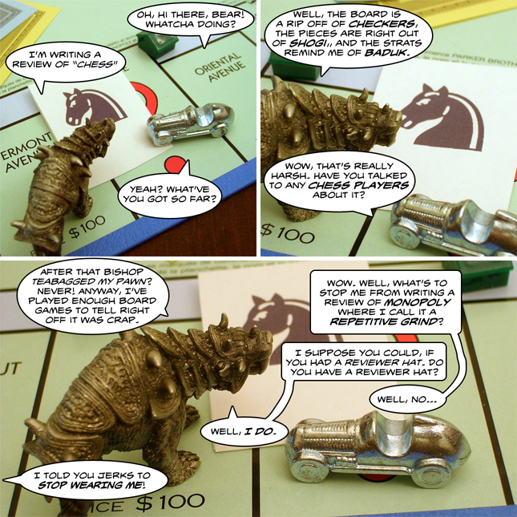

Back to: [West Karana](/posts/westkarana.md) > [2009](/posts/2009/westkarana.md) > [May](./westkarana.md)
# Adventures in Monopoly: Bear reviews Chess

*Posted by Tipa on 2009-05-10 15:57:04*

Also, "Sorry" is short for "Sorry I'm not playing Parcheesi" and "Chutes and Ladders" clearly has no understanding of the laws of gravity.

## Comments!

**[Kasul](http://shatteredblog.wordpress.com)** writes: Bear is obviously writing his 'first impressions' of Chess, I have a blacklight analysis of bear footprints on the chessboard that says he's only made a handful of moves with his pawns and never reached the endgame.

I want a reviewer hat! :)

---

**[Tesh](http://tishtoshtesh.wordpress.com)** writes: No mention of house rules? I guess that's for another time, eh? :)

---

