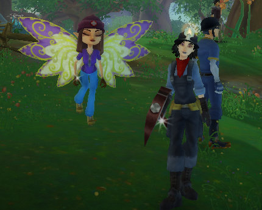

Back to: [West Karana](/posts/westkarana.md) > [2009](/posts/2009/westkarana.md) > [May](./westkarana.md)
# Free Realms: First Impressions

*Posted by Tipa on 2009-05-12 07:16:23*

  
Etha, 8 Medic; and Tipa, 16 Miner

Tipa is: 16 Miner/12 Ninja/8 Chef/7 Archer/2 Wizard

I've been enjoying myself quite a lot with Free Realms the past couple of weeks; when I sit down to play an MMO, like as not these days it'll be FR I fire up. I've been two boxing, which isn't really needed nor entirely effective, but makes some things easier. The dungeons are usually fairly challenging for their level, there's humor everywhere, there's a sort of whimsy I like, and I can't finish a quest without picking up a few more.

For me, it's a great solo game, with a lot of the stuff I like, like dressing up in cool outfits and having huge monster glowy weapons.

But it isn't a social experience. I've given up entirely trying to add my friends to my friends list, so aside from a couple I've been lucky enough to add, all the many, many people I would like to adventure with might be in the world, but I'll never see them or know they are there. Even if I did, friends are usually in mini-games and are out of contact.

This is the thing. Minigames that take you out of the world, break the MMO paradigm. The other players you see are usually just in the world enough to get to the next minigame or combat instance.

Respected gamers have noted that the game doesn't have [a single path](http://tobolds.blogspot.com/2009/05/free-realms-combat.html) to max level [through quests alone](http://commonsensegamer.com/?p=1318). While this differs from World of Warcraft (and Wizard 101, for that matter), I actually enjoy this aspect of the game. I'm not on rails! I have the freedom to level how I like because in Free Realms, the experience for killing a monster is enough to level on all by itself. Quests actually don't give that much experience.

You could possibly just skip your class quests entirely, as I did when I started a medic on my other account to help out my combat jobs which couldn't take hits very well. She spent her first few levels spamming her heal as my main character took down the dungeon goals, but now she's mixing it up in the melee as well (and is the tank when I am leveling ranged combat jobs like archer and wizard). Point is, that it was only last night that I got around to working through her medic quest chain, and doing them all up until the "come back when you are level 10" quest only gained her one level, from seven to eight.

The dungeon design in Free Realms is fantastic, they are utter joys. I've been in perhaps a dozen of the longer dungeons, and they've all been entirely different and fun enough to go through several times. Which you'll want to, as most of your better gear comes from running dungeons.

My biggest issue with Free Realms is that I am playing alone. Since it's nearly impossible to find people to adventure with, and players spend most of their time out of the world entirely, in their own private minigame areas, it's a very lonely experience. Contrast this with Wizard 101, where if you stand still long enough, you're surrounded by friends coming by to see what you're up to.

But Wizard 101 is a social MMO. Free Realms is an exploration MMO. I love exploration and I am a big fan of checking out Free Realms' more distant corners. There's still big huge parts of the game world I haven't been to, and most every place I've gone leaves me wanting to return and explore more of it. Neither games are achiever MMOs, which leave gamers used to WoW's endless grind to become more uber unsure how to play either of them.

If Free Realms doesn't figure out how to have a more social experience pretty quick, I question how many kids it will attract. I play a fair number of F2P MMOs. One thing kids love is MMOs they don't have to pay for, or that they can buy a card at Target that gives them playtime or in-game currency. Aeria, Outspark, Acclaim, Nexon, et al -- these are publishers of MMOs that are absolutely CROWDED with kids. You'll find all the successful games have one thing in common. It's EASY to meet up with friends. Kids don't seem to mind grindy games as much as adults apparently do. They don't need quests to tell them what to do. They just want to be doing whatever they are doing with friends. The MMOs they play usually have well-defined areas where players can meet and group up.

If Free Realms can figure out how to bring some social gaming to their already amazing exploration game, they might have a hit. Otherwise, it's hard to see how they will keep the kids when there are so many other social games out there for them, and the adults will likely just go back to playing more traditional MMOs.

## Comments!

**[Pete S](http://dragonchasers.com)** writes: Playing devil's advocate here.... you're implying that all kids are social. I love Free Realms. I don't feel at all lonely just due to my personality; I prefer playing games alone, while still being able to interact with others from time to time (ruling out single player games). Even though I have another player sitting 3 feet away, we rarely group; it just isn't our style.

I'll accept that players like me aren't the majority, but we have to come from somewhere, which infers that there are kids who also prefer playing games alone. Perhaps Free Realms will be their game?

Also and on a different tact, when I've watched kids play these games, they spend a lot more time 'puttering around' than probably you (and certainly I) do, so hooking up with friends (assuming they fix the friending features, which as you say, are outright broken right now) might not be as much of a challenge. 

All *that* said, it seems like they ought to be able to allow someone to join a friend anywhere, even if that just teleports you next to where your friend is mini-gaming. (Does your avatar stay in-world when you enter a mini-game?) The non-dungeon combat instances don't last very long, though the mining/harvesting/blacksmithing ones can. 

That would (I think?) give them the best of both worlds.

---

**[Ramon](http://dalayan.wordpress.com)** writes: I just wanted to write a post at Dalayan Diary that talks about how an MMO isn't really all that fun unless you have all those other people to play with, but what you write here essentially says the same thing :)

I started playing Runes of Magic recently, and while it's full of people, most of them are soloing (at least at the level I am, 13 knight). It's about the same I've witnessed in WoW and what drove me out of there completely. The game world is busy with people and resembles a beehive, but everyone is just busy on their own agenda.

In Shards of Dalaya, this is different. You probably remember from EverQuest how everyone was terrified of even walking two steps alone. That's gone in SoD because of the clever death mechanics -- you can essentially explore everywhere you want without fear of delevelling. And yet you find people grouping a lot, and it's easy to find pickup groups. That's what makes MMOs worth playing for me (and that's what my posting would be about in a bit more detail). It's the people, and the ease of finding people to play with.

If Free Realms' minigames make people even less available, that's certainly bad.

---

**[Spinks](http://spinksville.wordpress.com/)** writes: I can't help feeling that it's only designed to be social if you're actually in the same room physically as the people you're playing with. I wonder if that was by design. Maybe it was honestly designed to be played together by families who were in the same room. 

But yeah, I've felt the same thing. The game doesn't feel silent but people don't talk, there's no way to find others to look for groups, actually getting people onto your friends list is an exercise in futility but random people who run past you can friend you instantly. I'm having fun but there's no social network in there that I can see, and that's one of the things that hooks me into an MMO.

---

**[openedge1](http://simple-n-complex.blogspot.com)** writes: So this is basically WoW, W101 and Magic the Gathering all rolled into a game? No major grouping, and a lot of instanced combat? Mini games a plenty!

Who knows. I may actually like this (if it was not for the cartoony look, which I just cannot get into)

Thanks for the review

---

**[Anjin](http://bulletpointsblog.blogspot.com)** writes: Very interesting post, Tipa. I've been blogging my way through Free Realms recently and game to similar conclusions. I don't mind the lack of friends so much since I'm pretty antisocial. It will be a deal breaker, though, for a lot of people.

@Openedge1 - I can't help but suggest you at least fire it up and give it a try. It does skew more cartoony, but I rather this stylized fantasy than the "Brown + Light Bloom = Realism" school of MMO graphics.

---

**[Saylah](http://notadiary.typepad.com/mysticworlds)** writes: It lost me at all the instancing and completely silent/solo existence. I solo no doubt but FR feels dead because you don't even see others doing what they are off doing alone since it's all instanced. And I can't stand heavy instancing. i. just. can't. do. it. For me it's like GW which is lobby for MMO but everything else you do is in a private space. I wasn't a fan of if there so coupled with mini games this doesn't work for me. I'm glad for the people who are having a good time. there's nothing like the new adventures in a fun MMO.

---

**Vlcan** writes: I dunno it seems like it should be possible as adults with access to XFire, Facebook, Twitter, E-mail, Forums, Blogs, Cell phone, etc. to say "Hey meet me on server(#) at (insert time here) and add a friend." 

The way my kids added there friends was " Log on when you get home from school on server # and meet at the race track we can become friends and then race Lol. Or they called each other on land line phones. 

Kind of like when you can't get the lid off medicine because of that child proof cap so you give it to them and say open it and they do hehe.

---

**[Tipa](https://chasingdings.com)** writes: You'd think.... actually the people I have successfully friended were because of Xfire and Twitter, but most of these require people to be online at the same time, which seems to only be rarely. When FR first opened, people were posting their character names and every time, I would try to add them, only to fail.

---

**[Saylah](http://notadiary.typepad.com/mysticworlds)** writes: You'd think it would be easy but it's not. We had the same drama trying to meet up in W101. Adults do log into games immediately after work like kids might do. I think we're more random about what days and times we can play certain games. And not everyone does all the other social stuff like Facebook, Twitter, bleh. I certainly don't. MMO and blogging is as much effort I want to put into socializing over the interwebs. :-) I had to post dates and times on my blog to even get the few people I managed to get into my Friends List in W101. That seems like way too much effort to expending hooking up in MMOs.

---

**[Saylah](http://notadiary.typepad.com/mysticworlds)** writes: oops, adults do NOT log into games....

---

**[/AFK &#8211; May 17 &laquo; Bio Break](http://biobreak.wordpress.com/2009/05/17/afk-may-17/)** writes: [...] Realms hurts poor Roggie’s eyes… aww.  He’s not a fan of Candyland, either.  Tipa likes it, however, because she’s a being of pure light and [...]

---

