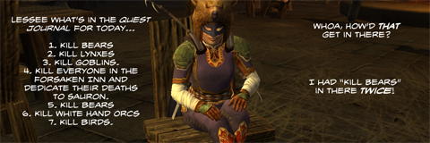

Back to: [West Karana](/posts/westkarana.md) > [2009](/posts/2009/westkarana.md) > [May](./westkarana.md)
# Daily Blogroll 5/14 -- Going Coconuts edition

*Posted by Tipa on 2009-05-14 07:37:06*

One of the nice things about doing the Daily Blogroll is that it takes the pressure off trying to do something fun every night. Tuesday night, Kasul and I were playing LotRO, running around doing quests in the Lone Lands, and I realized I was bored senseless by the tedium of LotRO's quest grind. Last night was all W101; a friend and I did a couple Moo Shu Onis and then farmed Baron Greebly for cool stuff, and we let each other see our homes. I was playing with a good friend each time, but LotRO's soul-crushing quest grind couldn't be saved. I suspect LotRO won't be on my hard drive much longer. I love the players, but the game is just a grind in pretty clothes.

Speaking of LotRO, Keen read of a survey which talks about [a quite different LotRO than the one we know](http://www.keenandgraev.com/?p=2352). A console based version with more action, players playing both good and evil races, more conflict, more war.... more fun?

[Via Stargrace](http://mmoquests.com/2009/05/14/kurns-tower-to-hit-eq2-finally/). EverQuest 2 will [finally be seeing Kurn's Tower](http://eq2players.station.sony.com/news_archive_content.vm?id=3087§ion=News&locale=en_US)! A couple of Rise of Kunark quest chains led to its door, but not inside. Kurn's was THE premier place to bring your young character in the EQ Kunark era. Lots of places to group, great experience, decent loot, and some cool quests as well. The EQ2 version has a lot to live up to.

Crookshankz spends a little time back near the original Kurn's as he [adventures in EverQuest's Field of Bone](http://thegaminggoob.wordpress.com/2009/05/13/eq-yakety-sax-and-2-questions/). Ah yes, back in the good old days when all you really worried about was how to stay alive.

Beau's back in Vanguard, [looking for that old-time retro magic](http://epicdolls.com/beauturkey/?p=1445) where people didn't see racing to max level as the only possible goal. Vanguard was meant for that kind of player, but will Beau find any kindred spirits in that game?

Order of the Stick goes another strip [without resurrecting Roy](http://www.giantitp.com/comics/oots0653.html). Just thought you'd like to know.

Over on Hardcore Casual, Syncaine's seemingly innocuous article on [giving MMOs credit for the things they do right](http://syncaine.wordpress.com/2009/05/13/giving-credit-when-its-due/) instead of focusing on their missteps turned into a rousing argument in the comments as to why bloggers (and especially Syncaine, a known WoW-buster who writes with all the fervor of an ex-WoW-junkie) are so reluctant to give World of Warcraft its props as the most popular MMO of all time?

And that's nothing compared to the discussion on Ysharros' article i[n praise of the MMO soloer lifestyle](http://stylishcorpse.wordpress.com/2009/05/13/never-the-twain-part-2/)! Welcome back, Ysh!

Openedge1, one of Age of Conan's most outspoken fan and critic, [looks back at a year of AoC](http://simple-n-complex.blogspot.com/2009/05/age-of-conan-retrospect.html), all its ups and downs, and looks to the future to see if it will last a second year. I'm sure Turbine would never cancel a popular franchise [just because of a little dip in popularity](http://www.wired.com/gaming/gamingreviews/commentary/games/2005/12/69848).

Thomas at The Friendly Necromancer looks at the pros and cons (mostly cons) of PvP in Wizard 101, and how [recent spells and other changes to the dueling arena](http://thefriendlynecromancer.blogspot.com/2009/05/pvps-dirty-laundry-list.html) have led to fights being dragged out to SIX HOURS or more. Last time I dueled, it was 4 lv 50s vs 4 wizards around 30 and after an hour and a half we just left. We couldn't see any way the fight could actually end, since the opposing side had a seemingly infinite supply of group rez/heal treasure cards. So W101 PvP is, at the moment, way too broken to enjoy, at least for the 4v4 fights.

And that's about it for today. Fare the well wherever the trade winds take you!

## Comments!

**[Spinks](http://spinksville.wordpress.com/)** writes: Oh, I remember Lone Lands quests. I read somewhere that they were planning to revamp the zone sometime soon, but your experience of LOTRO questing sounds very similar to mine. I love so many things they did with the game but the non-epic quests .... not so hot.

---

**[openedge1](http://simple-n-complex.blogspot.com)** writes: "Killing Bears"

OMG...NOoooooo....

Da BARES!

Has mental flashbacks of hitching around Middle Earth killing bear after bear, and them killing me over and over..NOoooo....

---

**[Sinnir](http://www.gamerzwrath.com)** writes: Guess I'll be needing to dust off the old hammer to make for quick zoning to the new x2, sooo glad i didnt sell that thing haha!

---

**[Keen](http://www.keenandgraev.com)** writes: You should not be scared of the Bear quests.... it's the BOARS that should have you screaming in fear. The boars were the WORST! Oh my god the intestine quests were awful. You could kill 20 boars and not get a single update.

---

**[Sean Weaver](http://auto-magic.blogspot.com)** writes: Hey! Two things, can you ad me to your blog roll? Can you put up my advert? and (sorry, three) can you meet up with me in w101? Please and thanks,

-Sean EmeraldWeaver, level 33 myth Magus

---

**[Ysharros](http://stylishcorpse.wordpress.com)** writes: You nailed why LOTRO didn't hold me in the end, despite its undeniable beauty, some nice touches (and some bad ones, like the deadened combat responsiveness and the fugliest hotbar icons evar), and some really great people. There was just something about questing there that was... bleh. Dunno why, because it's not like quests are really different in MMOs anymore, but they were still more bleh than others.

Ah, the mysteries of MMOs... ;)

---

**[Saylah](http://notadiary.typepad.com/mysticworlds)** writes: Ysh - That's how I felt about questing in LOTRO and EQ2. Like you said, it's all pretty much the same but for some reason, I couldn't stomach much of it in either of those games. I want to love EQ2 - I really do! *sniff*

---

**[Saylah](http://notadiary.typepad.com/mysticworlds)** writes: P.S. I wish I hadn't read today's blogroll and followed the link to Stylish Corpse. All it did was piss me the F off! LOL

---

**[Kurn&#8217;s Tower Coming To EQ2 - We Fly Spitfires - MMORPG Blog](http://blog.weflyspitfires.com/2009/05/14/kurns-tower-coming-to-eq2/)** writes: [...] how the interweb works sometimes. I was reading West Karana and then followed a link to MMOQuests were I found some info about the arrival of Kurn’s [...]

---

**[Ysharros](http://stylishcorpse.wordpress.com)** writes: Eh, sorry Saylah. It was just supposed to be a rantlet... I didn't think anyone would be paying attention, but I guess it's one of those undying debates.

---

**[Saylah](http://notadiary.typepad.com/mysticworlds)** writes: That's okay, I agreed with your point of view but the wide sweeping comments about solo players being this that or the other just...Grrrrrrrrr! Like I said there, I don't play games that don't support solo play. Others should stop playing games that support too much solo play if they feel it's impacting them. Vote with their dollars just like I do. It's not like there aren't AAA titles out there where being in a group provides significant benefit and access to dungeons and the accompanying loot. They should stick to those if solo players bother them so much.

---

