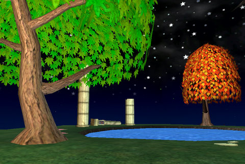

Back to: [West Karana](/posts/westkarana.md) > [2009](/posts/2009/westkarana.md) > [May](./westkarana.md)
# Wizard 101: Relax

*Posted by Tipa on 2009-05-14 12:00:28*

*Trees, spring and autumn
Surround the ruins of our dreams
Bookends to our lives*

Okay, so I like Wizard 101 player housing. So shoot me :P

## Comments!

**[Anjin](http://bulletpointsblog.blogspot.com)** writes: Bang?

Considering how much fun you had with the EQ2 guild hall stuff, I hope W101's housing gives you more webcomic ideas.

---

**[Saylah](http://notadiary.typepad.com/mysticworlds)** writes: Tipa - check your email please. The Sisters want to reach you about coming on their podcast.

---

**[Tipa](https://chasingdings.com)** writes: @Anjin well, EQ2 lets you have NPCs in your home/guild hall. I hope Wizard 101 thinks about it!

---

