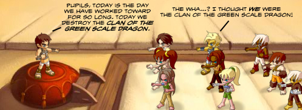

Back to: [West Karana](/posts/westkarana.md) > [2009](/posts/2009/westkarana.md) > [May](./westkarana.md)
# Daily Blogroll 5/15 -- Endelig Fredag edition

*Posted by Tipa on 2009-05-15 07:47:07*

I was thinking this morning about Norman Spinrad's "Bug Jack Barron", where a treatment can make you immortal, but a child has to die (this btw is a massive spoiler if you have not read the book). In MMOs, we *are* immortal, but at some point we've done everything or it just gets boring and we move on to the next game. If we had immortality in our real lives, how long would we live before we were just desperate to have it end so we could move on?

Anjin at Bullet Points closes out the raging argument on what the best balance is between solo and group content with his list of [the pros and cons of soloing](http://bulletpointsblog.blogspot.com/2009/05/random-shots-defending-solo-player.html). His conclusion? If you don't like your game's balance -- leave.

Syp of Bio Break looks at the breakaway success of F2P MMO Runes of Magic, and wonders if dead games of the past [could have been saved if they'd gone free](http://biobreak.wordpress.com/2009/05/14/runes-of-magic-if-you-build-it-for-free-they-will-come/). He cites Tabula Rasa as a game that might have been saved if they'd gone free, but I wonder. Going free hasn't made Anarchy Online popular, and Shadowbane stayed niche even after it discarded the subscription model.

Prolific blogger he, he muses about Lord of the Rings Online's possible future as a console game, [deciding it can never happen](http://biobreak.wordpress.com/2009/05/14/xboxs-lotro-taking-rumor-to-fact-in-1-2-blog-posts/), and here's why. I disagree; the game they were talking about would clearly be a far different game from the one we know on the PC.

Okay, here's a delicate matter. I consider Ogrebear a friend, though we've never met. I've been a big fan of his blog for years but... well, you know, the spelling. Not the best. But I have to [give him props for Taking Steps](http://ogrebear.com/?p=932). WTG Ogre :) And looking forward to EQ2 street view!

Openedge (how we miss the Communist Manifesto days!) was nodding his head in time to the beat of an article that was calling SOE's new MMO Free Realms an overwhelming assault on the senses, but the song in his heart halted when he turned to the comments and read [Ixobelle](http://www.ixobelle.com/) calling Age of Conan ugly. Ugly? NOBODY calls AoC "ugly" around the Edge! [OPENEDGE1 SMASH](http://simple-n-complex.blogspot.com/2009/05/age-of-conan-shocking-quote.html)!

Beau, recently returned to Vanguard, stands on the edge of a snowy vista and declares that THIS is how you get money from his wallet -- give him a world to explore, a life to live, [the sense of immersion that few games do well](http://epicdolls.com/beauturkey/?p=1452). I'm right there with you. Well, not in Vanguard. Not yet, anyway.

Tobold [doesn't expect Star Trek Online to come out before 2011](http://tobolds.blogspot.com/2009/05/mmos-on-my-radar.html), but Massively has news about [a contest that nets you a STO beta key](http://www.massively.com/2009/05/14/vote-for-your-favorite-star-trek-online-comic/), when's the real date? [Best fan guess is spring 2010](http://forums.startrekonline.com/showthread.php?t=5291)... and that sounds about right (would like it this year, though).

Copra hates it when people only comment on his posts when they are negative toward WoW, and not on the ones where he's bullish on the game, so I won't link to this one where he talks about signs that WoW is dying[.](http://bullcopra.blogspot.com/2009/05/coherently-incoherent.html)

And lastly, Green Armadillo, given the corporate need MMOs have to simultaneously nullify the accomplishments of the previous expansion when introducing a new one, but also give benefits to lapsed players to catch them up quickly, wonders if it just makes sense to [skip every other expansion](http://playervsdeveloper.blogspot.com/2009/05/incentives-to-skip-entire-expansions.html) to get both the benefits of a hand up and a debugged game?
## Comments!

**[openedge1](http://simple-n-complex.blogspot.com)** writes: I'm sorry. Was it a bit much? Too much eyeliner maybe?

Oh dear, I need to calm my little self down y'all!

As to the LOTRO rumor..I call foul on that as well. DDO I think would be a better choice, as the controls lend to a controller (thanks to mouseview being ON), and the skills can be arranged accordingly to not need a multitude of keys to work. Just like I did with AoC which allows certain commands to map to subkeys. 
I was able to get 3 ROWS of hotbars based on holding right or left shoulder button and tapping face buttons...awesome.

Cheers

---

**[ogrebears](http://ogrebear.com)** writes: My biggest problem with spelling is that i write something and i never ever go back and reread it. Even if firefox auto spell put a read line over it... In my mind i'm like... screw it to much effort.

---

**[chadmango](http://chadmango.blogspot.com/)** writes: I agree with Tipa on the LOTRO thing. It's a different game, with a different focus, and more importantly is being developed for a console, not a straight port

---

**[Anjin](http://bulletpointsblog.blogspot.com)** writes: Yay! I finally made Tipa's blogroll! This is the happiest day of my blogging life!

Too many exclamation points. But I don't care!

---

