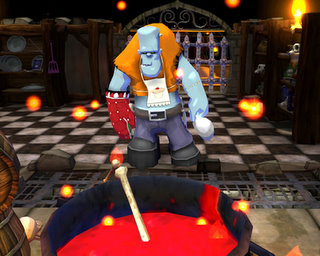

Back to: [West Karana](/posts/westkarana.md) > [2009](/posts/2009/westkarana.md) > [May](./westkarana.md)
# Dungeon Party goes live today!

*Posted by Tipa on 2009-05-15 11:00:30*

Interested in French MMOs but Saga of Ryzom isn't enough for you? You're in luck, because comedy-action F2P MMO Dungeon Party [goes live today](http://www.dungeon-party.com/index.php?rub=news_info), so download the client and get treasure hunting!

Is it good? I have no idea. I couldn't get the beta client to launch on my computer, but maybe they fixed it.

## Comments!

**[Hudson](http://hudshideout.com/blog)** writes: The French and combat! Who would have figured!

Ok ok....but I had to

---

**[Myrix](http://www.thewanderingrogue.com)** writes: I like the art style, it looks fun.

I think I'll check it out.

---

**[Pete S](http://dragonchasers.com)** writes: I played it once. 

I didn't get past the "Join the lobby, create or join a party, then launch the game" idea...

---

