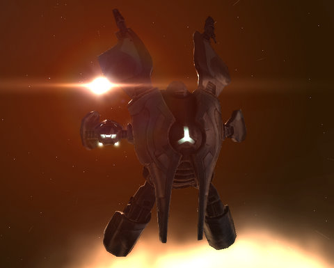

Back to: [West Karana](/posts/westkarana.md) > [2009](/posts/2009/westkarana.md) > [May](./westkarana.md)
# EVE Online: A noob in New Eden

*Posted by Tipa on 2009-05-18 08:20:02*

I'm in a sort of MMO rut these days, and it's not because MMOs have let me down. They haven't; most of the MMOs I play regularly are extremely good, and if I'm not having much fun, I'm sure it's not he game's fault.

I've been thinking about the old Bartle method for classifying MMO players as having varying degrees of four attributes, a character sheet of sorts for gamers -- Explorer, Socialite, Achiever and Killer. Everyone has each of those to a lesser or greater extent. Explorers like seeing something they haven't seen before. Socialites like doing things with other people. Achievers want to have the most or be the best, and Killers want to hug puppies and donate to worthy charities. The Bartle test shows me to be a heavy Explorer type, with about equal shares of Socialite and Achiever, and lastly, far and away the least, a Killer.

But the games I have been playing are mostly either Achiever-focused games (EQ2 and LotRO) or Killer games (Spellborn). Wizard101 is a Social game and Free Realms an Explorer game, but they were the minority and suffer from being kid-focused. Realizing that my rut may come from playing MMOs that really don't appeal to me (in EQ2, for instance, I mostly just make tableaux for comics instead of grinding shards and AAs as I am supposed to do), I downloaded EVE Online, the hardest core of all the Explorer-focused MMO I know of.

I hadn't wanted to go Gallente again, but I looked at all the ships available and in the appealing looks department, it was either Gallente or the Mon Calimari-looking Amarr ships. Given racial histories of either liberty or religious fervor, I went with liberty and taking on a very old family name, entered New Eden as Tipa Pinneau (by the time my mother was born, the name had been Anglicized to Pineo. I went back to the original).

Yes, I am half-French on my mother's side. You got a problem with that?

Since I played last year, the tutorial mission arcs have gone from a single catch-all mission arc to three, one for combat, one for business, and one for mining and industry. I had EVEMon to help decide on skills (three months to Battle Cruiser!) and Certificates to make sure I wasn't gimping myself (thanks, Krystalle, for pointing me to those!). EVEMon (and every. single. person I talked to) suggested pumping up the learning and stat skills to start, so that was most of Saturday, with a couple of necessary skill training to progress through the missions. Sunday was focused on getting basic certificates going (and by the time I get home from work, I should have Resource Harvester, Resource Foreman, and a basic combat certificate finished). The combat mission arc dealt with the capture of the saboteur Wolf, whom I finally tracked to a base deep in Deadspace. The last mission, he halted my ship in space with a stasis field, that I had to destroy from less-than-optimal range as my shields were eaten away by enemies. I destroyed it and warped out seconds before my ship was destroyed, repaired, and went back to finish the job.

That arc rewarded me the Tristan above. I used EVEMon to browse Battleclinic for good Tristan builds, and I was only a couple of hours away from a really solid build, so I trained that up while I searched the market for the fittings I'd need. Isis' Dark Laughter III is a speed tank -- she zips around the battle at 800m/s while destroying things from 10km with 125mm guns and Flameburst missiles, with a combat drone to help out a little. In the missions I've run with her, most of her enemies have died in the first few seconds; I can't lock target on them fast enough. Now that I have moved to Arnon, I expect things to be more difficult, but I'm liking it so far.

After the excitement of the combat arc, the business arc was a bit of a snore. The combat was depressingly simple, and though it taught the basics of salvage and hacking, the arc itself noted that it would be some time before we could use these abilities in real situations. I did peek in on the ship graveyards in some systems, with the salvagers buzzing around immense hulks like flies on a corpse. Someday... I didn't, by the way, appreciate that these missions couldn't be done usefully in a group. I flew them with my friend Kasul, and we ended up having to do most of them twice so we each could get the doodad from them.

The reward for this arc was the slow-moving hauler Iteron, which was amusingly destroyed in my only PvP incident of the weekend. I don't want to say PvP battle, because it wasn't. But I'll talk about that more in the next section.

The mining arc! I remembered this from last year! The last of the three arcs has you mining the skies for ore and forming it into various things. This is the arc that teaches new pilots, like me, how they are going to be making their money to start. The missions alternated between killing a couple extremely weak enemies and then mine something (and for this I used a combat drone which had no trouble keeping me safe from NPCs), or make something.

Midway through the arc, I came across a rich asteroid belt full of Veldspar, Scordite and Azure Plagioclase and figured I'd see how much this stuff sold on the market, maybe make some money. I mined a little of each, calculated the volume per unit of ore, calculated how much of each I could fit in my Iteron with two Extended Cargo Expander Is, checked the market, and found a good profit with the Veldspar a few jumps away. So I happily mined enough with my miner to fill the Iteron when someone flew up to me, suddenly turned red, and then flew off. They were gone, but somehow, they had claimed my can and everything in it in an instance.

I made a new can and opened the other one to get my ores back, but the game warned me that if I removed any of MY ore from the can, that I'd be KOS by the thief and his corp. I did it anyway, returned to base a jump away and got my Iteron. When I got back, I saw the thief had come back and claimed my NEW can as well, I opened it to get what ore I could out, and he appeared once more and shredded my ship. In the end, he got everything.

I wasn't that upset about losing the ship, it happens, but I was upset that my stuff was able to be instantly stolen without leaving me anything to do about it. I asked the newbie corp channel for help. (noobs are put in an NPC corp, apparently. The rookie channel is spammed by gold sellers and is unusable because of it, so it's good there's a channel new players can actually use). It turns out that jetcans belong to the last person who added something to them. So the thief had simply added one unit of ore to the can, and instantly everything of mine was his. This is called "can flipping". I could have claimed my stuff back by adding something more into it, but of course, at the time I didn't know this, and since taking my own stuff back is a declaration of hostile intent, I flew in to a noob trap.

It had taken about an hour to mine enough ore for the deal, so that was three quarters of a million ISK and an hour of time gone in a moment. And a ship!

One of the last missions in the mining arc brought me to a hidden pocket of space full of Kernite. I checked the market and found a good buyer for the stuff a few jumps away in low security space, but what the heck. I mined the belt bare, brought in a replacement Iteron, ferried it all to base in two loads, and then manually flew to the buyer at Old Man Star. The Iteron is FAR too slow for autopilot. I met no trouble on the way there or back, and managed to unload two holds full of Kernite for about 1.8m ISK.

That finished all three arcs for me (final reward for the mining arc was yet another Iteron), and the arc agents all pointed me to the Sisters of EVE station in the Arnon system for an epic arc, which Sara Pickell tells me can be farmed for big money. I spent the rest of the night ferrying my stuff and ships to the new base in the background while playing Free Realms. Now we'll see how well the Tristan does in real missions.... and yes, it is FULLY insured.

## Comments!

**[Hudson](http://hudshideout.com/blog)** writes: Sounds awesome good post

---

**[HZero](http://hzero.wordpress.com)** writes: Cool, I didn't expect to see you tackling EVE when I dropped into the site this morning. I've found it to be a great change of pace from the usual MMO's and I wished I had picked it up earlier. Gallente FTW! Fly Safe!

---

**Ryver** writes: I enjoy hearing someone else also starting out in EVE. A few buddies of mine wanted to try it out so I spent the trial period with it. I'll probably go ahead and register for a month or so after the upcoming US holiday.

---

**[mbp](http://mindbendingpuzzles.blogspot,com)** writes: Sorry to hear about your ship loss Tipa. Can flipping really sucks because it is completely counter-intuitive. Someone steals your stuff and leaves it in full view of you. You take it back and they get a free hit at you. It is a game mechanic tailor made for noob baiting. If you were actually in a mission instance then this was no unfortunate accident. They must have scanned you down to be able to warp to you. If mining isn't your thing then you should check out salvaging. Doing missions and salvaging the loot is a handy earner. You need to spend some cash for the skills but after that its all payback. In another of EVE's little peculiarities you can even salvage someone else wreck without fear of recrimination as long as you don't try to loot it. Not that I would encourage such behaviour of course :)

---

**[Julie Whitefeather](http://www.virginworlds.com)** writes: Can flippers, Salvage Thieves, Scammers and Rip off artists - Ironically CCP considers it all part of the game. One sure way to get rid of the problem with ore thieves is to get the corporate skill that allows anchoring. Tow a giant secure out to just beyond 5,000 km of an astroid field you frequent and anchor it. Make sure you set the password on the giant secure. Mine and fill the giant secures. Go back and get the ore from your giant secures strung out in a chain around the astroid field. As you discovered, taking back your ore makes you considered a "criminal". However there are two sides to that particular issue. This also means, that if you have a combat ship you can go back and get your combat ship (say your battlecruiser) and blow the ore thief out of the water with impunity (within a 15 minute period).

I have considered having a "no prisoners, no mercy" where we invite all of the known Eve Online virtual thieves and ask them to explain themselves.

---

**[Anjin](http://bulletpointsblog.blogspot.com)** writes: Well, you certainly make EVE sound interesting.

I DON'T WANT TO BE INTERESTED IN ANOTHER GAME, DARN IT! /grumble

---

**[Saylah](http://notadiary.typepad.com/mysticworlds)** writes: Oh Pooh!I wish I was playing now. I'm Gallente too so we'd be in the same neck of the woods. I would really have liked doing missions with another player. That would have been fun. And YES, do salvaging to earn money if you're doing Missions. There are good guides if you Google. I think even Evelopedia has one on it. Free cash for just salvaging ships (wrecks) you've already defeated while doing missions. I like EVE a lot more once I came back and didn't do any mining. Granted some folks love it but I wasn't one of them. :-)

---

**[Saylah](http://notadiary.typepad.com/mysticworlds)** writes: Dang, you're such a little distraction, Tipa. If you keep playing I'll have to email you and bug you for a static play-day so we can pal around and kill stuff.

---

**Cj Didge** writes: Never jet can mine, it will always attract someone who thinks griefing is pvp, Julie’s suggestion is a good one but only works in systems below 0.7 security as you’re not allowed to anchor anything above that. Sometimes its just easier in the end (and cheaper by preventing losses) to ferry the small amounts you mine back to a station. If you are going to mine as a profession in eve then you will want to get into a mining barge, with larger holds they work wonders for new players.

---

**[Tipa](https://chasingdings.com)** writes: Mining barge sounds like a good plan, but at the moment I just can't make any money at all unless I jetcan mine. I will definitely look into mining barges, though. I wonder how far away I am, training-wise. I'd definitely rather not jetcan if I didn't have to.

Hmmm EVEMon says I'm 9 days from the middle ORE mining barge, the Retriever. The largest one is well out of my price range at the moment, but the Retriever might be possible.

---

**[Brian](http://www.bluekae.com)** writes: Jet can mining is okay as long as you pick a quiet system. Look around for an out of the way system with a decent number of asteroid belts where the number of people in local is less than 50-sh. I've been mining into jet cans for months without having one flipped on me. Arnon is probably not a good place to mine since that's where the epic arc agent is so all of the noob baiters will flock there.

---

**JC** writes: If you can find a friend willing to sit with you while you mine, you can also toss your stuff in a jetcan, have them immediately grab it and put it into their hauler, and then they can trade it to you or contract it to you back at your station.

Or there's the ever popular "put a miner on your hauler and go afk for an hour while it sloooooowly fills up" thing ;-)

I wouldn't do that, though -- invitation to a suicide gank right there.

Retriever's a good mining platform. If you choose that route, that will be a big boon to you.

For myself, I trained to destroyers and ran a bunch of level 1 missions in them. I also trained salvaging, and by the time I was able to do level 2 missions, I had more than enough for a cruiser, and I converted my dessie into a pure salvage platform. And by the time I could do level 3 missions I could fly a BC also... though it took another 2 weeks before I could really tank it well.

Thing was, though... all the tanking skills for the BC applied to a BS also, so by the time I was ready for Level 4's all I needed for a BS was to train the bigger weapons.

So... I'm living proof that you don't need to mine as a noob to make money in EVE. 

Also, I don't know where your interests are, but if you do want to go a-pirating or whatever, you're better off training Gallente Frigate to at least 4, train some ewar skills so you can web and scramble a target, and then see about joining a corp that does pvp. They generally will reimburse ship losses done on corp ops and everyone needs tacklers. And since it only takes a few days to be able to tackle, you can get into pvp right off if you want.

If you want to stay in hi-sec while more skills train and such... mining can be ok, but IMO it's really boring. I'd rather run missions or do trade than mine, but of course ymmv.

---

**[wilhelm2451](http://tagn.wordpress.com/)** writes: I have found that the system you are in usually dictates the amount of grief you get. If you are in a system that attracts people... a system that is a sales hub, an agent/mission hub, or that sparklie things that bring people together, your potential to get griefed goes up. Finding a low population system with little going for it can often allow you to mine in peace. Of course, then you have to haul your ore or minerals someplace to sell them to get the best price usually.

Back when I was climbing the ladder to mining success, I found I was getting flipped quite a bit in one system that had a generous amount of Caldari Navy agents, but that just one jump over there was a system that was equally viable for mining purposes yet was almost always empty.

Of course, I eventually solved most of my can flipping problems by getting a second account so I could run a miner and a hauler together.

---

**[Hirvox](http://hirvox.blogspot.com/)** writes: Jet can flipping is an artifact of CCP's "let players sort it out with free-for-all pvp" philosophy. Here's how it works:
1) Miner puts stuff in a jetcan
2) Flipper arrives, jettisons a item into his own can
3) Flipper opens the miner's can and moves everything in the miner's can to his own can. With the miner's can empty, it disintegrates. Because the flipper just committed theft, he is flagged for 15 minutes.
4) Flipper renames his can to have the name the miner's can has
5) Miner takes stuff from the flipper's can, accidentally committing theft himself and thus flagging himself as a valid target for the flipper.
6) Flipper destroys the miner.

It's crucial to understand how it works, because there's countermeasures that rely on it.
First, flagging as a valid target is corporation-wide. You can have a corpmate standing by in a combat ship. As soon as the flipper touches the miner's can, the corpmate can vaporize him. As long as the miner himself doesn't touch the can, any attempt to attack him would result in a swift retribution by CONCORD. Once the enemy has been dispatched, the combat pilot can flip the can back without endangering the miner. If you don't have a corpmate in a decent combat ship available, a throwaway alt in a newbie ship can fulfill the same role. Just flip the can with the alt and steal the ore back from your him. He won't mind. And even if the flipper attacks your alt, you'll only lose the newbie ship, which you can get back simply by returning to the station.

---

**[Tipa](https://chasingdings.com)** writes: I would LOVE to get some payback on the flippers. Got flipped twice last night. The second one just silently swooped up and took my can. But the FIRST, ah, the first thought I was an idiot. He came up to me while I was fighting an NPC rat with drones while selecting asteroids for mining, and hung around awhile, then he flipped the wreck and left. I was kinda dubious but started mining. He came back about half a minute later when I had just one load in the can, so I took off. Then he started sending me messages saying the wreck had an Expanded Cargohold II in it and he wanted to give it to me.

I told him I may be a noob, but I'm not THAT much of a noob. I undocked -- he was hanging around RIGHT outside the station. I went to another system.

---

**Ryver** writes: I will agree with the prior poster that if you are mining only for the ISK, then you may want to also look at just salvaging. Within just a few days of starting in EVE, I was able to train to use salvagers. Each time you kill an NPC, fire up your salvager against the wreck. You won't always get an item, but when I received them in 0.9-0.6 space, they prices would easily range from 10 ISK to 300k ISK. Most of the time on the Epic Arc, I would make more money from salvaging the wrecks that I did for completing the quest (~100k ISK / quest).

If nothing else, it's a less aggrevating way to make ISK. Of course, you enjoy crafting in other games, so if you are mining to also craft and use/sell those, then mining may be for you :)

---

**[Tipa](https://chasingdings.com)** writes: While I do love crafting, I also know that given EVE's steep, steep skill curve, that it would be weeks or months before I could make things with enough efficiency to compete in the market or even to be cheaper than just simply buying the end product outright. Manufacturing for profit can be a long term goal.

Salvaging, though -- yeah I was thinking last night, as I looked over the remains of easily a dozen Serpents, that I should SO be salvaging those wrecks....

---

**[Hirvox](http://hirvox.blogspot.com/)** writes: Just fitting a salvager or two on one of your usual ships is okay, but eventually it's a good idea to move up to destroyers. With eight high-slots, you can fit several salvagers, a few small tractor beams, an afterburner and some cargohold expanders. A ship fitted like that will clean out even level 3 missions relatively quickly. And while you can't use a tractor beam on someone else's wreck, you can salvage those without becoming an outlaw. It's like being a skinner in World of Warcraft and cleaning up after someone who just kills beasts and leaves the corpses untouched.

---

**[Tipa](https://chasingdings.com)** writes: So, use one ship to do a mission, and then another to clean up after? Or would the destroyer use drones to do the killing while sucking up the loot?

---

**[Hirvox](http://hirvox.blogspot.com/)** writes: Switching ships is usually the best option, yes. Although Dominix-class battleships for the Gallente do work just fine with just the drone dps.

---

**Denidil** writes: There are several solutions to Can flippers - Here are two of them.

Method 1: Have a Cargohold that is 17199m3 in size [ this setup will run you around 150 mil ISK.. but it will pay for itself]. I use this to semi-afk mine in .7 Amarr space.

[Hulk, Solo Highsec Miner]
Expanded Cargohold II
Expanded Cargohold II

Survey Scanner I
'Anointed' I EM Ward Reinforcement
Ditrigonal Thermal Barrier Crystallization I
Cap Recharger II

Modulated Strip Miner II, Veldspar Mining Crystal II
Modulated Strip Miner II, Veldspar Mining Crystal II
Modulated Strip Miner II, Veldspar Mining Crystal II

Cargohold Optimization I
Cargohold Optimization I

Hornet I x5
Mining Drone I x5

Here is the other:

http://www.youtube.com/watch?v=ndWUlntJ58U 
(Hulk pilot fits it for PvP and proceeds to wreak utter havoc on can flippers).

Heh.. you can also just dock up and get a combat frig and hunt them down.. but the OH @#$% suprise of a Hulk fitted to pop them is so much more amusing.

---

