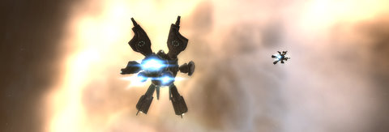

Back to: [West Karana](/posts/westkarana.md) > [2009](/posts/2009/westkarana.md) > [May](./westkarana.md)
# Daily Blogroll 5/19 -- Black Lung edition

*Posted by Tipa on 2009-05-19 08:09:23*

In EVE Online, at my new home at the Sisters of EVE base in the Arnon system, with Mining IV, Refining III, and two Miner II mining lasers and purely selling in-system, I make about 27.5K ISK per minute of mining. If I processed the ore at my current level and sold it in the best market within seven jumps, I would make about 26K ISK/minute of mining, not including travel time. The question is, how many sessions of mining would it take to pay for the skills and equipment necessary to make refining more profitable than just selling the ore straight with no additional skills going toward mining? EVEMon has me at about ten days to having the skills necessary to fly a ORE Retriever mining barge... EVE is the first game I have HAD to play with a spreadsheet open.

Speaking of which, new EVE patch is out today. Just bug fixes, but they do install a new version of DirectX? Why? Doesn't Microsoft keep my computer's DirectX updated with their updates?

Anyway, on to the blog roll.

And because I'm en EVE noob, I've been poring through the back posts of the most famous noob of them all, Wilhelm of the Ancient Gaming Noob where he notes that the 1.6m skill point boundary where the 100% skill point bonus disappears used to allow an exploit where you would start a new really long skill just before your noob time expired, and it would stay double experience for the duration. [Well, they nerfed that, but the exploiters still win](http://tagn.wordpress.com/2009/05/18/a-not-so-fabulous-turn-of-events/).

Remember Pirates of the Burning Sea aka EVE of the Caribbean? The pirate-themed historical trading MMO was based around three-realm RvR but never really struck a spark in players. Via Massively comes the news that Flying Labs thinks players [are having fun the wrong way](http://www.massively.com/2009/05/18/pirates-of-the-burning-sea-takes-bold-step-to-curb-mission-farmi/), by farming mission objectives that give the best loot. This has gotten to the point that that's all people do, similar to the old problems with Warhammer's scenarios and more recently with City of Hero's Architect missions. Rather than making missions more fun or identify player perceived need for those particular rewards, FL is removing loot from mission NPCs....

I dunno. Sounds dodgy to me at best. I get that the rewards were not intended, but PotBS is a pretty brutal game to begin with, on the same scale of complexity with EVE Online, but with more punishing PvP, when I played.

Speaking of balance between realms and Warhammer (weren't we?), Keen talks a little about Warhammer's new "Land of the Dead" expansion which will solve all the issues with realm wars and give people reasons to fight the good fight for their king. [Or will it](http://www.keenandgraev.com/?p=2368)? Due to Warhammer's two-sided conflict vs Dark Age of Camelot's three, one side can dominate a server so that the other side perhaps NEVER gets a chance to try the new content, since it can only be reached by the leaders in the realm war. Keen points out that DAoC's three-sided conflict kept all objectives in play all the time, and I remember DAoC's version of LoD, Darkness Falls, as often changing hands a couple of times nightly. It was FUN.

We reported last week about Thom Terrazas leaving Vanguard to become the new executive producer of EverQuest, following Clint Worely's departure for an unannounced project (EQ3...). Nostalgian Lazaretto of Complete Heal [happened to mention this on the Vanguard forums](http://www.completeheal.com/?p=1015) and ... oops ... Nobody had bothered to tell the Vanguard players that they were suddenly without a producer. [And hilarity ensued](http://forums.station.sony.com/vg/posts/list.m?topic_id=47150).

Saylah hates Free Realms. She hates the idea of it. She hates zoning. She hates instances. [So why is she a level 7 chef with a satchel of food](http://notadiary.typepad.com/mysticworlds/2009/05/1000001-another-game-makes-a-liar-of-me.html)? It's those damn addictive minigames is what!

Ogrebears, one of EQ2's most renowned bloggers, left the game a couple of months ago to play WoW instead. Since he seemed to be back in the fold for his Norrath Street View project, I asked him if he was back. No, no, no. He will never play EQ2 again, and [this is why](http://ogrebear.com/?p=952). Hold on, are you sure you want to be playing MMOs at all?

[Via Massively](http://www.massively.com/2009/05/18/analyzing-mortal-online-is-it-for-you/), [a complete writeup of Mortal Online](http://www.incgamers.com/Features/203/MortalOnlineAnalysed/1), the upcoming all PvP, all the time, completely sandbox, do what you wilt shall be the whole of the law, kind of game. Like, you know, [Darkfall](http://www.darkfallonline.com/). Players in Spellborn were very much looking forward to Mortal Online whereas they were pretty dismissive of Darkfall. Probably because they haven't had a chance to try Mortal Online, yet. Serious PvP MMOs are a different breed. Many people had just come off Darkfall or [The Realm Online](http://www.realmserver.com/) before Spellborn, were headed toward Mortal Online, and probably were thinking about what comes after that already.

After waffling a bit over tech support issues, wondering if he would continue to play Age of Conan or if this would be his time to quit MMOs forever, Openedge1 is loving the upcoming patch which [fixes combat and is wonderfulness in a box](http://simple-n-complex.blogspot.com/2009/05/age-of-conan-little-things.html), so Viva le Conan!

Syp wants MMO NPCs to [man up and solve their OWN problems](http://biobreak.wordpress.com/2009/05/17/to-the-quest-giver-i-saw-today/) rather than snare unwitting players to solve them -- and like as not just ask the next person who comes along to do the same thing! The real problem is one of respect. Ever tell a child to go do something just to keep them busy and out of your hair while you're doing something? Well, MMO worlds are populated entirely with people who just want players to go away and will tell them ANYTHING.

Let's all send good thoughts Crookshankz's way as he [camps Emperor Crush in EverQuest's Crushbone](http://thegaminggoob.wordpress.com/2009/05/16/eq-1000-words/). Mmmm.... and get that nasty inky assassin, too!

Hudson and about a million others reported that the Champions Online launch has been [delayed until September](http://hudshideout.com/blog/?p=2487). I have to admit I was looking forward to this game until I found it was modeled after the WoW quest model -- you know, get all the quests from exclamation-point decorated NPCs at a quest hub, follow the quest helper to clearly marked areas on the map where the quest may be completed, complete the quest and return for xp? Sorry. I'm done with mindless quest grind MMOs. Way to be heroic.

I was REALLY looking forward to it, too.

Lars at MMOment of Zen would like to [take EQ2's mentoring system and expand it](http://mmomentofzen.blogspot.com/2009/05/auto-mentoring.html) so that your level would be automatically set in accordance with whatever zone you happened to be in, so you would never actually outlevel content. That sounds... cool! At least if the rewards (xp, AA xp and loot) still scaled back to be useful to you at your actual level. 

And that's about it for today. Keep gaming, and if you are flying in EVE or mining in Free Realms, FRIEND ME!

## Comments!

**[Syp](http://biobreak.wordpress.com)** writes: You don't have to do the typical WoW-ish quests in Champions -- there's WAR-style PQs, coop missions, and PvP missions as well.

---

**[Tipa](https://chasingdings.com)** writes: We all know how well that worked out for Warhammer. Well, jury's still out and it's a long time until September, but if it launches as a WoW-style quest grinder, I'm out.

---

**[Spinks](http://spinksville.wordpress.com/)** writes: "or mining in Free Realms, FRIEND ME"

Sure ... if I could!

---

**[openedge1](http://simple-n-complex.blogspot.com)** writes: Hmmm...after reading Ogrebears issue with EQ2, none of that makes any sense. Weird. The LFG tool he is asking for does not exist in any other game I know of, and for grouping, I never had an issue in EQ2.

As to my "waffling", in all actuality, Funcom came through with their end of the bargain. I stated if I cannot get support help, I would leave. They did a turn around and made their efforts to help, and based on their questioning I was able to figure out the problem (they did not fix it, I did, but all I needed was another ear!).
I am glad they did, as I am having more fun that I ever have in an MMO (besides GW), and patch 1.05 will make this an ultimate PvE game (what they should have done in the first place), but for those who PvP, brand new changes to make that more interesting as well.

Good for them.

Cheers

---

**[Hudson](http://hudshideout.com/blog)** writes: I disagree about Champions Syp sorry. To me it was WoW in tights the minute I got in, and listening to fellow beta testers in Vent reminded me of WoW because all I had to do was close my eyes and it was the same except replace WoW NPC name with Superhero NPC name

Same issues, same bugs, same crappy interface it has had since beta launched. 

Grab quests, finish them, return to NPC, dont bothering reading or doing anything. Public quests were kinda a lame side job thing that no one either noticed or understood and for the most part went ignored. 

I am re-upping EQ2 because oddly enough it seems to be the last bastion of MMO mature players plus the ability to expand beyond the mundane questing experience. Although I hate the combat, I keep going back and I know that LOTRO won't last long with me. Luckily I have a good group of gamers to test many games with this time.

The reasons Ogre stated for leaving EQ2 can be said in all MMO's that are not WoW at this point. Merge servers, blah blah blah. Seen those complaints before. That doesn't stop a game as deep as EQ2 or LOTRO from being playable. He can think of better reasons than that c'mon. I could say the same for CoH or AoC too. Especially Warhammer but that game is just garbage.

---

**[Wiqd](http://wiqdintentionz.com/studios/blog2)** writes: Lars' comment on the mentoring system shows exactly why we need to do away with levels in MMOs, period.

---

**[We Fly Spitfires](http://blog.weflyspitfires.com)** writes: @Hudson After playing WoW for 6 months, I'm inclined to agree with you about the maturity comment. EQ2 does have a great community, something I felt was lacking in WoW. If WoW had EQ2's playerbase... well, it would make me very happy :) But then I suppose the games attact the player bases because of how they are designed.

---

**Graktar** writes: Actually you're wrong about one side being able to hold the Land of the Dead indefinitely. Mythic has already described how access to the Land of the Dead is earned, and it's through a points accrual system. Each side has their own pool of points, and when you fill up the pool, control flips to your side and your pool empties. The other side's pool stays exactly where it is. Even if one side is dominant, sooner or later the other side will get access to the new area unless the sides are so unevenly matched that the underdog can't score points in anything, ever. In which case I'd expect everyone on that side would have left the server already, Land of the Dead or not.

---

**Norikue** writes: "Many people had just come off Darkfall or The Realm Online before Spellborn,....." 

Whoa, hold up a minute. People are still playing The Realm!?! It's amazing that it's still going on since it's launch in 1996! Really though...people are still playing that?

---

**[Tipa](https://chasingdings.com)** writes: Pretty sure that's where the people said they were coming from. There were a LOT of them, too, and apparently the levels in the Realm are astronomical.

I can't imagine this game would be that old though. I must be thinking of a different game? But I'm pretty sure that was it. I'll poke around more.

@Graktar -- that's good news!

---

**DeepSleeper** writes: The way you describe "mindless quest grinds" -is- MMOs to me. That's what I play them for, that's essentially all I do.

What else is there, if not quests and experience gain? Combat for its own sake? Walking around looking at things? Making in-game money for... what? PVP?

The "quest grind" -is- the game to me. I study every bit of NPC text with interest, I enjoy the feel of performing a task for a reward. I'm now wondering what alternate style of play I'm missing.

---

**[Tipa](https://chasingdings.com)** writes: @DeepSleeper I'm not sure if you are being honest or sarcastic here.

My first MMO, Nexus: Kingdom of the Wind, was a social MMO. There was plenty of fighting, and you had to do a lot of it to progress, but mostly what you did was hang out with other people, and then go in big crowds to decimate an area of all life, and then maybe attend a wedding or a tournament.

In EverQuest, while there were quests, the usual play style was to group up with some folks, find a nice comfy dungeon spot, and camp rare drops (and xp, though xp was very slow in EQ). Given EQ's generally slow pace back then, you chatted a lot with your group and through the zone and generally just had a good time. Other times you'd be in a hunting group that would go to a usually overland zone and just kill whatever you came across -- Rathe Mountains, for instance, was famous for that.

DAoC had many of the same characteristics as EverQuest, but after you finished the newbie levels, groups tended to shift between normal killing and camping rare drops into small group PvP or massive armies meeting on the battlefield. You never quite knew what would be happening in a night of DAoC.

In fact, until I played WoW, I'd never played a game like it. And I LOVED WoW! But then I got bored with the quest grind. EQ2 was great, but then it started going the WoW route and I got bored with ITS farming and quest grind. Since grinding quests is SUCH a non-starter with me these days, I'm not going to bother with any games with that as their main feature.

Been there, done that.

---

**DeepSleeper** writes: That must be it then. I don't touch the social aspects of MMOs at all, what you describe there is basically anathema to me. Combat in MMOs without a quest is combat for its own sake, or for loot, and doesn't motivate me at all the way storyline text does. 

(And, for the record, that was 100% honest curiosity.)

---

**[Sente](http://adingworld.wordpress.com)** writes: @Edge: While not exactly Ogre's LFG tool, you will probably get somewhat close to that in City of Heroes/Villains. The LFG tool itself is still character-based, but a lot of other pieces are global name (i.e. account) based and exact levels are not that important. If the play may have something more suitable he/she may switch, otherwise it will probably be fine anyway in many cases.

The same goes for Lars' comments on EQ2 auto-mentoring; look at what City of Heroes/Villains has done in this area, it may probably be quite close to what he wants. But I think one important piece here would be that the developers would have to let go of the idea that players need to progress through content in a certain order. They could hint at an order, but it would really be up to the responsibility of the players to choose.

When a defined progression path becomes more important than teaming and social aspects is when we get the situations which plague a number of MMOs. 

If Champions Online is becoming a mission grind like LOTRO and perhaps WoW, then I am a bit disappointed. But will wait and see for myself at some point. I'd rather hope for a Guild Wars model for missions, combined with some of the good points from City of Heroes/Villains missions.

---

**[Hirvox](http://hirvox.blogspot.com/)** writes: BTW, there's an in-game channel called eve-bloggers that you might want to check out. Among other things, it has a healthy (and polite) pirate population in case you want to see how things look from the other side of the law. :-)

---

**Norikue** writes: The Realm Online is really that old. It was in beta in 1996. It's the first "MMO" I played. It was owned by Sierra but they sold it to a Canadian company, I believe it was anyway. It wasn't much of a game though. At the time it was much more of a chat room with cartoon characters. Sure there was monsters to battle etc, and yeah we did all have our own house. 

I did go to the link you had it is the same game I played back then. It looks like they kept updating it after I stopped playing it in 1998. 

It does just amaze me that it's still played though. It always had a strong community though.

---

**[Lars](http://mmomentofzen.blogspot.com/)** writes: @Sente - I was actually thinking of something more like in Final Fantasy XI. There were several zones that had soft level caps, so if you exceeded its designated level, you were lowered down automatically. For example, if you did a BCNM 20 fight, you would automatically scale to level 20 and my level 50 paladin could group with level 75 guildmates I normally never see and fill out the group with level 20s, etc., etc. Itemization in FFXI was such that sometimes some very low level items were really desirable to high levels. 

It was still somewhat of a nuisance in FFXI though because (at that time) it didn't scale your armor or abilities down meaning you had the hassle of having to keep multiple sets of armor at various level tiers. I hear that's not the case anymore, but I stopped playing a long time ago.

---

