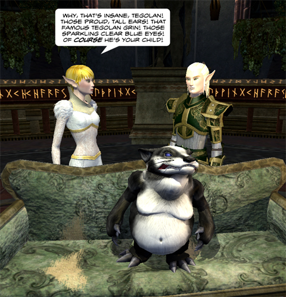

Back to: [West Karana](/posts/westkarana.md) > [2009](/posts/2009/westkarana.md) > [May](./westkarana.md)
# EQ2: Elven Child Support

*Posted by Tipa on 2009-05-19 23:41:15*

Somewhere in the Field of Bone, a Burynai is trying to explain to her husband why their daughter looks like an elf.

## Comments!

**[The Friendly Necromancer](http://thefriendlynecromancer.blogspot.com)** writes: haha! Hilarious. :-) Thanks, Tipa!

---

**[We Fly Spitfires](http://blog.weflyspitfires.com)** writes: Awesome :) Noob question: is that a screenshot? Looks a lot better than my game :) How did you make it? It's got that similar glossy look to the FTW comics.

---

**[Tipa](https://chasingdings.com)** writes: Um, pressed the screen shot key, brought it into Photoshop to crop and add the text, but the image was not manipulated. That's what the game looks like to me with my new computer. I didn't even change the graphics settings!

Now my old computer is another story. When Stargrace at MMOQuests got a new video card, she went with ATI instead of the nVidia most of us have been using since EQ pushed it so strongly. And EQ2 looks amazing with ATI -- it looks like that, WAY better than nVidia. So, I'm a convert.

---

**[We Fly Spitfires](http://blog.weflyspitfires.com)** writes: Dang, it looks way nicer than my in-game view. It's a lot more smooth, refined and 'glossy'. I thought it was manipulated! I'm using nVidia so that must explain it. I never even knew there was a difference!

---

