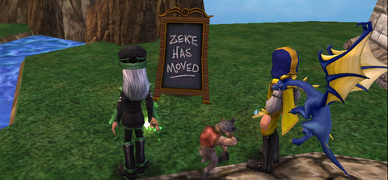

Back to: [West Karana](/posts/westkarana.md) > [2009](/posts/2009/westkarana.md) > [May](./westkarana.md)
# Daily Blogroll 5/22 -- On Holiday edition

*Posted by Tipa on 2009-05-22 08:20:38*

Long weekend for us in the US, Memorial Day weekend. Though meant to honor Americans who have died in wars, I remember it mainly as the beginning of school's summer session -- those last few weeks of school where the teachers pretty much relaxed and let you do whatever you liked. As a trumpet player in the school band, I always had the hope that I would be selected to be the lone trumpet that stood apart in the cemetery that also ended the Memorial Day parade and play taps as we all stood silent in prayer.

On to the Daily Blogroll!

[EQ2's producer has left](http://eq2players.station.sony.com/news_archive_content.vm?month=current&id=3095) for ~~EQ3~~ some unannounced, probably EverQuest-related project, and in true hit-and-run fashion, used his last communique with the EQ2 player base to outline some changes to procs which boil down to you doing less DPS now, so we can let you do more DPS later. Naturally, the hearts of all the DPS-obsessed types in EQ2 skipped a beat, pain started shooting through their right arms, blurry vision et al. Stargrace explains [why this isn't the end of the world](http://mmoquests.com/2009/05/22/o-m-g-the-sky-is-falling-ok-not-really/), and Ogrebears heads to EQ2Flames to get [the calm, considered, rational reactions](http://ogrebear.com/?p=965).

I was playing EQ2 the other night and some Shadow Knight was boasting that his dps was consistently over 10K. He was likely lying, but the groans from the SKs in the raid channel who could only manage 5K dps were legion -- suddenly they were not on top, suddenly they felt worthless. Point is, obsessing about these details is just going to lead to unhappiness.

Darkfall's awesome power has convinced [one of the game's most strident critics](http://www.brokentoys.org/2009/05/21/and-i-beheld-when-he-had-opened-the-sixth-seal/) to send Aventurine a fistful of Euros, so... is he looking for some impact PvP, or does he just want to sneak up on Syncaine and perma-kill him?

Syncaine doesn't seem alarmed about his imminent stalking as [he looks back on three months of Darkfall](http://syncaine.wordpress.com/2009/05/21/darkfall-3-month-review/) and, with the tourists finally gone, likes what he sees.

Tanya wins today's award for "[The Best Use of Pleonastic in a Blog Post](http://blog.tanyakhovanova.com/?p=135)". Grats, Tanya!

Zubon of Kill Ten Rats weighs in on the recent changes to City of Heroes' Architect missions to [discourage mission farming](http://boards.cityofheroes.com/showflat.php?Cat=&Board=hvh&Number=13521481&bodyprev=#Post13521481), and wonders why, if they disliked farming so much, they included badges [for such heroic achievements as killing 50,000 enemies](http://www.killtenrats.com/2009/05/22/farming-2/) in test mode missions?

Spinx [writes a long love letter to LotRO](http://spinksville.wordpress.com/2009/05/22/how-to-get-a-better-class-of-player/) and muses about the reasons the LotRO community is just, darn it, so much better than the community for, say, some other mega-popular MMO. The LotRO community is great, but in my TOTALLY SUBJECTIVE OPINION, can't make up for the boring, boring, boring, grindy game play. In several tries, I have never managed to make it past the Lone Lands/North Downs/Evendim quest grind to finally get to any of the fun parts of the game.

Syp of Bio Break [talks a little about Champions Online's "Advantages"](http://biobreak.wordpress.com/2009/05/22/champions-online-the-advantage-is-mine/), ways you can boost the power of your, well, powers in a way that will further distinguish your hero from everyone else's. Helping heroes be unique is a big win in my book, and a good way to further set Champions apart from CoH, where heroes largely gravitate to certain builds.

And lastly, Genda of Grouchy Gamer has a depressing story of what happens when [a guild of real life friends starts recruiting people they don't know](http://www.thegrouchygamer.com/?p=179) in order to beef up to take on bigger challenges. When I played WoW, this same story played out again and again.

## Comments!

**[Spinks](http://spinksville.wordpress.com/)** writes: I agree about the LOTRO gameplay being really grindy, btw :) It's why I couldn't stay longer than a month when I tried Moria a few months back -- CoH is like that for me too. So many things I like about the game but the basic gameplay? Uh no.

---

**[Richel](http://www.fieldstoneacademy.org/)** writes: I don't actually play this kind of game. I have only my DS and sims 2 on my pc. thanks for the info

---

