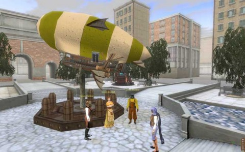

Back to: [West Karana](/posts/westkarana.md) > [2009](/posts/2009/westkarana.md) > [May](./westkarana.md)
# Steampunk MMO Gatheryn enters closed beta

*Posted by Tipa on 2009-05-22 16:22:11*

After the disappointment of finding out that Atlus' NeoSteam wasn't actually very (if at all) Steampunk, it was wonderful to come home today to find that somewhat more authentically Steampunk MMO [Gatheryn](http://www.mindfusegames.com/index.php) has entered closed beta! 

Full details below, but be warned: They are going to ask you about your favorite Steampunk books...!

> Greetings!

Some time ago, you expressed your interest in Gatheryn, a new steampunk-themed casual MMO from Mindfuse Games. We appreciate your enthusiasm, and we would like to thank you for your patience as Gatheryn draws closer to release!

Your continued interest is about to be rewarded, in fact: We at Mindfuse are preparing to start the Beta Testing phase for Gatheryn! As of today, we are opening the registration process to become a beta tester, and as thanks for your early interest and support, we'd like to invite you to be among the very first to sign up. By completing the full registration form, available now, you'll be signing up for an actual Gatheryn account, and you'll get a chance for an early look at the steam-powered Elymian Islands!

You can sign up for your full account, including full access to our new website features, at <http://www.mindfusegames.com/index.php?option=com_user&task=register>

Please note that our Beta Tester selection process is going to occur in waves, with our first rounds of testers playing strictly by invitation. Completing this form will not guarantee you an immediate Beta account. We will, however, be giving consideration to our earliest supporters, so sign up now, and thanks once again for your interest in Gatheryn!

In addition, please have a look at our all-new website, online now at <http://www.mindfusegames.com>.

Cheers,
Silas Gray -- Elymian Ambassador to OutWorld

See you in the Elymian Islands (I hope!)

## Comments!

**[Beau](http://www.spouseaggro.com)** writes: AGH! I want in on the BETA! :(

 BEau

---

**[openedge1](http://simple-n-complex.blogspot.com/)** writes: China Meiville, Neil Stephenson, Neil Gaiman all in my collection...even my avatar is Steampunk...yet, no invite..ARGH

Horrible.

Anyways, back to my wife...

Cheers

---

**[Ramon](http://dalayan.wordpress.com)** writes: Oooh, all these free-to-plays! Meanwhile I think free-to-play is the preferred way for all "casual" MMOs, if you define casual as "can't invest 38 hours a week into a single game". I think even [WoW could use a new pricing model](http://www.psy-q.ch/blog/articles/2009/05/23/pay-as-you-play-pricing-for-world-of-warcraft/).

And the fact that Gatheryn will be proper steampunk makes it all even nicer :) Four (potentially five) interesting F2Ps to play, oh my.

---

**[Sente](http://adingworld.wordpress.com)** writes: Good to see that they are making progress! Steampunk theme, casual playstyle, more emphasis on exploration and social activities. It can certainly be a nice complement, definitely something to try out.

---

**[We Fly Spitfires](http://blog.weflyspitfires.com)** writes: Never been much of a fan of the steampunk genre but I'm willing to check it out. Can you get guns etc in steampunk? I reckon WoW is quite steampunky now what with the inclusion of motor bike mounts and the like.

---

**[Tipa](https://chasingdings.com)** writes: I'm not sure what the gnomes are doing in WoW is steampunky as opposed to just high tech. Steampunk is as much an attitude as a tech tree.

Sure, Steampunk can have guns. They can even have ray guns :) But Gatheryn is unlikely to have guns, as it is a non-combat MMO. You explore, you play minigames which appear, from the screenshots on the game's website, to be integrated into the world in a way similar to EQ2's crafting.

---

**Bhagpuss** writes: I filled out the beta app earlier today. When it came to the "favorite steampunk" books/movies part, I said, quite truthfully, that I've never read/seen one.

We'll see if that bars me from consideration, although it does say somewhere in the faq that everyone who applies will get in eventually (not much of a promise as they are also having an Open beta before launch).

---

**[Tesh](http://tishtoshtesh.wordpress.com/)** writes: I got the same email, but the TOS for the Beta preclude game industry employees from joining in the fun. I'll be sitting the Beta out, but I look forward to the release.

I'm still a bit bummed, though.

---

