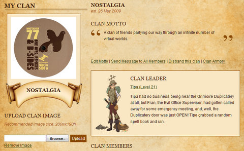

Back to: [West Karana](/posts/westkarana.md) > [2009](/posts/2009/westkarana.md) > [May](./westkarana.md)
# Legends of Zork: We have a Clan!

*Posted by Tipa on 2009-05-27 06:31:13*

Yeah, I *know* [Legends of Zork](http://legendsofzork.com/) is a ["ProgressQuest"-like achiever game](../../../index.php/2009/04/17/achiever-games-legends-of-zork-and-progress-quest/) where you grind meaningless combat again and again to earn gold for gear that you will wear so you can return to the grind to replace it.

But aren't most RPGs like that? Just because you know there's a man behind the curtain, doesn't mean you can't enjoy the show. It's like five minutes a day to kill my thirty monsters... um, plus the half hour to make spreadsheets analyzing the various combinations of weapons, spells and armor to be most effective.

Two-handed weapons? Total win. Defense spells? Only if you focus on Spirit.

Yesterday, the Implementers ([do they still call them that?](http://en.wikipedia.org/wiki/Implementer)) added Clans (guilds) to the game, and Nostalgia was born on Yet Another Game. Aside from a way of trading out of date items to each other and packing all our stats together to form a guild ranking (we're #39 of 181), and we're not doing too badly with just four members.

Play Legends of Zork at all and are looking for a clan for some reason? Look up Nostalgia!
## Comments!

**[Stargrace](http://www.mmoquests.com)** writes: So glad we got ourselves a guild set up on LoZ!

---

