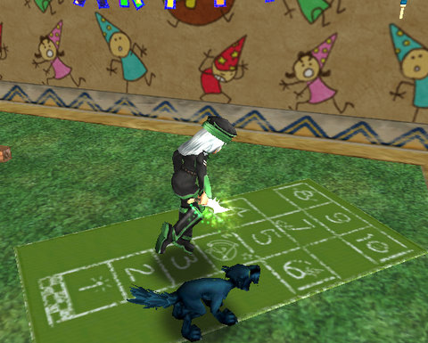

Back to: [West Karana](/posts/westkarana.md) > [2009](/posts/2009/westkarana.md) > [May](./westkarana.md)
# Wizard 101: What I'd like to see in Grizzleheim

*Posted by Tipa on 2009-05-27 07:39:03*

Wizard 101's sixth world, [Grizzleheim](https://www.wizard101.com/site/home2/wizard101/page_8ad6a40421580c0b0121690146290349), has been announced, and it already looks like it will be a real departure from the other worlds of the Spiral. 

Quantize believes, from the announcement, [that Grizzleheim is explored parallel to the other worlds](http://www.wizard101central.com/forums/showthread.php?t=11898) as you play through the game. 

The announcement seems to (aheam) BEAR that out:

> Players will first encounter the Viking Bears of Grizzleheim, great traders with the ability to travel the worlds of the Spiral, in the free-to-play areas of Wizard City.

As student wizards adventure through subsequent worlds, Grizzleheim will offer new quests, new locations to explore, new opponents and new Viking-themed decorative housing items interspersed throughout the mid and higher levels of the game.

That doesn't mean there won't be material for high level players, but it probably does mean that to experience all of Grizzleheim, you'll likely want to be leveling up a new wizard from scratch. Which is a good reason; until now, Wizard 101 has been so linear that there hasn't been much reason to play through the game more than once.

Nonetheless, I expect an additional five levels in the game to give those who choose not to restart something to look forward to. Though the previous level cap was 50, until Dragonspyre, it was VERY difficult to advance much past level 45 in Moo Shu unless you had done so early enough to exploit higher level instances for quick, combat-free, mega-experience, before they nerfed repeat instance experience.

Dragonspyre, then, was the first post-nerf expansion that raised the effective level cap from 45 to 50; and Grizzleheim will likely do something similar, allowing wizards to progress to level 55, and perhaps earn an additional skill point, though likely no additional spells for their main school.

Grizzleheim's "parallel path" will likely delay, for awhile, W101's problems with fight duration. Dragonspyre yard trash was often more difficult than most Moo Shu bosses, and any fight could be expected to take a significant amount of time, and yet give only a small amount of experience and gold. Compared to the previous four worlds, Dragonspyre was often a relentless grind.

Now, they can add easier, more casual encounters tuned for lower level wizards.

These are things we can guess from what we see in the screenshots and read from the announcement. But every MMO expansion has something special in it, something that will give people who have left the game something to pull them back.

Here are my not-so-humble suggestions:

 * **Appearance slots:** I've been wanting these since forever. KingsIsle used to offer statless costumes on holidays for Crowns, but without special slots where you could wear this clothing without sacrificing the stats of the clothing you need for adventuring, it was near useless. KingsIsle hasn't offered statless holiday clothing since their winter celebration. This would be a boon for the game, the players and KingsIsle itself (as it could once again sell holiday outfits), that I would be shocked if appearance slots were not a feature of the Grizzleheim expansion.

 * **House pets:** Unlike appearance slots, I've seen nothing from KingsIsle that would lead me to believe that Wizard 101 is about to get house pets. Anyone who has played the game for any length of time has gotten several pets; I've got at least a dozen. Some I've sold, some I've passed to alts, but most of them I have kept. I have a room in my bank that REALLY needs a good cleaning. I should be able to free my pets from the vault and let them roam (or even just stand) in my home. I have a bunch of dark nooks that would be perfect for a bat or spider. Krokotilians who could walk slowly up and down my street. Let me put my pets in my home, and I'll definitely be more interested in playing more to get more pets. As it stands now, my level 48 life pet is too useful for battle to not equip all the time.

 * **Auction House:** The Grizzleheim bears are traders? And they may appear in every world? Would it be wrong to think that these Viking bears might sell items on your behalf through consignment? Wizard 101 has thus far lacked an economy, though you can see crowds of people trading Treasure Cards, the one item in the game you can barter, in the Shopping District. Wizards playing through the game are drowned in cool gear they cannot wear or give away, and can only sell. Why not put it on the market? Someone gets something they really want, you get cash you can use to improve your house (or buy something YOU really want). Wizard 101's rare item grind becomes optional. Another total win.

What sort of things do you think Grizzleheim will bring?

## Comments!

**[Tesh](http://tishtoshtesh.wordpress.com/)** writes: I'm dearly hoping for a currency exchange. The ability to let players exchange Crowns for Gold and back again via a "state controlled" auction house facilitating trade between players is something that has worked beautifully for Three Rings and Puzzle Pirates, and I think it's long overdue in W101.

An in-game Auction House is another piece of the puzzle, and would be brilliant, but I think that the currency exchange is the missing piece of the monetization puzzle that King's Isle really needs to even out the experience.

---

**[The Friendly Necromancer](http://thefriendlynecromancer.blogspot.com)** writes: [...]Tara over at West Karana asks what improvements we’d like to see to the game. I agree with her list, and here’s a couple more of my own: [...]

---

**Quantize** writes: Ooo, I feel quite famous. I hope that Grizzleheim strays from the enclosed feel of the other five worlds. I think wide-open, vast expanses of world would be a great feature, but only time will tell.

---

**AmberStargem** writes: I hope that they can bring back the GOOD crown items. I would love to have some of the mooshu crown robes. I would also like to be able to trade in gold for crowns or arena tickets. I also hope for cool outfits and furniture items etc.

P.S. I heard the Test Realm is coming out in one or two weeks cant wait! :)

---

**AmberStargem** writes: An auction house would be awesome! Think of Malistaires robes for schools that they arent in!

---

**batista 619** writes: i like to know what levels can be allowd in grizzleheim

---

**[Tipa](https://chasingdings.com)** writes: My level 1 Fire Wizard could not go to Grizzleheim, but my level 12 Myth Wizard could. So I'd guess either level 5 or 10; based on the fights in the first section of Grizzleheim, I'd suspect level 10 is the minimum.

---

**12th Nightmare** writes: I read, somewhere, that level 5 is the minimum for getting the quest that gets the whole Grizzleheim thing going. But, yeah, the fights would be pretty much impossible at that level.

---

**[Hannah DragonRider](https://chasingdings.com)** writes: I think I would want to see a more wider variety of clothing items that have special powerups. For example I am only level 20 now so I haven't realy gotten to the exciting parts of the game yet.In the stores of Krokotopia it says you can BUY a robe or cloak etc. that will give you 4% shield in fire, 125 health, and 45 mana. I would want to see where you can earn those kinds of clothing items because who realy has 20,000 dollars to spend. I barely can keep up with a thousand. And no offense but on realy hard quests that I have had to do you only get like 10 dollars. I was kind of let down on the Golem tower award too because that was realy hard. Only 100 experience points. I have attempted that about 30 times and didn't even win it until yesterday and again I'm level 20. That's like the 3 quests you are assigned. But overal your game is awesome and I'm addicted! I am about to have a birthday and I'm going to ask my mom to buy me the $80 crowns package! YOUR GAME REALY ROCKS!

---

**[mark](http://wizard101)** writes: how do you get a sword saint by code?

---

**[mark](http://wizard101)** writes: how do you get a sword saint outfit

---

**[mark](http://wizard101)** writes: how do kill your self

---

**[namgfd](http://wizard101)** writes: how do you get a sword saint outfit by code?

---

**[namgfd](http://wizard101)** writes: how do you get a sword saint clothes in wizard 101?

---

