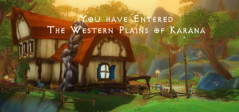

Back to: [West Karana](/posts/westkarana.md) > [2009](/posts/2009/westkarana.md) > [May](./westkarana.md)
# Will EverQuest III be Free Realms II?

*Posted by Tipa on 2009-05-28 07:01:20*

No, I don't (to answer people on Twitter) actually know anything about EverQuest III. I don't even know if it exists. And in this NDA-loving age, if I knew anything, I couldn't write about it. Isn't it grand that the only time someone can write about something these days is if they know nothing about it?

Some people think SOE should just abandon EverQuest, as if there was a taint on the brand. Wrong. Both the PC EverQuests are still going strong, and EverQuest's ongoing influence over modern MMOs can't be overstated. The next EverQuest may not be (probably won't be) called EverQuest III. Maybe it will be called something like EverQuest: The Tunarian Age. EverQuest: Through the Sands of Time. EverQuest: The Higher Planes vs The Undershore. Whatever. You get the point.

But back to the point. Free Realms is under development for three years or so, it launches, does great, fantastic reaction, two million players already -- and then Clint Worely, EverQuest producer, vanishes into a secret internal project. Two weeks later, Bruce Ferguson, EverQuest II producer, follows him.

It isn't tough to connect the dots here. SOE launches a new MMO, and ramps up production on another. A MMO that requires the producers of EQ and EQII.

That doesn't mean that this new game has anything more to do with Free Realms other than being the MMO they are doing after Free Realms. I think the connection is a little closer.

How many MMO engines does SOE own or license? There's the original EQ engine, which is kinda old and by all accounts difficult to change. EQII had another original engine, but though it's come a long way in four years, is still system intensive. Vanguard uses Unreal Engine 3.0. There are lots of other engines they could license, but when it came to Free Realms, they wrote yet another.

How could they justify writing a whole new engine instead of using or licensing one that already existed?

They wanted an engine with low system requirements, with a large, seamless world, able to support vast numbers of players without lag, could stream content in the background as players explored, integrated with the web (and potentially other targets we haven't seen, like hand helds and smart phones), scalable, comes with a cash shop, is portable to the PlayStation 3 and perhaps the PSP... all this cool back-end stuff.

They wouldn't have made this engine just for one game. They wrote the Free Realms engine to be the platform for any number of games that would be able to have all the good stuff above available from Day Zero.

That doesn't mean EQIII would have to look or work at all like Free Realms -- I doubt the art style is tied to the engine, except perhaps the lack of sophisticated shaders, but maybe not even that. Plus, an EQIII would have to have things like guilds, raids, crafting and so on to be called EverQuest.

This may seem a little like Linus waiting for the Great Pumpkin, but I believe EQ3 is out there, and now I am pretty sure it will be based on the FR engine. This is probably all really secret stuff, and if I ever suddenly go silent and the site goes dark and I'm never heard from again, it means I was right, and they got to me.

## Comments!

**[Pete S](http://dragonchasers.com)** writes: How does The Agency fit into this? What engine is it built on? Any idea?

---

**[Tipa](https://chasingdings.com)** writes: The Agency is built on the Unreal Engine.

---

**[openedge1](http://simple-n-complex.blogspot.com)** writes: Unreal...(giggle)

But, you may be right...DARN. Well, as long as they focus on adding a little more "realism" to the characters, I guess I could live with it. But, the cutesy look for a hardcore RPG does not work for me. And too much cartoon starts to put them into a niche, and could alienate players.

Who knows.

---

**[Lars](http://mmomentofzen.blogspot.com/)** writes: I agree, they no doubt intend on recycling their tech on a future project. That's just smart management, to build something that can be used for multiple projects. That doesn't mean you can infer much from FR to EQ3 and beyond. Star Wars Galaxies and EQ2 were built on the same engine and there are some pretty big differences between the games in terms of technical capabilities.

That being said, an open, seamless EQ-based MMO would be really nice.

---

**[ogrebears](http://ogrebear.com)** writes: OK now that i read the post i won't go as far as calling it blasphemy, but i still don't agree. If we were to compare the size of a EQ sized word to free realms. The entire world of free realms could fit in the commonlands. When you add all the music, zones, and creates an MMO the size of eq.

The WoW trial which only downloads the thing you need for the starting zone your in takes roughly 10 minutes to download, and if you go to any other zone your going to have to sit there and wait another 10 minutes for it to get that next zone. (Once you get it you never have to wait again, but still 10 minutes is more time than the average gamer will be willing to wait). If my guild was going on a raid and 1 person was knew and we had to sit there waiting even a few minutes for them to download the zone for the first time is would drive me and probably most people crazy.

HMmm i might make a full post on this.

---

**Drakul** writes: Ogrebears- You assume that FreeRealms doesn't scale well. It may, in fact, scale very well.

---

**[ogrebears](http://ogrebear.com)** writes: I don't see how FR can scale well that my point. No matter what SoE does there is a limit on how much bandwidth people have, if you don't count dial up users the average download speed in the US is about 2Mbps. Which at max speed is roughly 15MB a minute, no one get max speed so its less than that but let us 15 for an example.

Can you fit an entire zone, and sounds in 15mbs? A few texture, a 3d texture map, a few sounds, maybe there is space for a compress song as well. It would look pretty plain. FreeRealms size is larger than that. When you first go to the racing game you end up having to wait 3-5 minutes for the download. In a full zine MMO people would get annoyed pretty fast if they had to wait 3-5 minutes the first time they went to a instance/city. And if the instance/city changes you might have to download the entire thing again.

---

**Drakul** writes: My bad. I don't play it and didn't realize they stream the entire game in real time. I definitely see how that could be a problem.

---

**[rob](http://www.lostaneighth.com)** writes: I believe that Guild Wars has a similar "download when you need it" thing going on. Granted, Guild Wars is not the best example of a massive persistent world either. However, since this is talk about reusing the ENGINE for EQ3, I think you are making a giant assumption to assume that the method of delivery of the "zone assets" is tied to the engine. Besides, it seems to me that it would be trivial to just include the zone assets in the installer ( pre-loaded ) and write a patcher/updater to simply keep them up to date. Then you never have to download a zone on the fly.

It works like this for Free Realms because free realms is meant to be a lighter weight experience by design. They want someone to see it, click the "play" button and be in the world playing mini games ASAP. 

I don't think this would be a bad thing for EQ3 to take advantage of. Hell, I was considering playing Eve last night but didn't because I remembered that I had uninstalled it and by the time it would download again I would have been asleep anyway. I see no reason why you couldn't give players both options. Download a massive client today and never have to download a zone mid-game, or download only a handful of zones for now and get the rest later on as you need it. So long as people understand how it works, I think it could be a great thing.

---

**[Green Armadillo](http://playervsdeveloper.blogspot.com)** writes: I think this is a good bet. The FR engine seems solid enough, and includes many of the features that the hypothetical mystery Sony project is likely to want. 

Personally, I don't "think SOE should just abandon EverQuest, as if there was a taint on the brand", but I do think it would be a mistake to bring out EQ3 while EQ 1 and 2 are still going strong. I enjoy Norrath, and having a future game set in the world would make me more likely to buy it. The problem is that I would cancel my EQ2 subscription to do so.

---

**[We Fly Spitfires](http://blog.weflyspitfires.com)** writes: I would love to see EQ3. I'm still enjoying EQ2 but I need to something new and exciting cause I've just got that 'been there, done that' feeling with EQ2. 

People worried about EQ2 killing off EQ but it didn't so I'm not worried about EQ2's population if EQ3 came out. There are plenty of players who have left SOE games completely and would come back to EQ3.

---

**Ryver** writes: Perhaps FR scales down well, but when turning everything up, I see my temp/activity/fan speed on my graphics card (ATI 4850HD) just up quite high. Of course, I'm not sure I could stand helping my daughter play it on lower settings. Pretty graphics do help, even when stylized.

For those curious:

Intel C2D 3.0GHz
ATI 4850HD
8G RAM

So the computer isn't a slouch, but FR can consume more graphics power than I expected. Typically, more than most of my other games (though, they are on medium settings in some cases).

---

**[Tipa](https://chasingdings.com)** writes: If EQ3 is the same sort of play experience as EQ or EQ2 (both quite different from one another), then it could be a problem. But if we look to EQ Online Adventures, the version for the PS2, there's a hint of how EQ could be put on a console. Simplified interface, huge, glorious monsters, dazzling effects and so on. I really wanted to play EQOA but couldn't afford the fees involved. So SOE has done it once.

Will be fun to see how it develops!

---

**Emmwynn** writes: Whilst I'd love to see an EQ3 in the spirit of EQ1 I'm afraid it won't happen. Free Realms is the most successful SOE MMO-style game and that business model is one of free-to-play with microtransactions. EQ1 and EQ2 have never come close to the success of Free Realms and they'll be voices in the heads of SOE telling them that the Free Realms business model is the way forward. The slow movement towards microtransactions in many of their existing games should give an indication of this. EQ3 could well be free and supported by microtransactions and that's not a game I'd want to play. I hope I'm wrong. I hope they simply see EQ1 coming towards the end of it's natural life and plan to provide a modern successor that plays in the same way as EQ1. I suspect my initial thoughts are closer to the truth thous.

---

**[Wolfshead](http://www.wolfsheadonline.com/)** writes: Just a few thoughts here...I loved the original EverQuest. I loved it's rich lore and geography. The problem is that SOE let the group focus of EQ get away from them as it morphed into a raiding game. Raiding MMOs are unsustainable and financially impractical.

The question that SOE should be asking is this: given the reality of Blizzard's stranglehold on the MMO market what can we do to bring the original EQ fans back into the fold?

The magic of EQ was in those first 3 expansions *before* raiding became the dominant play style -- those expansions should be the template but with a careful balance between solo, grouping and raiding.

As far as Free Realms influencing EQ3 this is a great point. I love the look and feel of the art in Free Realms. For once SOE has got it right. Finally they learned that consistently executed stylized art is the key. Look at EQ versus the Ruins of Kunark expansion. The artwork was completely different in style between those 2 offerings. Goblins in EQ looked vastly different then the goblins in Kunark.

SOE commits the same sin with EQ2. The artwork is not cohesive nor is it consistent. The average player may not pick up on this but subconsciously it works against the overall enjoyment of the player.

Nothing would make me happier to see SOE win back all of the players that migrated to WoW and bring in all of the new ones. If anyone can do it it's SOE. It seems with Free Realms they've learned some lessons from Blizzard on how to make a successful children's MMO. If EQ3 is in the works then it would most likely be available on the PS3 as well as the PC. I'm sure they'd give it a new name instead of EQ3 :)

---

**[Don't Fear the Mutant » And then there was E3](http://blog.dontfearthemutant.com/?p=591)** writes: [...] own events later this year. Who knows if SOE got something big to show at Fan Faire (hopefully Tipa’s “Free Realms-based” EQ3 or something completely different) and Blizzard probably saves the next expansion for World of [...]

---

**KnowMadd** writes: When my daughter plays Free Realms, the bandwidth to do anything else is limited to the point that it is stupid. Streaming a game engine in todays average internet is stupid period.

I will not let anyone play a game on my network that completely hinders everyone else on the network. I can run three SWG accounts concurrent, my daughter on Wizard 101, and the wife can still surf / facebook no problem.

As soon as Free Realms is up, everthing else moves at a snails pace.

Only word for that is "FAIL"!

---

**[Everquest 3 Contrarian | Stropp's World](http://stroppsworld.com/2009/05/31/everquest-3-contrarian/)** writes: [...] been a little discussion of late about the nature of Everquest 3. Tipa has been proposing that EQ3 will use the client/server model that seems to work so well for Free Realms. This model [...]

---

