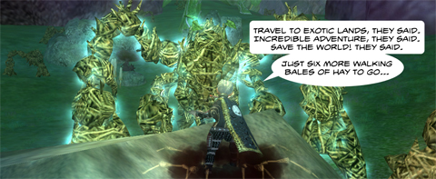

Back to: [West Karana](/posts/westkarana.md) > [2009](/posts/2009/westkarana.md) > [May](./westkarana.md)
# Daily Blogroll 5/28 -- No funny name episode

*Posted by Tipa on 2009-05-28 08:15:58*

I've been staying away from talking about Darkfall and Free Realms lately because, what's more to say about it?

Well, Darkfall is about to launch in the US, and we can only hope that makes more waves than Spellborn's rather uneventful splash when it did the same a couple months back. Keen thinks [Darkfall's NA launch](http://www.keenandgraev.com/?p=2402) will give the game a chance to launch in the shape it should have been from the start. It's kind of odd, really. Is Europe becoming a kind of live beta for US players? Spellborn, Runes of Magic, now Darkfall -- the Europeans pay to make the game better for us.

How generous of them!

I'm not going to make a big deal over the amount of time it takes, anymore, before someone can review an MMO, or even give a first impressions. I gave EVE Online about twenty hours; NeoSteam about three, and I expect Mabinogi will take about twenty. Why should I, when [Tobold is right there with his own experiences](http://tobolds.blogspot.com/2009/05/how-much-time-do-you-need-to-play-game.html)? He spent 40 hours playing for his Luminaire review. Dayum.

Spinks looks at the rather boring goals of MMO heroes (kill more rats, kill bears, deliver this package, talk to that guy) vs those of villains (destroy civilization, defeat the gods, rule the world) and wonders [why villains always get the best plots](http://spinksville.wordpress.com/2009/05/28/why-do-villains-get-the-best-plots/)? She suggests using other players as foils for villainous plots, because, well, game designers can't seem to do the job, I guess.

Funcom advertised an Age of Conan in-game event without telling the players that THEY were supposed to provide the food, contests and entertainment (in their own defense, Funcom did provide a once-a-day sparkler to help get the party going). The community was not amused. Then they advertised a web page scavenger hunt that was not in game and caused language issues with players. The censors clamped down on the forums, and critical threads were deleted. [Openedge1 looks at the mess](http://simple-n-complex.blogspot.com/2009/05/age-of-conan-launch-day-blues-redux.html) and calls it launch day, all over again. Why is Funcom having so many problems with their community?

Some people want everything! Give them FedEx or Kill Ten Rats quests and they say they should be more creative. Give them a quest with a plot and that's not right, either. Ysharros writes of a particular quest in EQ2's Village of Shin that involves [pumping monks for information they show no interest in telling](http://stylishcorpse.wordpress.com/2009/05/27/quest-design-from-the-sublime-to-the-ridiculous/). Spinks would suggest a villainous quest that would go something like "Kill the next monk that talks back to me -- and then burn the village to the ground!"

Heartless\_ looks at Free Realm's press release bragging of two million players, and [wonders why he never sees any of them in the game itself](http://hgamer.blogspot.com/2009/05/free-realms-hits-2-million-none-could.html)? Well, he sees them -- running to the next minigame, but nobody is talking. I dunno, sometimes people talk to me and I just don't see it because the chat window is always turning invisible. Then I look over the chat and see that at some point in the past, someone said something to me. Seriously. Chat in FR is broken and was broken in beta.

Scopique at Cedar Street (how do you pronounce that, anyway? Not Cedar Street -- Scopique.) Anyway, [Scopique examines change in MMOs](http://www.cedarstreet.net/2009/05/same-as-it-ever-was.html). Not the kind of change where a weapon is adjusted or a monster's abilities are tuned, but changes that change the very nature of the game. Good? Bad? Inevitable? But all games change. EQ went from social/casual to achiever/raid. WoW went from social/casual to achiever/raid. LotRO went from social/casual to... hey, is this what they call a 'pattern'?

I don't often link to commercial blogs, but this post on io9 decrying the Gawker Media editorial decision to [masquerade advertising as actual articles](http://io9.com/5271559/vampires-are-not-real-and-blood-copy-is-not-a-real-blog) is just full of win. Not the advertising, but I love the tips on how to separate their actual content with the secret ads. Very... subversive. If only every commercial site were that up-front about it.

And lastly, because it just wouldn't be a blogroll without Syp, he notes that the number of blogs devoted to a game is a rough indicator of its popularity (makes sense), and then [takes a look at a couple of really cool Lord of the Rings Online blogs](http://biobreak.wordpress.com/2009/05/27/lotro-the-boggening-er-bloggening/). 

Hey, imagine my shock when I didn't find any other blogs devoted to a single zone in EverQuest. I thought I'd have to push my way through all the exciting South Karana stories to get my voice heard at all!

Anyway, see you tomorrow and until then, keep gaming!

## Comments!

**[openedge1](http://simple-n-complex.blogspot.com)** writes: *Why is Funcom having so many problems with their community?*

Simple. They do not care, and that is what is troublesome. 
I think it will be hard for this game going forward now as well with discussion of issues creating "events" due to license issues. What will that spell for content? LOTRO could finally do it, but who knows how harsh a deal Funcom signed..

But, I still keep thinking "tax break". Something monetarily helps Funcom survive such disasters..otherwise how can a company survive on two failed (failing?) MMO's? That or who knows how much money was given to do the adverts for this "webpage" scavenger hunt...bah.

I better say Cheers before I continue to rant!

---

**[Spinks](http://spinksville.wordpress.com/)** writes: "Spinks would suggest a villainous quest that would go something like “Kill the next monk that talks back to me — and then burn the village to the ground!”"

That's the old nice Spinks. Now that I've played through Wrath, I know better! 

I'd torture him first :)

---

**[mbp](http://mindbendingpuzzles.blogspot.com)** writes: @Open Edge: Funcom/LOTRO? Did I miss some deal that was announced between Funcom and Turbine? Google leaves me none the wiser. Please enlighten.

---

**[Ysharros](http://stylishcorpse.wordpress.com)** writes: Yeah... I guess yet again I didn't argue my point correctly. Maybe I should just junk the whole damned blogging thing and be done with it.

---

**[Hudson](http://hudshideout.com/blog)** writes: Thanks for the recent pimpage. Stay tuned, because I think Im about to become an EQ1 blogger. Its my destiny

---

**[openedge1](http://simple-n-complex.blogspot.com)** writes: @mbp
Reader Digest version (in BASIC code to help those...in need)

IF "discussion of issues creating “events”

AND "license issues"

FOR "LOTRO could finally do it" (GOTO line 1)

BUT "how harsh a deal Funcom signed.." (GOTO Line 2)

Do you understand now?

---

