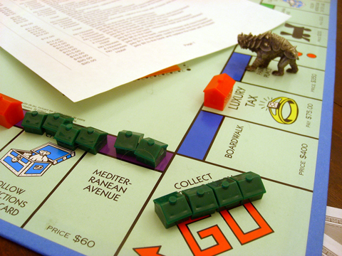

Back to: [West Karana](/posts/westkarana.md) > [2009](/posts/2009/westkarana.md) > [May](./westkarana.md)
# Adventures in Computer Science: Monopoly board computer

*Posted by Tipa on 2009-05-31 08:33:15*

  
*Monopoly board computer after calculating 2 * 2*

Yesterday, Bear was caught in a bind because he didn't have a computer to run the Champions Online beta. He didn't know that he was standing on a computer -- the Monopoly board itself.

Before World War II, computers weren't machines, [they were a profession](http://www.ieeeghn.org/wiki/index.php/Women_Computers_in_World_War_II). Rooms of people-computers, usually women, would perform calculation after calculation with mechanical calculators (that could only add and subtract) and paste the results in huge books, which would be shipped to military bases and used to calculate firing solutions for weapons of war.

In 1936, British mathematician Alan Turing described a theoretical primal computer, which could do only a couple of very simple operations. He imagined an infinitely long strip of tape split into cells, which could be either blank, or have some sort of mark. A read/write head could travel along the tape in either direction, one cell at a time, recognize a mark in a cell, write or erase a mark, and modify its internal state.

This extremely simplified computer came to be known as a [Turing machine](http://en.wikipedia.org/wiki/Turing_machine). Turing's machine worked by the [process of recursion](http://en.wikipedia.org/wiki/Recursion), which means simply that a calculation is carried out by the process of repeated steps. Turing theorized that any computable function could be calculated by a Turing machine. Alonzo Church had previously theorized that any calculable mathematical function could be distilled into a series of recursive steps. The [Church-Turing thesis](http://en.wikipedia.org/wiki/Church%E2%80%93Turing_thesis) proved that a Turing machine and Church's thesis were logically identical, and therefore, a Turing machine could calculate any calculable function.

It follows, then, that any algorithm or device that can emulate a Turing machine, can calculate any calculable function, and further, that any two devices or algorithms that can emulate a Turing machine, are functionally identical (or [Turing complete](http://en.wikipedia.org/wiki/Turing_completeness)).

In our Monopoly board computer, the endless strip of tape is represented by the properties on the Monopoly board. Since 40 spaces is not infinite, the Monopoly board computer isn't Turing complete, and thus can't be proven to be able to run Champions Online. But it's good enough for our purposes (technically, since no computer has an infinite amount of storage, no physical computer is Turing complete, which means that there exist problems that are solvable, that computers cannot solve).

Since it would be inconvenient to always be spinning the board, the read/write head is here represented by Bear, who can move freely backward and forward on the board, one square at a time. The state of the Monopoly computer is represented by cash on hand.

Every computer needs a program, the series of recursive steps that control Bear's actions. This program takes 0, 1 or 2 houses on Mediterranean, 0, 1 or 2 houses on Boardwalk, and places a number of houses corresponding to their [product](http://en.wikipedia.org/wiki/Product_(mathematics)) in Go.

We start off with two houses on Mediterranean and two houses in Boardwalk, Bear on Go, and no cash.

Looking up the state of having no cash, and there being no houses on Bear's square, the instructions state to "take $15 from the bank, build 4 houses and move forward". After following a couple dozen steps, you'll come to the state pictured above, with $8 on hand, four houses (the solution) in Go, and Bear building hotel after hotel backward around the board because this Turing machine has no HALT state.

Writing programs for the Monopoly board isn't the simplest job. Since a Turing machine is a thought experiment, not a basis on which to construct a real computer, it doesn't care how many steps it takes to perform even the simplest calculations. So since I didn't feel like figuring out the algorithm myself, I wrote a [genetic algorithm](http://en.wikipedia.org/wiki/Genetic_algorithm) (GA) to do it for me.

Alan Turing's machine works on the principal (s,a) -> (s1,a1,d) where 's' is the initial state, 'a' represents a mark (or no mark) at the current position, 's1' is the new state, 'a1' is the mark to write (or erase) at the current position, and 'd' is the direction to move the head -- forward, backward, or stay put. My GA generates all possible (s,a) -- states range from no money to $20, and marks from no houses to a hotel. It then makes a thousand random programs by filling in these (s,a) with a random (s1,a1,d). It then runs each of these programs, scores them on the basis of how many of {0,1,2} * {0,1,2} it gets correct, and replaces the least fit programs with a combination of programs created by combining the genetic material of two programs to make a new program, or (1/4 of the time) by an entirely new random program.

Then it repeats it over and over until it produces the perfect program.

Here's the heart of the GA program that wrote the Monopoly board program (in Python):

`gen = 0
while True:
      gen = gen + 1
      print "Gen",gen
      newChromo = []
      for i in range((2*maxchromos)/3):
         if random() < 0.25:
            c3 = makeChromosone()
         else:
            c1 = ranChromo()
            c2 = ranChromo()
            c3 = {}
            for k in c1:
               c3[k] = c1[k]
            for k in c2:
               c3[k] = c2[k]
         newChromo.append(c3)
      cfitness.sort()
      for i in range(len(newChromo)):
         c = newChromo[i]
         d = cfitness[i]
         f = score(c)
         chromos[d[1]] = c
         cfitness[i] = (f,d[1])
`

The complete set of instructions for running your own Monopoly board computer [are found here](../../../uploads/2009/05/fit09.txt) -- it's a comma-separated value (CSV) file, and is best opened in a spreadsheet program. The Python program for writing Monopoly board programs [can be found here](../../../uploads/2009/05/turing.zip). It's undocumented, but based on how you write the "score" function that determines fitness, should be able to write any number of simple programs for the Monopoly board.

Enjoy!

## Comments!

**[openedge1](http://simple-n-complex.blogspot.com/)** writes: This is a VERY fascinating Sunday read..I was compelled by...

Oh look...a kitty.

---

**[Tipa](https://chasingdings.com)** writes: Did someone say Kitty? Look up at the picture at the top right ;)

---

**[Tesh](http://tishtoshtesh.wordpress.com/)** writes: That's just... unbearably nerdy. This may be my favorite nerd article for a very long time. Now, if there were a way to work astrophysics in, I'd just sit back and bask in the moment.

Thanks! Now I need to go tinker a bit...

---

