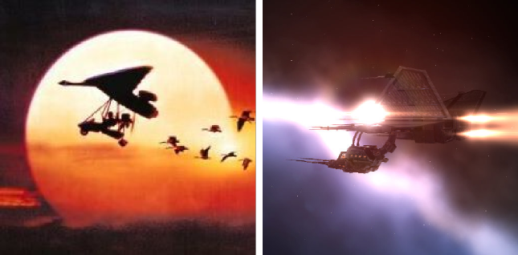

Back to: [West Karana](/posts/westkarana.md) > [2009](/posts/2009/westkarana.md) > [November](./westkarana.md)
# EVE Online: Dealing with the Caldari problem

*Posted by Tipa on 2009-11-03 07:40:24*

As much as I like picking up Caldari and Amarr dogtags from my kills and selling them for lots of ISK to pilots who pretend loyalty to those violent races, it's getting to the point where I can hardly warp into Amarr or Caldari space without warnings to move off or be shot down. Since I do like running trade routes into Caldari-owned Jita for spare change, this could become a problem. Only my training in Diplomacy lets me dock at 4-4.

I thought I would humble myself and see if perhaps I could run some missions for these lesser folk, take the first step toward a new understanding between the upright Gallente Republic and the unwashed barbarian hordes. I flew to Caldari space hoping to enroll in their schools for new pilots, but when they asked me to talk a little about myself in the application and I wrote "my ship is stained green with the blood of Caldari pilots", they politely escorted me out of the station at gunpoint.

Barbarians, I tell you.

Turned out I went to the WRONG SCHOOL, but I was feeling kinda down, so I set the navigator for Minmatar space and started plotting out the next chapter in my thrilling holonovel, "Better Than You: A Gallente Story".

The Minmatar's were only too happy to see me. They'd had a lot of dealings with OtakuCorp, and were willing to start me right off on Level 2 missions. I smiled and asked for the tutorial missions. I was hoping to fly through all three arcs and do the epic arc for standings, and then try my luck with the Caldari again.

I'd flown my Gallente Navy Comet because, GALLENTE REPRESENT, right? The instructors smiled and gave me a Slasher instead.

Now, I don't mean to dis my Minmatar brothers and sisters, but the last time I saw a craft of THIS design, it was leading a flock of Canadian geese to Maryland in the indie kid's movie, Fly Away Home.

So while I wait for my business skills to finish training, I guess you'll find me honking at the head of a flock of ~~geese~~ drones or something as I go on a desperate quest to make everyone LIKE me, if I have to kill them all to do it. 
## Comments!

**[mbp](http://mindbendingpuzzles.blogspot.com)** writes: LOL Tipa I never spotted the likeness before but you are absolutely right. 

Believe it or not it is possible to fall in love with the Junkyard Wars appearance of Minmatar ships. After all "In Rust we Trust".

---

**kinolyen** writes: I'm just wondering, how do you expect to deal with the "Caldari problem" by flying for the Minmatar Republic? Since Minmatar and Gallente are allies, you'll get missions from them which will sometimes put you once again against either Amarr or Caldari forces, and the storyline missions in Minmatar space will also lower both your Amarr and Caldari standings.

If you're really concerned about your Caldari and Amarr standings, I suggest that first of all you simply decline any mission where you would have to face Caldari (or Amarr). In case you don't know, there's an icon in most mission briefings which will show you what forces you'll have to fight. Apart from that, there's not much more you can do then fly missions for the faction you want to improve, and if Caldari's your lowest standing right now, you should fly for them.

Of course, it is quite possible that your standings are already damaged beyond repair, i.e. you don't have access to any Caldari agent. Then you're only hope would be that your Amarr standings are not that bad yet. By flying for Amarr you could in that case indirectly increase your Caldari standings through Amarr storyline missions.
However, if you now decide to fly for Minmatar for a while (whose storylines will heavily decrease your Amarr standings), you'll be completely screwed sooner or later (I suspect sooner). 

So be careful, and fly safe ;)

---

**[Magson](http://phoenq-magson.blogspot.com)** writes: My character is Caldari, and I started off missioning for the Caldari Navy. After a while, I was at something like a 3 with Caldari, 2 with Amarr and pretty negative with both Minmatar and Gallente. I didn't have any diplomatic skills at the time, so I went off to Minmatar space to work for the Sisters of EVE, since they increase standings with everyone.

They only appear to have level 1 missions in hi-sec space, though, so..... I was already in Rens, and started working for Brutor Tribe. This brought up Minmatar and indirectly Gallente.

But... even though I'm back in Caldari space and working for the Corporate Police Force.... my unmodified standings are now: Caldari 1.63, Minmatar 1.01, Gallente -0.27, and Amarr -1.21. I have worked a little for an Amarr corp, but only to L2 missions, but I've also got all my social skills to 4 now, so I at least have positive standings with the 4 empires that way. Could be worse.

Anymore, I avoid any missions vs opposing factions -- I only kill pirate factions now. Once I get out to 0.0 I won't care anymore, but for now... I want "everyone" in Empire space to like me.

---

**Chris** writes: Bad Amarr standings? Check
History of shooting up Providence? Check
Flying Minmatar ships? Check

Come fly with the Ushra'Khan! You'll fit right in :)

---

**kinolyen** writes: Don't listen to the terrorist propaganda guy ;)

---

**[Tipa](https://chasingdings.com)** writes: Hey, I remember U'K from those hours after CVA fell apart :)

@Magson -- I don't care if all factions love me, but I'd rather none of them HATE me. So no more Amarr or Caldari killing for me, just faction work from now on.

---

**[Magson](http://phoenq-magson.blogspot.com)** writes: Perhaps "having them all love me" was a bit strong. I simply want the option to be able to go anywhere in Empire space, so... no -2 or lower standings is all I need, I suppose. I do a bit of trading here and there and like to be able to hit all the various regional hubs as well as Jita.

---

